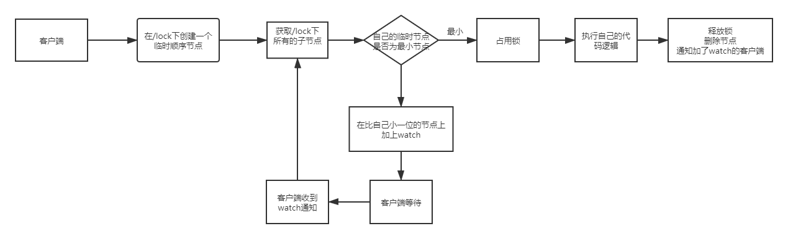

[toc]

#### **1. 数据发布/订阅**

Zookeeper采用推拉相结合的方式：客户端向服务端注册自己关注的节点，一旦该节点的数据发生变更，那么服务端会向响应的客户端发送Watcher事件通知，客户端收到事件通知后，需要主动到服务端获取最新的数据

#### **2. 负载均衡**

#### **3. 命名服务——提供全局唯一ID**

#### **4. 分布式协调/通知**

* 集群管理
* 分布式日志收集系统
* 在线云主机管理
* 机器上/下线

#### **5. Master选举**

#### **6. 分布式锁**

##### **6.1 Zookeeper实现分布式锁方式1**

多个客户端创建同一个path的临时节点，创建成功的取得锁，创建失败的客户端监听这个临时节点，获得所锁的客户端释放锁(删除临时节点)，或者宕机(也会删除临时节点)，其他客户端就收收到Watch通知，可以去抢占锁

缺点：会出现惊群效应——释放锁的时候，会唤醒许多线程来争夺锁

##### **6.2 Zookeeper实现分布式锁的机制2**

#### **7. 分布式队列**

分为两种——**常规的先入先出队列**和**等到队列元素集聚之后才统一安排的Barrier模型**

* **FIFO**

  同分布式锁的第二种方案

* **Barrier**

  Barrier分布式屏障——规定一个队列的元素必须都集聚后财通统一进行安排，否则一直等待

  实现如下

  

  