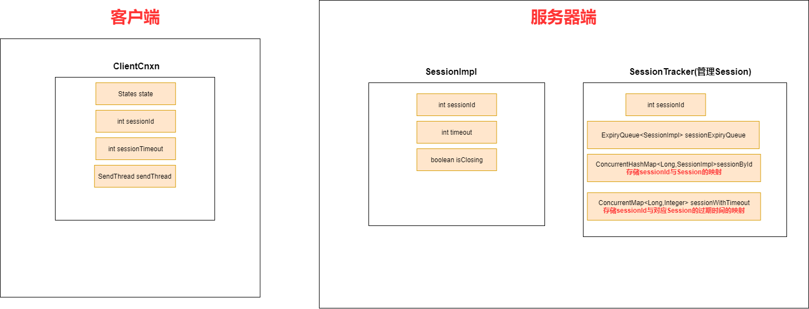

### 1. 会话状态

States枚举类，枚举了当前会话的状态

```java
    public enum States {
        CONNECTING,
        ASSOCIATING,
        CONNECTED,
        CONNECTEDREADONLY,
        CLOSED,
        AUTH_FAILED,
        NOT_CONNECTED;

        public boolean isAlive() {
            return this != CLOSED && this != AUTH_FAILED;
        }

        public boolean isConnected() {
            return this == CONNECTED || this == CONNECTEDREADONLY;
        }
    }
```

以下是会话状态的变化图


### 2. 会话管理器

**SessionTracker**——Server端会话管理器，负责Server端会话的**创建，管理和清除**

**SessionTracker**有三个核心字段

1. sessionsById——存储sessionId与Session实例的映射
2. sessionWithTimeout——存储sessionId与其对应的Session实例的超时时间的映射
3. sessionExpiryQuery——buckets，根据过期时间对Session实例进行排序



#### 2.1 会话创建


