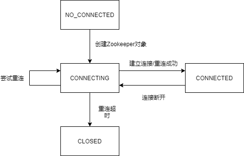
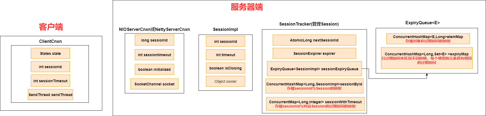
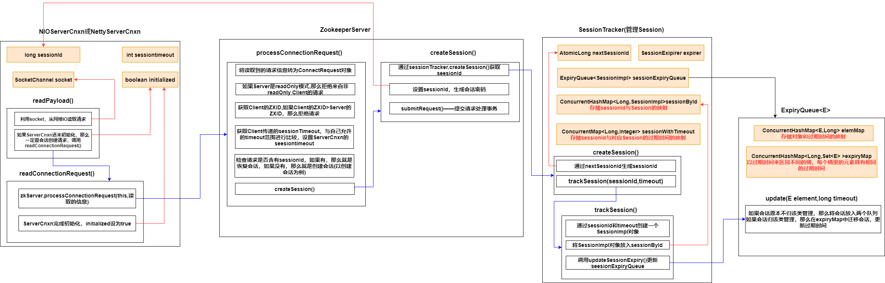
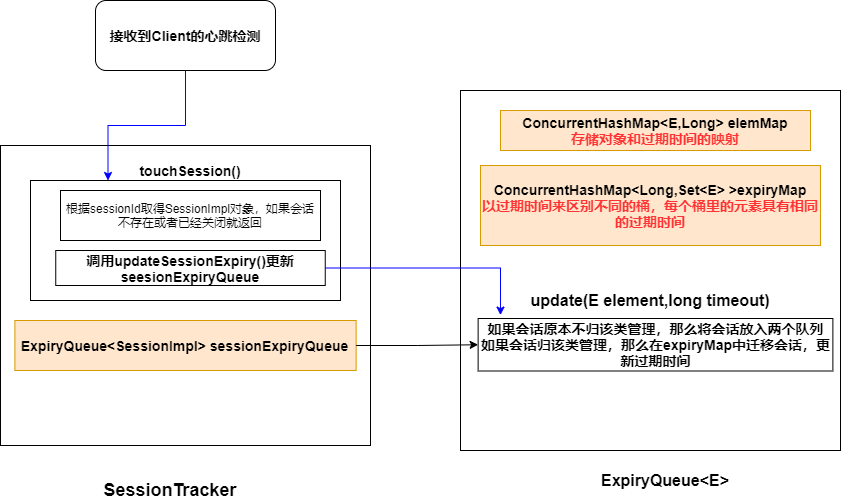
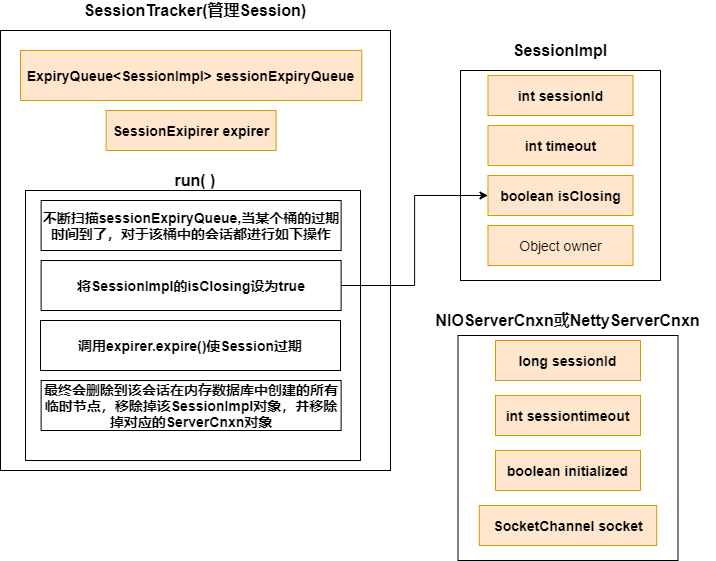

[toc]


### 1. 会话状态

States枚举类，枚举了当前会话的状态

```java
    public enum States {
        CONNECTING,
        ASSOCIATING,
        CONNECTED,
        CONNECTEDREADONLY,
        CLOSED,
        AUTH_FAILED,
        NOT_CONNECTED;

        public boolean isAlive() {
            return this != CLOSED && this != AUTH_FAILED;
        }

        public boolean isConnected() {
            return this == CONNECTED || this == CONNECTEDREADONLY;
        }
    }
```

以下是会话状态的变化图




### 2. 会话相关类



#### 2.1 SessionTracker——Server端会话管理器，负责Server端会话的**创建，管理和清除**

* **SessionTracker核心字段**

1. sessionsById——存储sessionId与Session实例的映射
2. sessionWithTimeout——存储sessionId与其对应的Session实例的超时时间的映射
3. sessionExpiryQuery——看下面
4. nextSessionId：生成下一个SessionId

#### 2.2 ServerCnxn

Zookeeper中ServerCnxn有两个子类——NIOServerCnxn，NettyServerCnxn

其作用如下

1. ServerCnxn负责**Client与Server的通信**，每个ServerCnxn实例维护一个Client连接
2. **作为Client端会话的载体**——每个Client连接都有一个会话，所以每个会话都有一个ServerCnxn实例

#### 2.3 ExpiryQueue

用于管理会话过期时间，采用分桶策略

* **核心字段**

1. elemMap：存储 **过期时间**与 **会话**的映射
2. expiryMap：基于分桶策略，将过期时间相同的会话存储在同一个桶中


### 3. 会话的创建，管理，清除

#### 3.1 会话创建



#### 3.2 会话管理

1. 基于分桶策略的会话管理

   * SessionImpl在创建的时候会放入sessionById和sessionExpiryQuery中

   * sessionExpiryQuery对SessionImpl的存储是基于**分桶策略**，将过期时间相同的SessionImpl放在相同的桶中

   * **SessionTracker**本身是一个线程，run()中会不断的扫描sessionExpiryQuery，当某个桶的过期时间到了，就会关闭该桶中的所有会话，并调用 **expirer.expire()**清除会话
   
2. 会话激活

   * Client与Server连接期间，会不断发送PING(心跳检测)，服务器接受到这个PING后，会激活对应的会话（这个过程叫**TouchSession**，调用 **touchSession()方法**）
   * 

#### 3.3 会话清除

**SessionTracker**本身是一个线程，run()中会不断的扫描sessionExpiryQuery，当某个桶的过期时间到了，就会关闭该桶中的所有会话，并调用 **expirer.expire()**清除会话




