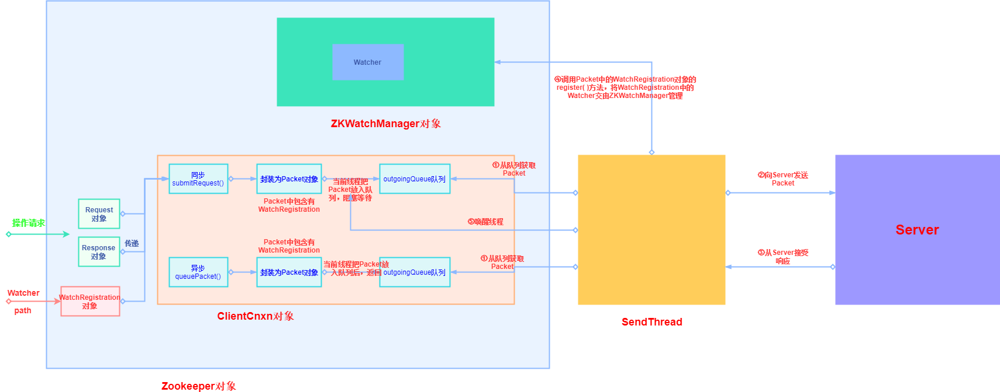
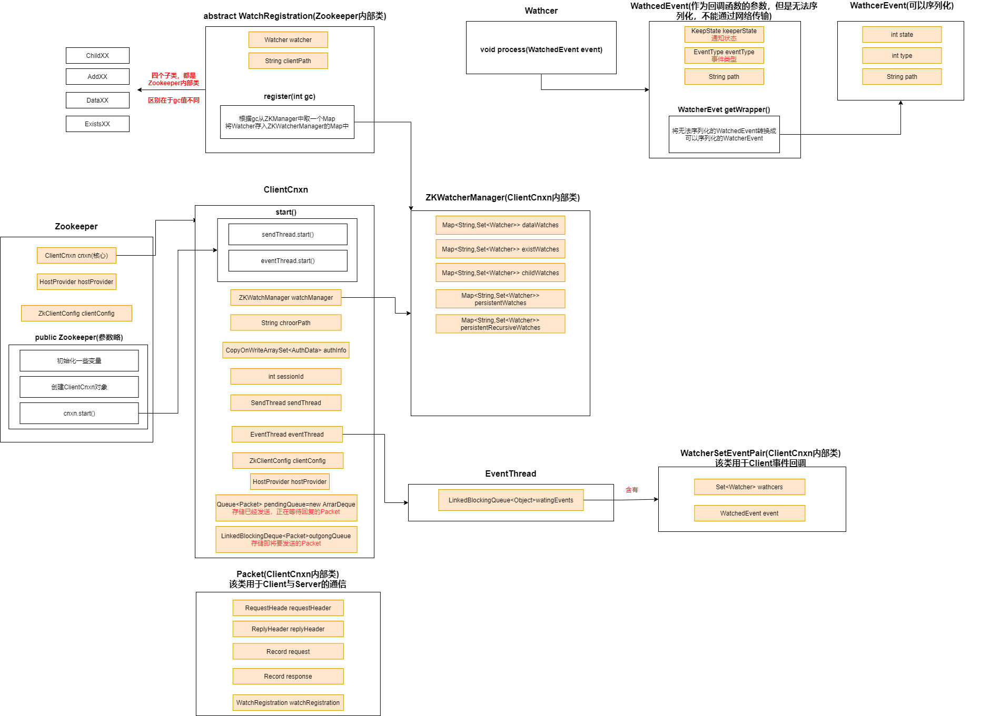
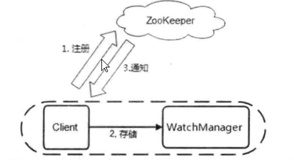
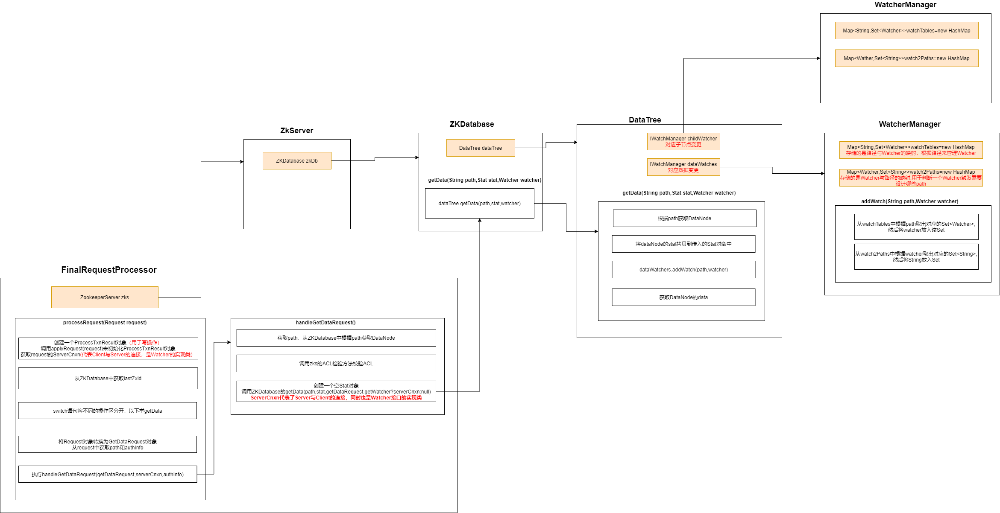
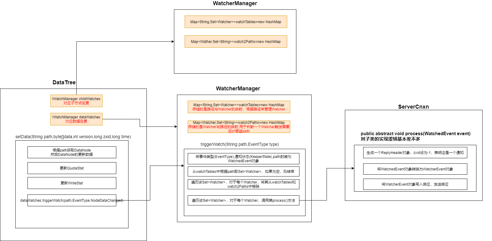
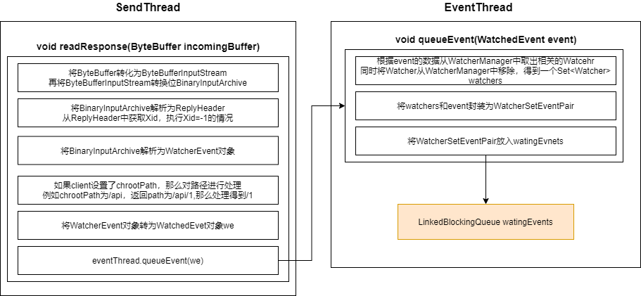

- [1. Zookeeper Client介绍与类图](#1-zookeeper-client介绍与类图)
  - [1.1 Zookeeper Client介绍](#11-zookeeper-client介绍)
  - [1.2 Zookeeper Client方法调用流程图](#12-zookeeper-client方法调用流程图)
  - [1.3 Zookeeper Client类图结构](#13-zookeeper-client类图结构)
- [2. Zookeeper Watcher机制](#2-zookeeper-watcher机制)
  - [2.0 Watcher机制整体逻辑](#20-watcher机制整体逻辑)
  - [2.1 Client注册和存储Watcher](#21-client注册和存储watcher)
  - [2.2 Wathcer在Server端的存储](#22-wathcer在server端的存储)
  - [2.3 Server端触发Watcher](#23-server端触发watcher)
  - [2.4 Client回调Watcher](#24-client回调watcher)

### 1. Zookeeper Client介绍与类图

#### 1.1 Zookeeper Client介绍

* **每创建一个Zookeeper对象，就是成功创建了一个与服务器连接的客户端**
* **Zookeeper提供的API有同步和异步两种模式**

  * 调用同步API，Client的线程会阻塞，直到收到Server的响应结果(不管是否成功)
  * 调用异步API，Client会从API返回，继续干自己的事情，Server返回响应结果时(不管是否成功)会通知Client（通过一个Callback对象）

#### 1.2 Zookeeper Client方法调用流程图



#### 1.3 Zookeeper Client类图结构



* ClientCnxn：网络连接器

  * pendingQueue：两个核心队列之一，存储已经发送，正在等待恢复的Packet（服务端响应的等待队列）

  * outgoingQueue：两个核心队列之一，存储即将要发送的Packet（Client请求的发送队列）

    

  * chrootPath：命名空间，客户端在connectString中添加后缀来设置

    ```
    IP1,IP2,IP3/apps/a
    ```

    

  * SendThread：

    * 负责向服务器发送Packet，接受服务器响应

    * 维护Client与Server之间的Session生命周期——以一定的频率向Server发送PING包来实现心跳检测
    * 在Session周期内，如果Client与Server出现TCP断开，自动重连
    * 将来自服务端的事件写入EventThread的watingEvents

  * EventThread：负责Client的事件处理，并触发注册的Watcher，EventThread不断地从watingEvents中取出Object，识别其类型(Watcher或AsyncCallback)，并分别调用其process()或processResult()来触发回调

    * watingEvents：存放所有等待被Client等待的事件


### 2. Zookeeper Watcher机制

#### 2.0 Watcher机制整体逻辑



1. Client向Zookeeper服务端发送Watch，进行注册
2. 同时Client还会把Watch存储到WatchManager中
3. Zookeeper服务端触发Watch时间时，会向Client发送通知，Client依据通知从WatchManager中取出对应的Watcher对象来执行**回调逻辑**

#### 2.1 Client注册和存储Watcher


1. Wathcer会封装为WatchRegistration对象，然后WatchRegistration对象会封装进Packet对象中
2. Packet对象发送outgoing队列后，会有SendThread发送给服务器，服务器上会实现该Watcher的注册
3. SendThread接收到服务器的响应后，会从Packet对象中取出WatchRegistration对象，然后调用其**register()**，将WatchRegistration中的Watcher交由ZKWatchManager保管

#### 2.2 Wathcer在Server端的存储



最终，ServerCnxn（Watcher）存放到了DataTree的WatcherManager中的watchTables和watch2Paths

**Zookeeper服务器端，其实是把ServerCnxn当做Watcher进行存储**

#### 2.3 Server端触发Watcher

以setData()触发Watcher举例

setData()方法最终会调用 **DataTree的setData()方法**，而Watcher的触发就在这setData()中



#### 2.4 Client回调Watcher



watingEvent是一个阻塞等待队列，EventThread的run()会不断对处理该队列中的对象

EventThread的run()会从watingEvent中取出WatcherSetEventPair，从中取得Set `<Wather>`和WatchedEvent ,然后逐个执行执行每个Watcher的process( )

```java
public void run() {
    try {
        isRunning = true;
        while (true) {
            Object event = waitingEvents.take();//从watingEvents中取出WatcherSetEventPair
            if (event == eventOfDeath) {
                wasKilled = true;
            } else {
                processEvent(event);//处理WatcherSetEventPair
            }
            if (wasKilled) {
                synchronized (waitingEvents) {
                    if (waitingEvents.isEmpty()) {
                        isRunning = false;
                        break;
                    }
                }
            }
        }
    } catch (InterruptedException e) {
        LOG.error("Event thread exiting due to interruption", e);
    }
}

private void processEvent(Object event) {
    try{
        if (event instanceof WatcherSetEventPair) {
            // 处理WatcherSetEventPair
            WatcherSetEventPair pair = (WatcherSetEventPair) event;
            for (Watcher watcher : pair.watchers) {//从WatcherSetEventPair中取出Set<Watcher>
                try {
                    watcher.process(pair.event);//逐个回调
                } catch (Throwable t) {
                    LOG.error("Error while calling watcher.", t);
                }
            }
        }
    }//以下代码略
}
```
