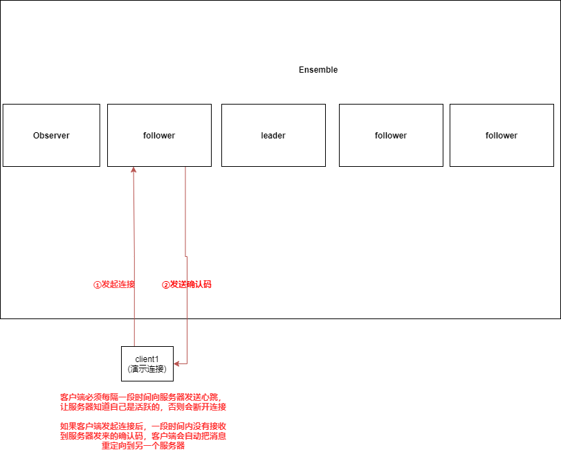
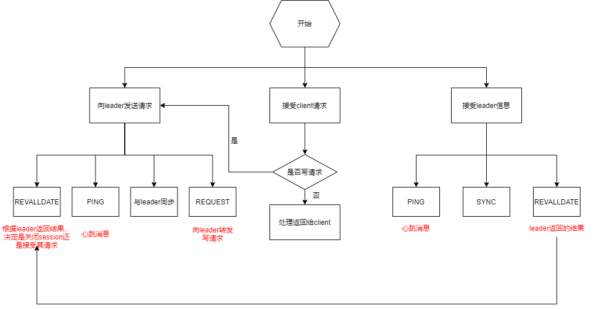

### 客户端

* Client：应用使用ZookeeperClient来使用Zookeeper服务
  * 向服务器发送连接后，需要服务器向Client发送确认码，才可以建立Session，如果一段时间内，没有接收到确认码，那么自动将消息重定向到另一个服务器
  * Client与服务器建立Session后，会被分配SessionId，并且必须每隔一段时间向服务器发送心跳，告诉服务器自己是活跃的，否则会关闭Session

### 集群组成

* Ensemble：Zookeeper集群，最小数量为3
  * 集群的角色分类(3.5.0后)
    * leader
    
      1. proposal的唯一调度者和处理者
    
      2. 在Zookeeper集群启动时候从磁盘读取日志恢复数据
      3. 维持与learner的心跳，接受learner请求并判断learner的请求类型
    
    * learner
    
      * follower
    
        * 常规follower：只提供读服务器，参与Proposal投票，参与Leader选举投票
        * non-voting-follower：没有投票权，但是仍可以对外提供服务，也可以接收到Leader的信息
    
      * observer——跟follower相近，只是不参与写操作的“过半写成功”策略，也不参与leader选举
    
        可以增加Observer，在不影响集群写性能的情况下，增加集群的读性能
    
  * 集群的角色分类(3.5.0后)
  
    * leader
    * learner
      * follower
      * observer

### Leader和Follower工作流程

**Leader工作流程**

**Follower工作流程**

### 服务器结构

* Request Processor(只有Leader才有，处理写请求用的)
* Automic Broadcast：原子广播
* Replicated Database：内存上的数据库，包含有整棵data tree各个Server的Replicated Database保持数据一致

