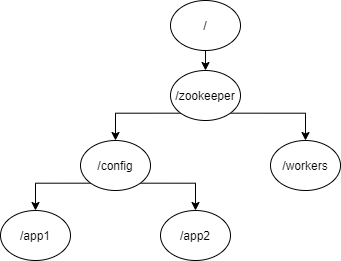

**Zookeeper层次数据模型data tree**

树形结构，由一个个znode组成，存储在内存中

**Znode的结构**

* stat：状态信息，包括了版本号，时间戳
  * czxid：创建节点的事务的ZXID
  * mzxid：最近一次修改节点数据的事务的ZXID
  * pzxid：该节点的子节点最后一次创建/删除的事物的ZXID
  * version：：节点数据变化的次数
  * cversion：节点的子节点的数据变化的次数
  * aversion：节点的ACL变化的次数
  * ctime：该节点创建时的时间
  * mtime：该节点最后一次修改的时间
  * ephemeralOwner：如果节点是临时节点，那么该字段为创建节点的Session的SessionID，否则为0
  * dataLength：该节点data的长度
  * numChildren：该节点的子节点数目
* data：该Znode存储的数据，最多1MB（可以设置），每个节点都有一个ACL列表，规定了可以对该znode的data做哪些操作
* children：该Znode下的节点

**支持的操作**

* 通过路径来定位Znode
* Znode的数据只支持全量写入和读取，不支持部分写入和读取
* 所有的API都是wait-free，正在执行的API调用不会影响其他API的完成

**Znode的类型**

* 持久节点：客户端断开连接后，不会消失
* 临时节点：客户端断开连接后，客户端创建的临时节点都会消失，临时节点不能有子节点
* 顺序节点：Zookeeper会将10位序列号加到原始名称后来设置Znode路径（名字具有顺序性）
  * 持久顺序节点
  * 临时顺序节点