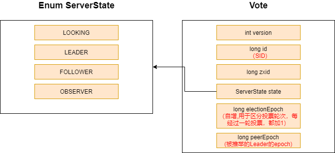
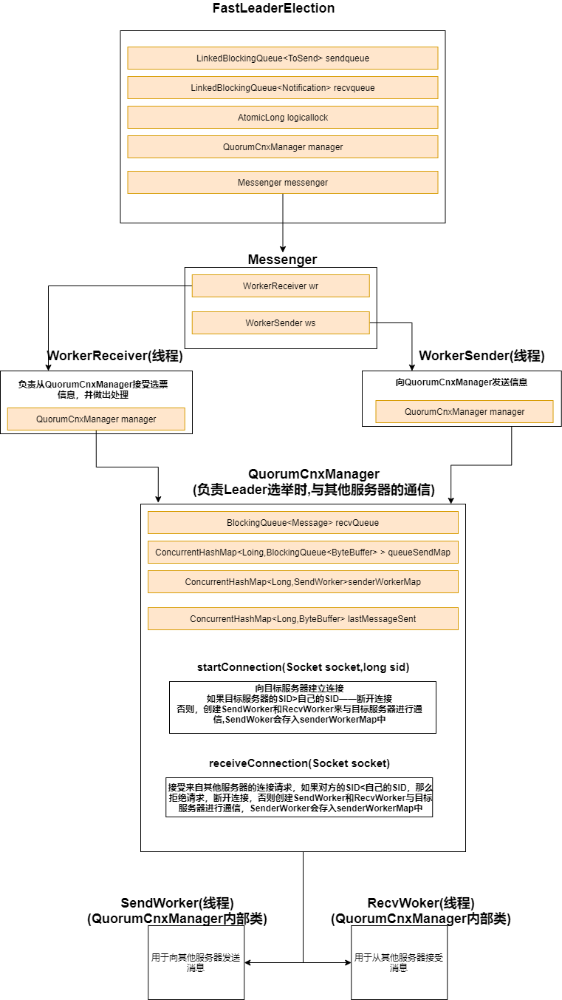
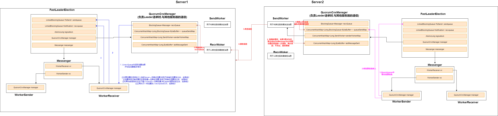

- [1. Leader选举概述（Observer不参与投票）](#1-leader选举概述observer不参与投票)
- [2. Leader选举算法代码分析](#2-leader选举算法代码分析)
  - [2.1 服务器状态和 投票数据结构](#21-服务器状态和-投票数据结构)
  - [2.2 选举功能核心类说明](#22-选举功能核心类说明)
    - [2.2.1 QuorumCnxManager——负责各个服务器之间在Leader选举过程中的网络通信](#221-quorumcnxmanager负责各个服务器之间在leader选举过程中的网络通信)
      - [2.2.1.1 核心字段](#2211-核心字段)
      - [2.2.1.2 QuorumCnxManag会其他服务器建立TCP连接](#2212-quorumcnxmanag会其他服务器建立tcp连接)
    - [2.2.2 FastLeaderElection——产生投票，处理其他服务器的投票](#222-fastleaderelection产生投票处理其他服务器的投票)
  - [2.3 选举通信](#23-选举通信)
    - [!选举消息通信](#)

## 1. Leader选举概述（Observer不参与投票）

leader选举发生的时机有2个——集群启动，集群运行期间Leader宕机

1. 集群启动时候，所有服务器的状态都是 **LOOKING**

   集群运行期间Leader宕机，那么所有的非Observer服务器变更状态为 **LOOKING**（Observer不参与投票）
2. 每个Server都会发出一个投票，以(sid，ZXID标识)

   * SID：被推荐的服务器的唯一标识
   * ZXID：被推荐的服务器的事务ID

   每个Server最初都会投自己，所有最初持有的投票——sid为服务器自己的myid，ZXID为服务器自己最后一次提交的事务的ZXID
3. ```
   while(!(服务器统计投票信息，是否有过半服务器持有相同的投票信息)){
     开启新一轮投票
   
     每台服务器会向其他所有服务器发送自己持有的投票，同时也会接收来自其他服务器的投票,接收到其他服务器的投票后，会检查该投票的有效性（是否本轮投票，是否来自LOOKING服务器）
   
     对接收到的每一个投票，服务器都会拿来跟自己持有的投票比较
       * 先检查ZXID，如果接收到的投票的ZXID>自己持有的投票的ZXID，那么更新该投票为自己持有
       * 如果ZXID相同，比较sid，如果接收到的投票的sid>自己持有的投票的ZXID，那么更新该投票为自己持有
   }
   
   过半服务器持有的投票，该投票的SID确认出Leader，其余服务器更新状态为Follower
   ```

## 2. Leader选举算法代码分析

3.4.0版本前，Zookeeper支持三种选举算法——LeaderElection，UDP版的FastLeaderElection，TCP版的FastLeaderElection

3.4.0后，只保留了TCP版的FastLeaderElection

### 2.1 服务器状态和 投票数据结构



### 2.2 选举功能核心类说明



#### 2.2.1 QuorumCnxManager——负责各个服务器之间在Leader选举过程中的网络通信

##### 2.2.1.1 核心字段

1. recvQueue：消息接受队列，接受从其他服务得到的消息
2. queueSendMap：消息发送队列，保存即将要发送的消息，按照服务器的SID进行分组，为每台服务器都分配一个 **单独的发送队列BlockingQueue**
3. senderWorkerMap：消息发送器队列，每台服务器的SID都对应一个SendWoker
4. lastMessageSent：存储最近发送过的消息，为每个SID保留一个最近发送过得消息

##### 2.2.1.2 QuorumCnxManag会其他服务器建立TCP连接

Zookeeper有一种特殊的建立TCP连接的规则：只允许SID大的服务器向SID小的服务器建立连接，反过来会被拒绝，QuorumCnxManager通过**startConnection()与receiveConnection() **与其他服务器建立连接

每与一台服务器建立连接，就会创建一个SendWorker，一个RecvWorker用于收发消息，**SendWorker会存入senderWokerMap中**

#### 2.2.2 FastLeaderElection——产生投票，处理其他服务器的投票

**核心字段**

* sendqueue：选票发送队列，保存待发送的选票
* recvqueue：选票接受队列，保存接收到的选票
* WokerReceiver：选票接收器，从QuorumCnxManager中获取其他服务器发送来的选举信息，并对选举信息进行校验

  有以下几种情况

  * ①该选票的选举轮次<当前Server——忽略该选票，发出自己的选票
  * ②该选票来自没有投票权的服务器(Observer，No-Voting Follower)——忽略该选票，发出自己的选票
  * ③当前Server的状态不是LOOKING——忽略该选票，发出Leader信息
  * ④正常执行——将选票保存到recvqueue队列中
* WorkerSender：选票发送器，不断地从sendqueue中获取待发送的选票，传递给QuorumCnxManager

### 2.3 选举通信

#### 
