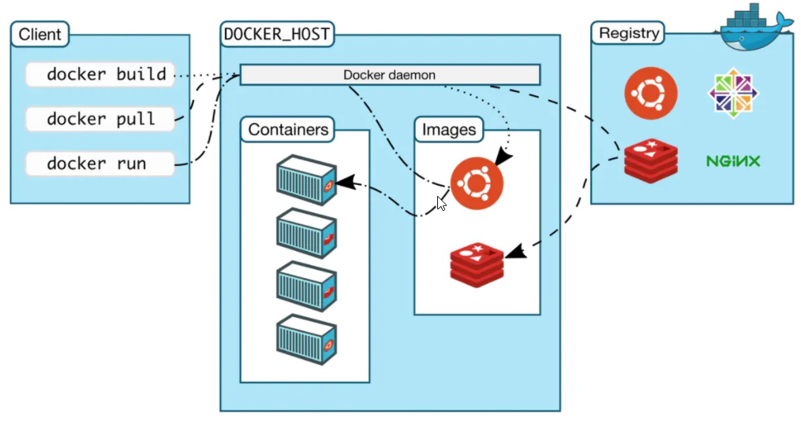
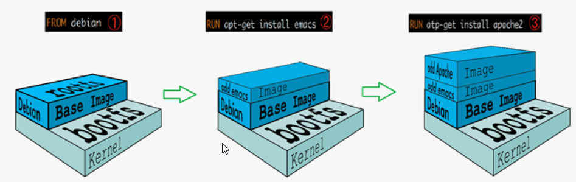

[toc]

### 1. Docker介绍

* Docker的核心思想——**隔离**
* Docker是一种容器技术，我们主需要准备镜像，然后运行镜像即可
  * 容器化技术不是模拟一个完整的操作系统
  * 容器内的应用直接运行在宿主机的内核上，容器没有自己的内核，十分轻便
  * 容器之间相互隔离，每个容器都有一个属于自己的文件系统，IO操作隔离，互不影响

### 2. Docker核心概念

#### 2.1 Docker架构图

* Client：发出命令的客户端
* Docker_Host：运行Docker的主机
* Registry：注册中心，保存用户构建的镜像

#### 2.2 名词概念

* image（镜像）

  镜像就好比一个模板，可以通过镜像来创建容器，一个镜像可以创建多个容器

  一个镜像就是一个可执行的包，期中包括运行服务所需要的所有内容

* container（容器）

  服务or项目运行在容器中，通过镜像创建

  容器可以被创建，启动，停止，删除，暂停

* registry（仓库）

  保存用户构建的镜像

#### 2.3 其他概念

* **镜像分层**

  Docker支持通过已有镜像来构建新的镜像

  

* **可写的容器层**

  容器启动时，一个新的可写层加载到镜像的顶部，这一层称为 **容器层**，**容器层**之下的都叫 **镜像层**

  所有对容器的改动都只会发生在 **容器层**，只有容器层是可写的，**镜像层只读**

  因为所有对容器的改动只会发生在容器层，镜像层只读，**所有镜像可以被多个容器共享**

  **镜像层底部包含了操作系统内核，所以启动容器后，其内部是有操作系统的**

  

  

* **数据卷**

  容器可以被删除，但如果容器被删除了，那么哪些需要持久化的数据怎么办？——**数据卷**

  数据卷可以把容器的数据持久化到宿主机上——简单来说就是把宿主机的目录映射到容器中的目录，服务在容器中的目录写数据会同步到宿主机上