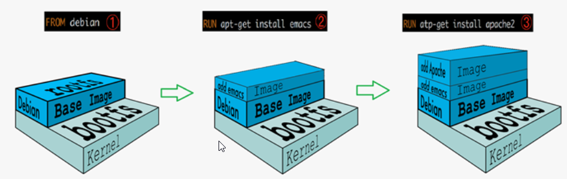
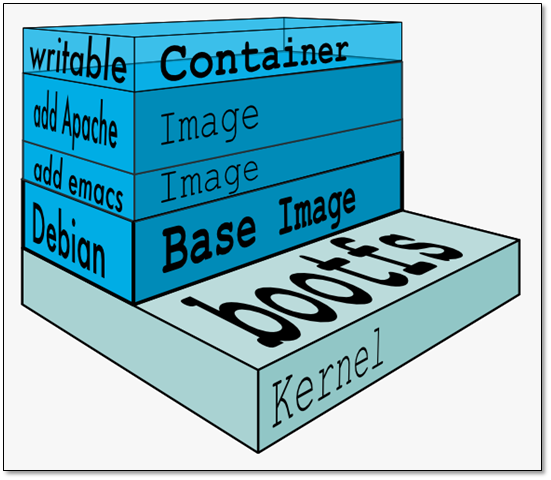
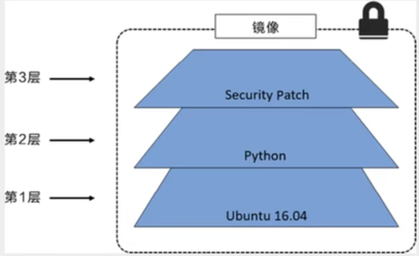
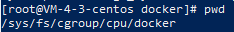

容器技术的核心功能——通过约束和修改进程的动态变现，为其创造一个 **"边界"**

Docker主要使用 **Namespace**和 **Cgroups**来实现这个功能

* **Namespace**

  负责 **隔离** ——修改进程视图，让进程只能看到限定的东西

* **Cgroups**

  负责 **限制**——限制Docker容器进程可以使用的资源量

**一个Docker容器**——就是一个启用了多个 Namespace的应用进程，而这个进程能够使用的资源量，受 Cgroups配置的限制

### 1. Docker使用Namespace技术

Linux提供了 Mount，UTS，IPC，NetWork，User这些Namespace

(Mount Namespace让进程只能看到当前Namespace里面的挂载点信息，Network Namespace让进程只能看到当前Namespace里的网络设备和配置)

创建Docker容器进程时，传入**一组Namespace参数**——容器进程就只能看到**当前Namespace所限定的文件，设备，状态，配置**

* **Namespace**修改了 Docker容器进程的视图
* 但是对于宿主机来说，**Docker容器进程跟普通进程是一样的**，都是由**宿主机操作系统**统一管理，只不过启动的时候加上了一组Namespace参数

#### 虚拟机与容器结构的对比

Hypervisor通过硬件虚拟化功能，模拟出运行一个操作系统需要的各种硬件，然后在其之上安装多个OS

用户进程能看到的只有所处OS的文件和目录——**Hypervisor**负责将不同的OS隔离

如果将Docker  Engine放在上图的位置，那么就表示**容器进程之间的隔离**是由**Docker Engine**负责的

但是对于宿主机来说，**Docker容器进程跟普通进程是一样的**，都是由**宿主机操作系统**统一管理，只不过启动的时候加上了一组Namespace参数

真正对容器进程之间的隔离负责的是**宿主机的操作系统**，所以**真正的结构对比应该如下图**

### 2. Docker使用Cgroups技术

如果仅仅使用Namespace技术——**隔离的不够彻底**

* 多个容器之间使用的还是同一个操作系统内核（可能出现某些容器进程抢占大量资源）

* 一些资源无法被Namespace化(例如时间)

所以需要使用 **Cgroups技术**来为容器进程设置**资源限制**

#### Cgroups介绍

* **Linux Cgroup(Linux Control Group)**——**限制一个进程组可以使用的资源上限**

* Cgroup暴露出来的接口是**文件系统**——**/sys/fs/cgroup**目录下

  

* **/sys/fs/cgroup**目录下有许多**子系统**，每个子系统都由其独有的资源限制能力

  

  

* 在**某个子系统(例如/sys/fs/cgroup/cpu)**下创建应用目录myapp，OS会自动在myapp目录下生成**该子系统对应的资源限制文件**

#### Docker使用Cgroup

* Docker会在**每个子系统**下创建 docker目录

  

* 每创建一个Docker容器进程，Docker会在每个子系统的docker目录下，创建 **ContainerID目录**

  

  **ContainerID目录**下，就是对容器进程进行**资源限制**的**资源限制文件**

#### 