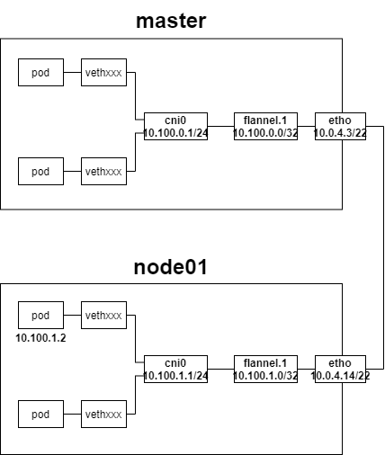

[toc]

## 1. Kubernetes网络安装实战

下图为安装完网络插件后的网络拓扑



* etho：云服务器虚拟网卡，绑定私网IP
* master初始化参数
  * **serviceSubnet**：10.96.0.0/16
  * **podSubnet**：10.100.0.1/16
* 每个Node都会分配一个 PodCIDR
  * master分配的PodCIDR是10.100.0.1/24
  * node01分配的PodCIDR是10.1001.1./24
* 每个Node分配到一个Pod运行任务后，会在自己的PodCIDR中为Pod分配一个虚拟IP


**我们来看一下master的路由表**

```
[root@VM-4-3-centos ~]# route
Kernel IP routing table
Destination     Gateway         Genmask         Flags Metric Ref    Use Iface
default         gateway         0.0.0.0         UG    0      0        0 eth0
10.0.4.0        0.0.0.0         255.255.252.0   U     0      0        0 eth0
10.100.0.0      0.0.0.0         255.255.255.0   U     0      0        0 cni0
10.100.1.0      10.100.1.0      255.255.255.0   UG    0      0        0 flannel.1
link-local      0.0.0.0         255.255.0.0     U     1002   0        0 eth0
172.17.0.0      0.0.0.0         255.255.0.0     U     0      0        0 docker0
```

```
[root@VM-4-3-centos ~]# ip route
default via 10.0.4.1 dev eth0
10.0.4.0/22 dev eth0 proto kernel scope link src 10.0.4.3
10.100.0.0/24 dev cni0 proto kernel scope link src 10.100.0.1
10.100.1.0/24 via 10.100.1.0 dev flannel.1 onlink
169.254.0.0/16 dev eth0 scope link metric 1002
172.17.0.0/16 dev docker0 proto kernel scope link src 172.17.0.1
```

* 如果主机IP或者网络不在路由表中，走默认路由，交由由默认网关(10.0.4.1)
* 对10.0.4.0/22网段下IP的访问不走GateWay，交由网卡eth0发送——同一子网下的其他云服务器
* 对10.100.0.0/24网段下IP的访问不走GateWay，交由cni0(10.100.0.1)发送——该主机上的Pod
* 对10.100.1.0/24网段下IP的访问走GateWay flannel.1(10.100.1.0) ——同一集群中其他主机上的Pod