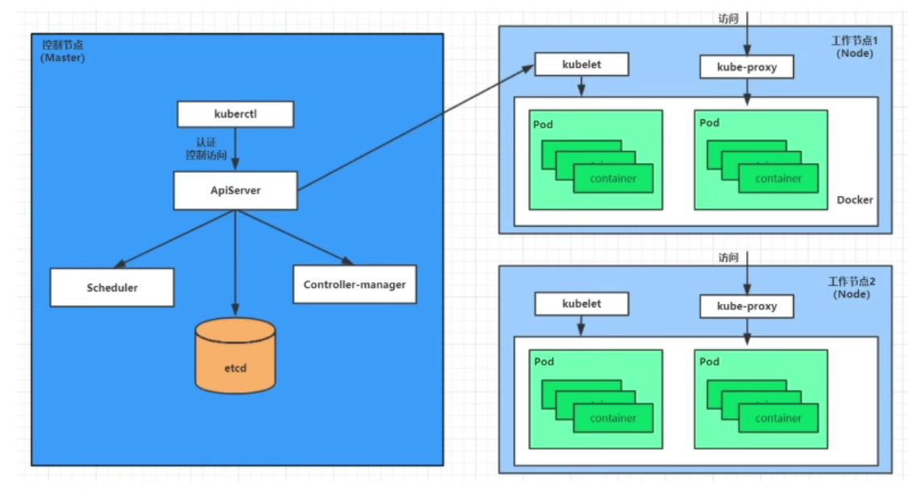
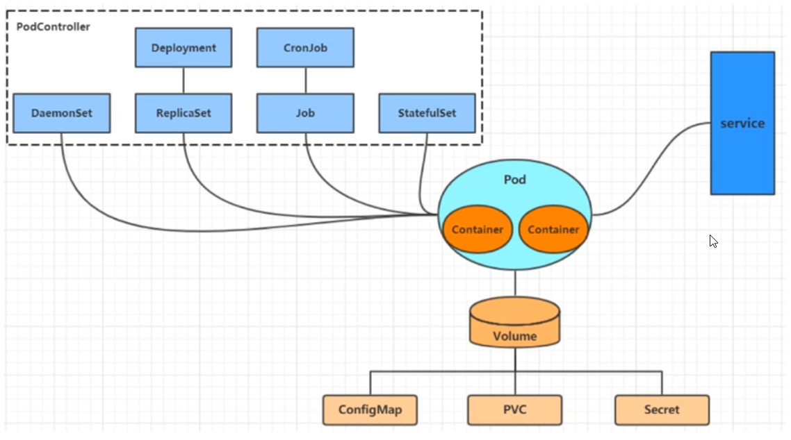
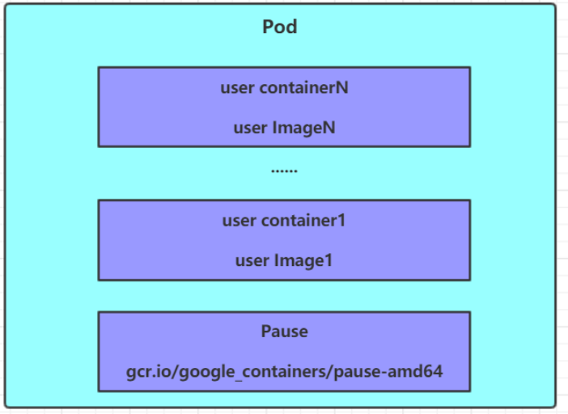

[toc]

# 1. Kubernetes介绍

Kubernetes的本质是一组服务器集群，它可以在集群的每个节点上运行特定的程序，来对节点中的容器进行管理，它的目的是实现资源管理的自动化

## 1.1 Kubernetes提供的功能

* **自我修复**：一旦某一个容器崩溃，能够在1s中左右迅速启动新的容器
* **弹性伸缩**：可以根据需要，对容器数目进行跳转
* **服务发现**：服务可以通过自动发现的形式找到它所依赖的服务
* **负载均衡**：如果一个服务启动了多个容器，能够自动实现请求的负载均衡
* **版本回退**：如果发现新发布的程序版本有问题，可以立即回退到原来的版本
* **存储编排**：可以根据容器自身的需求自动创建存储卷

## 1.2 Kubernetes集群组成

一个Kubernetes集群由 **控制节点(master)**和 **工作节点(node)**构成



### 1.2.1 master

* **ApiServer**：操作集群资源的唯一入口，接收用户命令
* **Scheduler**：负责集群资源调度，按照调度策略选择node节点来运行Pod
* **ControllerManager**：负责维护集群的状态
* **ControllerManager**
* **Etcd**：存储及群众各种资源对象的信息

### 1.2.2 node

* **Kubelet**：负责维护容器的生命周期（通过控制Docker来创建，更新，销毁容器）
* **KubeProxy**：提供集群内部的服务发现和负载均衡
* **Docker**

### 1.2.3 各个组件的调用关系

1. 一旦Kubernetes启动后，master和node都会将自身信息存储到etcd数据库中
2. 一个Nginx服务建立请求发送个master的ApiServer
3. ApiServer调用Scheduler组件来决定把服务安装到哪个node上，此时Scheduler会从etcd读取各个node节点的信息，根据算法进行计算，并将结果告诉ApiServer
4. ApiServer调用Controller-Manager去调度node节点安装Nginx服务
5. node节点的Kubelet接收到指令后，会通知Docker，Docker启动一个Nginx的pod
6. 一个Nginx服务就运行了，如果外界想要访问nginx,就需要通过KubeProxy来对Pord产生访问代理


# 2. 资源管理

Kubernetes将所有内容抽象为**资源**，用户通过操作资源来管理Kubernetes

Kubernetes本质上是一个集群系统，用户可以其中部署各种服务

所谓服务，其实就是一个个容器

Kubernetes最小管理单元是Pod，容器放在Pod中，Kubernetes通过**Pod控制器**管理Pod

Pod可以提供服务之后——通过 **Service资源**来访问Pod中的服务，Kubernetes提供各种 **存储系统**来持久化Pod中程序的数据




## 2.1 YAML语言

如果多段yaml配置放在同一个文件中，中间使用 **---**分割

```yaml
#对象
hxq:
  age: 20
  score: 100
  
#数组
names:
  - "hxq"
  - "mmh"
```

 

## 2.2 Kubernetes资源类型

* **集群级别资源**
  * **nodes**：集群组成服务器
  * **namespaces**：隔离Pod
* **pod资源**
  * **pods**：装载容器
* **pod资源控制器**
  * **relicationcontrollers**：控制Pod资源
  * **replicasets**：控制Pod资源
  * **deployments**：控制Pod资源
  * **daemonset**：控制Pod资源
  * **jobs**：控制Pod资源
  * **cronjobs**：控制Pod资源
  * **horizontalpodautoscalers**：控制Pod资源
  * **statefulsets**：控制Pod资源
* **服务发现资源**
  * **services**：统一pod对外接口
  * **ingress**：统一pod对外接口
* **存储资源**
  * **volumeattachments**：存储
  * **persistentvolumes**：存储
  * **persistentvolumeclaims**：存储
* **配置资源**
  * **configmaps**：配置
  * **secrets**：配置

## 2.3 资源管理方式

* **命令式对象管理**——使用命令，后面跟参数

  ```
  kubectl run nginx-pod --image=nginx --port=80
  ```

* **命令式对象配置**——使用命令，后面跟配置文件

  ```
  kubectl create/patch -f nginx-pod.yaml
  ```

* **声明式对象配置**——通过apply命令和配置文件（只能创建和更新Pod）

  ```
  kubectl apply -f nginx-pod.yaml
  ```

| 类型           | 操作对象 | 使用环境 | 优点           | 缺点                             |
| -------------- | -------- | -------- | -------------- | -------------------------------- |
| 命令式对象管理 | 对象     | 测试     | 简单           | 只能操作对象活动，无法审计，跟踪 |
| 命令式对象配置 | 文件     | 开发     | 可以审计，跟踪 | 操作麻烦                         |
| 声明式对象配置 | 目录     | 开发     | 支持目录操作   | 意外情况下难以调试               |


### 2.3.1 命令式对象管理

#### Kubectl命令

```
kubectl [command] [type] [name] [flags]
command：指定要对资源执行的操作，例如create,get,delete
type：指定资源类型，例如deployment,pod,service
name：指定资源名称
flags：额外的可选参数

kubectl --help可以得到帮助信息
kubectl command --help得到对应command的帮助信息
```


#### get命令

```
#显示所有的pod信息
kubectl get pods

#显示指定pod的信息
kubectl get pod pod_name

#显示所有的pod信息（更详细）
kubectl get pods -o wide

#以Json格式显示信息
kubectl get pods -o json

#以yaml格式显示信息
kubectl get pods -o yaml
```


#### Command汇总

* **基本指令**
  * **create**：创建一个资源
  * **edit**：编辑一个资源
  * **get**：获取一个资源
  * **patch**：更新一个资源
  * **delete**：删除一个资源
  * **explain**：展示资源文档
* **运行和调试**
  * **run**：在容器中运行一个指定的容器
  * **expose**：暴露资源为Service
  * **describe**：显示资源内部信息
  * **logs**：输出容器在pod中的日志
  * **attach**：进入运行的容器
  * **exec**：执行容器中的一个命令
  * **cp**：在Pod内外复制文件
  * **rollout**：管理资源的发布
  * **scale**：扩(缩)容Pod的数量
  * **autoscale**：自动调整Pod的数量
* **其他指令**
  * **apply**：通过文件对资源进行配置
  * **label**：更新资源上的标签
  * **cluster-info**：显示集群信息
  * **version**：Server版本，Client版本
  * **api-resources**：查看资源类型

### 2.3.2 命令式对象配置

```yaml
#配置namespace
apiVersion: v1
kind: Namespace
metadata:
  name: test

---
#配置pod
apiVersion: v1
kind: Pod
metadata:
  name: nginxpod
  namespace: test
spec:
  containers:
  - name: nginx-containers
    image: nginx

```


#### 查看yaml设置的资源

```
kubectl get -f nginxpod.yaml
```


#### 删除yaml设置的资源

```
kubectl delete -f nginxpod.yaml
```


## 2.4 Namespace

实现多套环境的资源隔离

Kubernetes通过将集群内部的资源分配到不同的Namespace中，形成逻辑上的"组"，以方便不同的组中的资源进行隔离使用和管理

还能结合Kubernetes的资源配额限制，限定不同的Pod占用的资源 


```shell
[root@master ~]# kubectl get ns
NAME              STATUS   AGE
default           Active   6h  #所有未指定Namespace的资源都会分配到该Namespace
kube-node-lease   Active   6h  #集群节点之间的心跳维护
kube-public       Active   6h  #此命名空间下的资源可以被所有人访问（包括未认证用户）
kube-system       Active   6h  #所有由Kubernetes系统创建的资源都在这个命名空间中
```


### yaml配置Namespace

```yaml
apiVersion: v1
kind: Namespace
metadata: 
  name: dev
```


## 2.5 Pod

Pod是Kubernetes集群进行管理的最小单元，程序必须部署在容器中，而容器必须存在于Pod中

一个Pod中可以存在一个或多个容器

Kubernetes集群中的各个核心组件都是以Pod方式运行的（在Kube-System命名空间下）

每个Pod中默认都有一个根容器Pause




### 创建并运行

Kubernetes没有提供单独运行Pod的命令，都是通过**Pod控制器**的操作Pod

```
#命令格式 kubectl run (pod控制器名) [参数]
# --image  指定Pod的镜像
# --port   指定端口
# --namespace 指定namespace 
kubectl run nginx --image=nginx --port=80 --namespace test
```


### 配置Pod

```yaml
apiVersion: v1
kind: Pod
metadata:
  name: nginx
  namespace: dev
spec:
  containers:
  - image: nginx:latest
    name: pod
    ports:
    - name: nginx-port
      containerPort: 80
      protocol: TCP
```


## 2.6 Label

Label——在资源上添加标识，用来对资源进行区分和选择

### Label特点

* 一个Label以key/value的形式附加到各种资源上（Node，Pod，Service等）

* 一个资源对象可以定义任意数量的Label

  同一个Label可以被添加到任意数量的资源对象上

```
版本标签："version":"release", "version":"stable"......
环境标签："environment":"dev"，"environment":"test"，"environment":"pro"
架构标签："tier":"frontend"，"tier":"backend
```


### Label Selector

Label Selector用于查询和筛选拥有某些标签的资源对象

```
#给pod打上标签
kubectl label pods pod_name key=value [-n namespace]

#为pod更新标签
kubectl label pods pod_name key=value --overwrite[-n namespace]

#查看标签
kubectl get pods pod_name --show-labels [-n namepsace]

#筛选标签
kubectl get pods -l 标签筛选条件 [--show-labels] [-n namespace]

#删除标签
kubectl label pods pod_name 标签key- [-n namespace]
```


### 配置Label

```yaml
apiVersion: v1
kind: Pod
metadata:
  name: nginx
  namespace: dev
  labels:
    version: "3.0" 
    env: "test"
spec:
  containers:
  - image: nginx:latest
    name: pod
    ports:
    - name: nginx-port
      containerPort: 80
      protocol: TCP
```


## 2.7 Deployment

Pod控制器中的一种


Deployment管理的Pod被删除，Deployment会重新创建一个

### 配置Deployment

```yaml
apiVersion: apps/v1
kind: Deployment
metadata:
  name: nginx
  namespace: dev
spec:
  replicas: 3
  selector:
    matchLabels:
      run: nginx
  template:
    metadata:
      labels:
        run: nginx
    spec:
      containers:
      - image: nginx:latest
        name: nginx
        ports:
        - containerPort: 80
          protocol: TCP
```


## 2.8 Service

每创建一个Pod，都会给其分配一个Pod IP，但是Pod IP会随着Pod重建而变化，并且Pod IP只是集群内部可见的虚拟IP，外部无法访问

通过 **Service**，我们可以让外部访问到Pod——实现服务发现和负载均衡

**--type**

* **ClusterIP**：在集群内部上发布服务，只有集群内部可以访问
* **NodePort**：使用NAT在每个Node的同一个端口上发布服务，可以通过任意Node IP+端口号访问
* **LoadBalancer**：在云环境中（需要云供应商可以支持）创建一个集群外部的负载均衡器，并为使用该负载均衡器的 IP 地址作为服务的访问地址

### 创建集群内部可以访问的Service

```
kubectl expose resource_type resource_name --name=service_name --type=ClusterIP --port=80 --target-port=80 [-n namespace]

--type：如果仅让集群内访问，那么为ClusterIP
--port：指定service暴露出来的端口
--target-port：Pod要暴露出来的端口
```


### 创建集群外可以访问的Service

```
kubectl expose resource_type resource_name --name=service_name --type=NodePort --port=80 --target-port=80 [-n namespace]

--type：如果仅让集群内访问，那么为NodePort
--port：指定service暴露出来的端口
--target-port：Pod要暴露出来的端口

创建成功后，如下显示
NAME                   TYPE       CLUSTER-IP     EXTERNAL-IP   PORT(S)        AGE
nginx-deploy-service   NodePort   10.96.139.97   <none>        80:30790/TCP   2m24s

集群内部可以通过 CLUSTER_IP:80访问
集群外部可以通过 MASTER_PUBLIC_IP:30790访问
```


### 配置Service

```yaml
apiVersion: v1
kind: Service
metadata:
  name: svc-nginx
  namespace: dev
spec:
  clusterIP: 10.109.179.231 #固定svc的内网ip
  ports:
  - port: 80
    protocol: TCP
    targetPort: 80
  selector:
    run: nginx
  type: ClusterIP
```


## 2.9 资源属性

在Kubernetes中，所有资源的一级属性都是一样的

* **apiVersion** ：版本，由kubernetes内部定义，版本号必须可以用 kubectl api-versions 查询到
* **kind** ：类型，由kubernetes内部定义，版本号必须可以用 kubectl api-resources 查询到
* **metadata**： 元数据，主要是资源标识和说明，常用的有name、namespace、labels等
* **spec** ：描述，这是配置中最重要的一部分，里面是对各种资源配置的详细描述
* **status** ：状态信息，里面的内容不需要定义，由kubernetes自动生成

**spec**是重点，**spec**常见的子属性有

* **containers** ：<[]Object> 容器列表，用于定义容器的详细信息
* **nodeName** ：根据nodeName的值将pod调度到指定的Node节点上
* **nodeSelector** ：<map[]> 根据NodeSelector中定义的信息选择将该Pod调度到包含这些label的Node 上
* **hostNetwork** ：是否使用主机网络模式，默认为false，如果设置为true，表示使用宿主机网络
* **volumes** ：<[]Object> 存储卷，用于定义Pod上面挂在的存储信息
* **restartPolicy**： 重启策略，表示Pod在遇到故障的时候的处理策略


# 3. Pod


每个Pod中都包含一个或多个容器，容器可以分为2类

* **用户程序所在的容器**
* **Pause容器**——所有的Pod都有会的一个 **根容器**，其有2个作用
  * **评估整个Pod的健康状态**
  * 其上设置有Pod IP，该Pod的容器都根据此Pod IP来实现Pod通信

按照Pod的创建方式，Pod可以分为两种类型

* **自主式Pod**：kubernetes直接创建出来的Pod，这种pod删除后就没有了，也不会重建
* **Pod控制器创建的Pod**：kubernetes通过控制器创建的pod，这种pod删除了之后还会自动重建


## 3.1 Pod资源清单

```yaml
apiVersion: v1     #必选，版本号，例如v1
kind: Pod       　 #必选，资源类型，例如 Pod
metadata:       　 #必选，元数据
  name: string     #必选，Pod名称
  namespace: string  #Pod所属的命名空间,默认为"default"
  labels:       　　  #自定义标签列表
    - name: string      　          
spec:  #必选，Pod中容器的详细定义
  containers:  #必选，Pod中容器列表
  - name: string   #必选，容器名称
    image: string  #必选，容器的镜像名称
    imagePullPolicy: [ Always|Never|IfNotPresent ]  #获取镜像的策略 
    command: [string]   #容器的启动命令列表，如不指定，使用打包时使用的启动命令
    args: [string]      #容器的启动命令参数列表
    workingDir: string  #容器的工作目录
    volumeMounts:       #挂载到容器内部的存储卷配置
    - name: string      #引用pod定义的共享存储卷的名称，需用volumes[]部分定义的的卷名
      mountPath: string #存储卷在容器内mount的绝对路径，应少于512字符
      readOnly: boolean #是否为只读模式
    ports: #需要暴露的端口库号列表
    - name: string        #端口的名称
      containerPort: int  #容器需要监听的端口号
      hostPort: int       #容器所在主机需要监听的端口号，默认与Container相同
      protocol: string    #端口协议，支持TCP和UDP，默认TCP
    env:   #容器运行前需设置的环境变量列表
    - name: string  #环境变量名称
      value: string #环境变量的值
    resources: #资源限制和请求的设置
      limits:  #资源限制的设置
        cpu: string     #Cpu的限制，单位为core数，将用于docker run --cpu-shares参数
        memory: string  #内存限制，单位可以为Mib/Gib，将用于docker run --memory参数
      requests: #资源请求的设置
        cpu: string    #Cpu请求，容器启动的初始可用数量
        memory: string #内存请求,容器启动的初始可用数量
    lifecycle: #生命周期钩子
        postStart: #容器启动后立即执行此钩子,如果执行失败,会根据重启策略进行重启
        preStop: #容器终止前执行此钩子,无论结果如何,容器都会终止
    livenessProbe:  #对Pod内各容器健康检查的设置，当探测无响应几次后将自动重启该容器
      exec:       　 #对Pod容器内检查方式设置为exec方式
        command: [string]  #exec方式需要制定的命令或脚本
      httpGet:       #对Pod内个容器健康检查方法设置为HttpGet，需要制定Path、port
        path: string
        port: number
        host: string
        scheme: string
        HttpHeaders:
        - name: string
          value: string
      tcpSocket:     #对Pod内个容器健康检查方式设置为tcpSocket方式
         port: number
       initialDelaySeconds: 0       #容器启动完成后首次探测的时间，单位为秒
       timeoutSeconds: 0    　　    #对容器健康检查探测等待响应的超时时间，单位秒，默认1秒
       periodSeconds: 0     　　    #对容器监控检查的定期探测时间设置，单位秒，默认10秒一次
       successThreshold: 0
       failureThreshold: 0
       securityContext:
         privileged: false
  restartPolicy: [Always | Never | OnFailure]  #Pod的重启策略
  nodeName: <string> #设置NodeName表示将该Pod调度到指定到名称的node节点上
  nodeSelector: obeject #设置NodeSelector表示将该Pod调度到包含这个label的node上
  imagePullSecrets: #Pull镜像时使用的secret名称，以key：secretkey格式指定
  - name: string
  hostNetwork: false   #是否使用主机网络模式，默认为false，如果设置为true，表示使用宿主机网络
  volumes:   #在该pod上定义共享存储卷列表
  - name: string    #共享存储卷名称 （volumes类型有很多种）
    emptyDir: {}       #类型为emtyDir的存储卷，与Pod同生命周期的一个临时目录。为空值
    hostPath: string   #类型为hostPath的存储卷，表示挂载Pod所在宿主机的目录
      path: string      　　        #Pod所在宿主机的目录，将被用于同期中mount的目录
    secret:       　　　#类型为secret的存储卷，挂载集群与定义的secret对象到容器内部
      scretname: string  
      items:     
      - key: string
        path: string
    configMap:         #类型为configMap的存储卷，挂载预定义的configMap对象到容器内部
      name: string
      items:
      - key: string
        path: string
```

## 3.2 Pod配置

Pod配置最主要的是 **Pod.spec.containers属性**

```yaml
[root@k8s-master01 ~]# kubectl explain pod.spec.containers
KIND:     Pod
VERSION:  v1
RESOURCE: containers <[]Object>   # 数组，代表可以有多个容器
FIELDS:
   name  <string>     # 容器名称
   image <string>     # 容器需要的镜像地址
   imagePullPolicy  <string> # 镜像拉取策略 
   command  <[]string> # 容器的启动命令列表，如不指定，使用打包时使用的启动命令
   args     <[]string> # 容器的启动命令需要的参数列表
   env      <[]Object> # 容器环境变量的配置
   ports    <[]Object>     # 容器需要暴露的端口号列表
   resources <Object>      # 资源限制和资源请求的设置
```


### 3.2.1 imagePullPolicy

* **Always**：总是从远程仓库拉取镜像（一直远程下载）
* **IfNotPresent**：本地有则使用本地镜像，本地没有则从远程仓库拉取镜像（本地有就本地 本地没远程下载）
* **Never**：只使用本地镜像，从不去远程仓库拉取，本地没有就报错 （一直使用本地）

> 默认值说明：
>
> 如果镜像tag为具体版本号， 默认策略是：IfNotPresent
>
> 如果镜像tag为：latest（最终版本） ，默认策略是always


### 3.2.2 command和args

容器创建后执行

>特别说明：
>    通过上面发现command已经可以完成启动命令和传递参数的功能，为什么这里还要提供一个args选项，用于传递参数呢?这其实跟docker有点关系，kubernetes中的command、args两项其实是实现覆盖Dockerfile中ENTRYPOINT的功能。
> 1 如果command和args均没有写，那么用Dockerfile的配置。
> 2 如果command写了，但args没有写，那么Dockerfile默认的配置会被忽略，执行输入的command
> 3 如果command没写，但args写了，那么Dockerfile中配置的ENTRYPOINT的命令会被执行，使用当前args的参数
> 4 如果command和args都写了，那么Dockerfile的配置被忽略，执行command并追加上args参数


### 3.2.3 env

配置容器中的环境变量

```yaml
apiVersion: v1
kind: Pod
metadata:
  name: pod-env
  namespace: dev
spec:
  containers:
  - name: busybox
    image: busybox:1.30
    command: ["/bin/sh","-c","while true;do /bin/echo $(date +%T);sleep 60; done;"]
    env: # 设置环境变量列表
    - name: "username"
      value: "admin"
    - name: "password"
      value: "123456"
```


### 3.2.4 ports

ports的子属性有

```yaml
KIND:     Pod
VERSION:  v1
RESOURCE: ports <[]Object>
FIELDS:
   name         <string>  # 端口名称，如果指定，必须保证name在pod中是唯一的		
   containerPort<integer> # 容器暴露出来的端口
   hostPort     <integer> # 容器要在主机上公开的端口，如果设置，主机上只能运行容器的一个副本(一般省略) 
   hostIP       <string>  # 要将外部端口绑定到的主机IP(一般省略)
   protocol     <string>  # 端口协议。必须是UDP、TCP或SCTP。默认为“TCP”。
```

集群内部可以通过 **PodIP:containerPort**访问Pod内的容器


### 3.2.5 resources

对容器进行资源配额，有两个子属性

* **limits**：用于限制运行时容器的最大占用资源，当容器占用资源超过limits时会被终止，并进行重启
* **requests** ：用于设置容器需要的最小资源，如果环境资源不够，容器将无法启动

```yaml
apiVersion: v1
kind: Pod
metadata:
  name: pod-resources
  namespace: dev
spec:
  containers:
  - name: nginx
    image: nginx:1.17.1
    resources: # 资源配额
      limits:  # 限制资源（上限）
        cpu: "2" # CPU限制，单位是core数
        memory: "10Gi" # 内存限制
      requests: # 请求资源（下限）
        cpu: "1"  # CPU限制，单位是core数
        memory: "10Mi"  # 内存限制
```

>- cpu：core数，可以为整数或小数
>- memory： 内存大小，可以使用Gi、Mi、G、M等形式


## 3.3 Pod生命周期

1. **Pod创建过程**
2. 运行 **初始化容器**过程
3. 运行 **主容器**过程
   * 主容器运行前——>执行post start
   * 主容器运行时——>不断进行容器存活性探测和就绪性探测
   * 主容器停止运行前——>执行pre stop
4. **Pod终止过程**


### 3.3.1 pod的创建过程

1. 用户提交创建pod请求给ApiServer
2. ApiServer生成pod信息，存入etcd，返回确认信息给client
3. ApiServer开始反映etcd中pod对象的变化，其他组件通过watch机制来跟踪检查ApiServer上的变动
4. Scheduler发现有新的Pod要创建，为Pod分配主机，并将结果发送给ApiServer
5. Node节点上的Kubelet发现有Pod要调度过来，尝试调用Docker启动容器，并将结果发给ApiServer
6. ApiServer将接收到的Pod信息存入etcd

### 3.3.2 pod终止过程

1. 用户提交删除pod请求给ApiServer
2. ApiServer将Pod标记为terminating状态（ApiServer会给Pod一个宽限期(30s))
3. node上的kubelet检测到pod对象转变为terminating状态——启动Pod终止过程
4. Pod控制器监控到Pod的终止行为，将其从对应的Service的Pod列表中移除
5. 如果Pod定义了pre Stop，那么标记为terminating后会执行pre stop
6. Pod中的容器收到停止信息，开始停止容器
7. 如果宽限期到了，Pod中还有容器在运行，那么Pod会收到立即终止的信号
8. kubelet请求ApiServer在Pod的宽限期设为0完成删除操作，此时Pod对用户不可见

### 3.3.3 运行 **初始化容器**过程

**初始化容器**——在Pod的 主容器启动之前要运行的容器

* 初始化容器必须运行完成直到结束，若某初始化容器运行失败，那么Kubernetes需要重启它直到成功
* 初始化容器必须按照定义的顺序依次执行

#### **初始化容器作用**

* 提供主容器镜像中不具备的工具程序或自定义代码
* 初始化容器要先于应用容器串行启动并运行完成，因此可用于延后应用容器的启动直至其依赖的条件得到满足

#### 初始化容器配置

```yaml
apiVersion: v1
kind: Pod
metadata:
  name: pod-initcontainer
  namespace: dev
spec:
  containers:
  - name: main-container
    image: nginx:1.17.1
    ports: 
    - name: nginx-port
      containerPort: 80
  initContainers:
  - name: test-mysql
    image: busybox:1.30
    command: ['sh', '-c', 'until ping 192.168.90.14 -c 1 ; do echo waiting for mysql...; sleep 2; done;']
  - name: test-redis
    image: busybox:1.30
    command: ['sh', '-c', 'until ping 192.168.90.15 -c 1 ; do echo waiting for reids...; sleep 2; done;']
```

### 3.3.4 hook

hook支持三种方式定义操作

#### exec指令

```yaml
 lifecycle:
    postStart: 
      exec:
        command:
        - cat
        - /tmp/healthy
```


#### TCPSocket指令

```yaml
lifecycle:
    postStart:
      tcpSocket:
        port: 8080
```


#### HTTPGet指令

```yaml
  lifecycle:
    postStart:
      httpGet:
        path: / #URI地址
        port: 80 #端口号
        host: 192.168.5.3 #主机地址
        scheme: HTTP #支持的协议，http或者https
```


### 3.3.5 容器探测

* liveness probes：存活性探针，用于检测容器是否处于正在运行状态，如果不是，k8s执行Pod的重启策略
* readiness probes：就绪性探针，用于检测Pod是否可以接受请求，如果不能，k8s不会转发流量

**支持三种探测方式**

* **exec命令**

  ```yaml
    livenessProbe:
      exec:
        command:
        - cat
        - /tmp/healthy
  ```

* **TCPSocket**

  ```yaml
    livenessProbe:
      tcpSocket:
        port: 8080
  ```

* **HTTPGet**

  ```yaml
    livenessProbe:
      httpGet:
        path: / #URI地址
        port: 80 #端口号
        host: 127.0.0.1 #主机地址
        scheme: HTTP #支持的协议，http或者https
  ```


**以livenessProbe为例，其下还有一些配置**

* initialDelaySeconds：容器启动后等待多少秒执行第一次探测
* timeoutSeconds：探测超时时间（默认1s，最小1s）
* periodSeconds：执行探测的频率（默认是10s，最小1s）
* failureThreshold：连续探测失败多少次才被认定为失败（默认为3，最小值为1）
* successThreshold：连续探测成功多少次才被认定为成功（默认为1）


**如果livenessProbe探测失败，那么k8s执行Pod设定的重启策略——重启策略有三种**

* **Always**：容器失效时，自动重启该容器（默认值）

* **OnFailuer**：容器终止运行且退出码不为0时重启

* **Never**：不重启容器

  ```yaml
  apiVersion: v1
  kind: Pod
  metadata:
    name: pod-restartpolicy
    namespace: dev
  spec:
    containers:
    - name: nginx
      image: nginx:1.17.1
      ports:
      - name: nginx-port
        containerPort: 80
      livenessProbe:
        httpGet:
          scheme: HTTP
          port: 80
          path: /hello
    restartPolicy: Never # 设置重启策略为Never
  ```

  

## 3.4 Pod调度

Pod在哪个Node上，默认由Scheduler计算出，k8s提供了4种调度方式

* **自动调度**
* **定向调度**
* **亲和性调度**
* **污点(容忍)调度**

### 3.4.1 自动调度

由Scheduler计算得出

### 3.4.2 定向调度

在Pod上声明 **nodeName**或**nodeSelector**——>**强制调度**(即使指定的Node不存在，也会执行调度，但是会报错)

#### nodeName

```yaml
apiVersion: v1
kind: Pod
metadata:
  name: pod-nodename
  namespace: dev
spec:
  containers:
  - name: nginx
    image: nginx:1.17.1
  nodeName: node1 # 指定调度到node1节点上
```

#### nodeSelector

为Node添加标签

```yaml
apiVersion: v1
kind: Pod
metadata:
  name: pod-nodeselector
  namespace: dev
spec:
  containers:
  - name: nginx
    image: nginx:1.17.1
  nodeSelector: 
    nodeenv: pro # 指定调度到具有nodeenv=pro标签的节点上
```

### 3.4.3 亲和性调度

**亲和性**：如果两个应用频繁交互，那么有必要利用亲和性让两个应用尽可能的靠近，减少网络IO

**反亲和性**：当应用采用多副本部署时，有必要采用反亲和性将各个应用实例分散到各个node上，提高服务的可用性


**亲和性调度**分为三类

* **nodeAffinity(node亲和性)**

  以node为目标，让pod尽可能的与node亲和

* **podAffinity(pod亲和性)**

  以pod为目标，让pod之间尽可能亲和

* **podAntiAffinity(pod反亲和性)**

  以pod为目标，让pod之间尽可能反亲和


#### NodeAffinity

* 如果同时定义了nodeSelector和nodeAffinity，那么必须两个条件都得到满足，Pod才能运行在指定的Node上
* 如果nodeAffinity指定了多个nodeSelectorTerms，那么只需要其中一个能够匹配成功即可
* 如果一个nodeSelectorTerms中有多个matchExpressions ，则一个节点必须满足所有的才能匹配成功

```yaml
pod:
  spec:
    affinity:
      nodeAffinity:
        requiredDuringSchedulingIngnoredDuringExecution: #Node节点必须满足的条件，不满足的Node不考虑
          nodeSelectorTerms: #node选择列表
            matchFields: #要求node拥有这些field
            matchExpressions: #要求node拥有如下标签
              key: #键
              value: #值
              operator: #操作符
        preferredDuringSchedulingIgnoredDuringExecution: #优先调度到满足指令规则的Node上(倾向)
          preference: 
            matchFields: 
            matchExpressions: 
              key: #键
              value: #值
              operator: #操作符
          weight: #倾向权重
```

```yaml
apiVersion: v1
kind: Pod
metadata:
  name: pod-nodeaffinity-required
  namespace: dev
spec:
  containers:
  - name: nginx
    image: nginx:1.17.1
  affinity:  #亲和性设置
    nodeAffinity: #设置node亲和性
      requiredDuringSchedulingIgnoredDuringExecution: # 硬限制
        nodeSelectorTerms:
        - matchExpressions: # 匹配env的值在["xxx","yyy"]中的标签
          - key: nodeenv
            operator: In
            values: ["xxx","yyy"]
```

```yaml
apiVersion: v1
kind: Pod
metadata:
  name: pod-nodeaffinity-preferred
  namespace: dev
spec:
  containers:
  - name: nginx
    image: nginx:1.17.1
  affinity:  #亲和性设置
    nodeAffinity: #设置node亲和性
      preferredDuringSchedulingIgnoredDuringExecution: # 软限制
      - weight: 1
        preference:
          matchExpressions: # 匹配env的值在["xxx","yyy"]中的标签(当前环境没有)
          - key: nodeenv
            operator: In
            values: ["xxx","yyy"]
```


