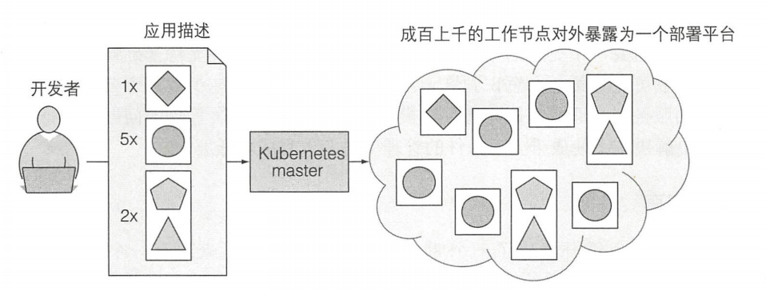
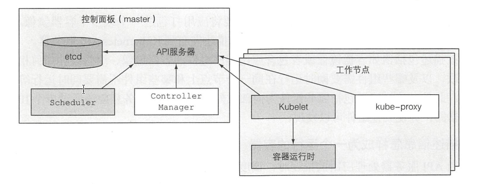
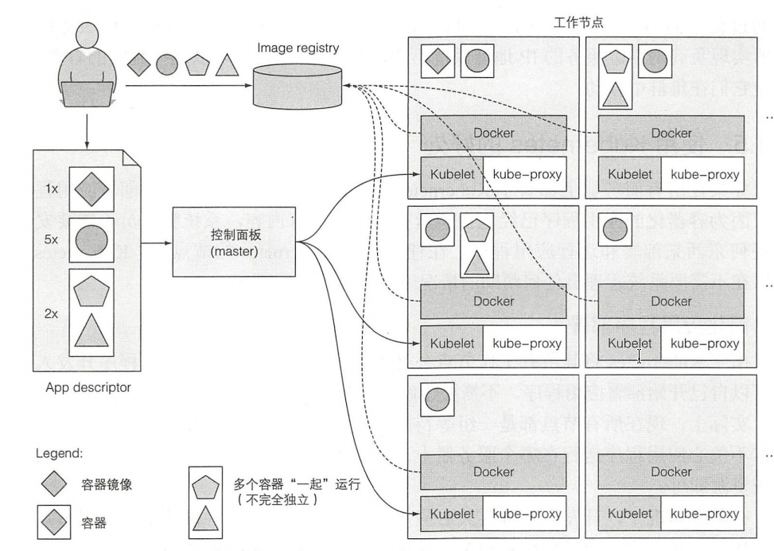

[toc]

### 1. Kubernetes核心功能

Kubernetes集群由 **主节点**和 **工作节点**组成

所有的 **工作节点**对外暴露为一个 **部署平台**

**主节点**用于承载**Kubernetes master(控制面板)**

开发者将 **应用描述**提交给 **Kubernetes master**，**Kubernetes master**会挑选适合的工作节点来部署引用

### 2. Kubernetes集群架构

Kubernetes集群有许多 **节点**组成，节点分为 **主节点**与 **工作节点**

* **主节点**：负责承载 **Kubernetes master(控制面板)**
* **工作节点**：用于部署应用，所有的工作节点对外暴露为一个 **部署平台**

#### 2.1 Kubernetes master

Kubernetes master，拥有控制集群，由多个组件组成，**每个组件**运行在**单个主节点**上 或者**通过副本部署在多个主节点**上

* **Kubernetes API服务器**

  负责Kubernetes master组件之间的通信，工作节点与主节点之间的通信

* **Scheculer**

  调度器，用于调度一个工作节点来部署应用

* **Controller Manager**

  执行 群级别的功能，如复制组件、持续跟踪工作节点，处理节点失败等

* **etcd**

  一个可靠的分布式数据存储，它能持久化存储集群配置

#### 2.2 工作节点

* **容器运行时**

  Docker等容器组件

* **Kubelet**

  负责工作节点与API服务器的通信

* **Kubernetes Service Proxy(kube-proxy)**

  负责组件之间的负载均衡网络流量

### 3. Kubernetes运行应用

#### 3.1 部署应用

1. 将4个应用的镜像上传到镜像仓库
2. 将应用描述发送给master（4个应用分为3个pod，每个pod的数量也说明了）
3. master中的API 服务器处理应用描述时，Scheduler通过调度，将每个pod的指定数量调度到工作节点上(发送消息通知给工作节点的Kubelet)
4. 工作节点上的Kubelet告知Docker从镜像仓库拉取镜像并运行容器

#### 3.2 保持容器运行

一旦应用运行起来，Kubernetes会不断确认应用的部署状态与提供的描述一致

**例如**

* 如果你指出你需要运行五个 web 服务器实例，那么Kubernetes 总是保持正好运行五个实例。如果实例之一停止了正常工作，比如当进程崩溃或停止响应时， Kubernetes 将自动重启它

* 如果整个工作节点死亡或无法访问， Kubernetes 将为在故障节点上运行的所有容器选择新节点，并在新选择的节点上运行它们

#### 3.3 动态伸缩

应用运行时，可以决定要增加还是减少应用的副本数，可以人工操作也可以交给Kubernetes（Kubernetes可以根据实时指标（如 CPU 负载、内存消耗、每秒 询或应用程序公开的任何其他指标）自动调整副本数）

#### 3.4 容器在集群中移动，但仍可提供服务

Kubernetes可能会在集群中迁移容器，如何保证容器迁移的同时，仍可以对外提供服务呢？

告诉Kubernetes哪些容器提供相同的服务——Kubernetes通过一个静态IP来暴露这些容器

并把这个IP暴露给集群中的所有应用，外界客户端通过DNS查找IP来调用服务——即使这些容器迁移，也可以提供服务

