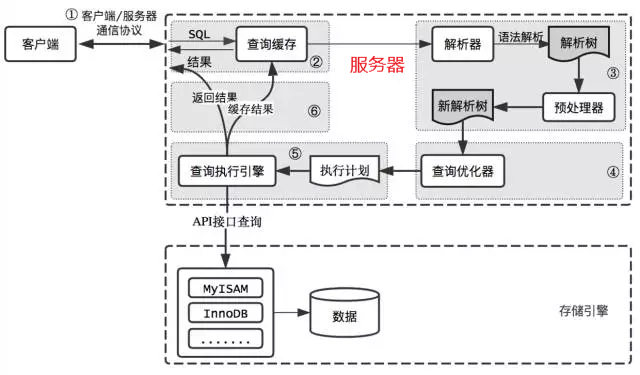

  
* **MySQL分为三层**
  * **连接层**：(客户端和一些连接服务，完成连接处理，授权认证，安全等功能
  * **核心服务**：查询缓存，解析器，优化器，内置函数，存储过程，视图，触发器等  
  * **存储引擎**：负责MySQL数据的存储和提取，向服务器提供存储引擎接口，可以访问磁盘和内存  

* **MySQL存储过程**   
   * **①客户端/服务器连接通信**   
     * MySQL服务器中的连接器处理MySQL客户端连接请求，随机双方进行通信
     * MySQl客户端/服务器通信是**半双工**的——任意时刻，要么客户端向服务器发送信息，要么服务器向客户端发送信息，不能同时进行    
     * 客户端用**一个数据包**将请求发送给服务器，如果数据过程，服务器会抛弃掉一些数据   
     * 服务器用**多个数据包**向客户端发送信息，客户端必须完整的接收这些数据——所以尽量保持查询简单且只返回必需的数据，减小通信间数据包的大小和数量是一个非常好的习惯，这也是查询中尽量避免使用SELECT *以及加上LIMIT限制的原因之一。
   * **②查询缓存(一般不建议开，MySQL8.0后移除该功能)**   
     * 在进行③前，如果**查询缓存**是打开的话，MySQL会检查查询语句是否命中缓存里的数据，如果命中就返回缓存里的数据   
     * MySQL将缓存存放在一个引用表中，通过一个哈希值来索引，这个哈希值通过查询本身、当前要查询的数据库、客户端协议版本号等信息计算得来。所以两个查询在任何字符上的不同（例如：空格、注释），都会导致缓存不会命中。   
     * 如果查询中包含任何用户自定义函数、存储函数、用户变量、临时表、MySQL库中的系统表，其查询结果都不会被缓存   
     * **缓存失效**：MySQL的缓存查询系统会跟踪查询中涉及的每个表，当某张表发生变化，和这张表相关的所有缓存数据都会失效    
     * **缓存对写操作的影响**：对于写操作，每个执行写操作时，写操作涉及的表的所有缓存都会被设置为失效    
     * **缓存对读操作的影响读操作——额外开销**  
        * 任何查询语句在开始前，都要检查缓存，即使这条查询永不会命中缓存 
        * 如果查询结果可以被缓存，那么执行完成后，将查询结果存入缓存  
   * **③语法解析和预处理**   
     * **语法解析**  
       MySQL通过关键字将SQL语句进行解析，生成一颗对应的解析树   
     * **预处理**  
       预处理则会根据MySQL语法规则进一步检查解析树是否合法
   * **④查询优化**   
     **解析**树由**查询优化器**转化为**执行计划**   
     一条查询语句有很多种执行计划，优化器就是找到其中最好的执行计划(成本最低)
   * **⑤执行器**   
     执行器根据**执行计划**中的指令，调用存储引擎提供的接口，查询执行引擎，得出结果
   * **⑥返回结果给客户端**  
     如果缓存打开，并且查询结果可以被缓存，那么查询结果会存储到缓存中   
     结果集返回给客户端是一个**增量并且逐步返回**的过程，可能在MySQL产生第一条结果时，就开始向客户端返回结果集   