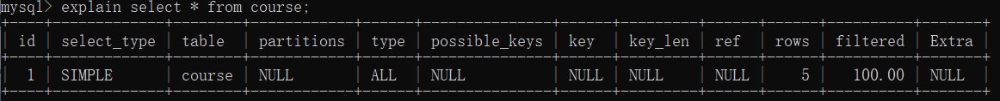

一条SQL语句执行的过程中  
①会先由解析器解析为语法树  
②然后预处理器会根据MySQL规则检查语法树是否合法    
③一条SQL语句有多种执行计划，接下来由优化器找到该SQL语句最好的执行计划  
④根据执行计划中的指令，查询存储引擎，得到结果   

**1. explain关键字**  
explain模拟优化器来执行SQL语句，让我们知道SQL语句在执行过程中，最后选用的是哪一个执行计划    

**2. explain用法**  
explain +select查询语句    
    

通过explain我们可以知道
* 表的读取顺序  
* 数据读取操作的操作类型
* 哪些索引可以使用
* 哪些索引被实际使用
* 表之间的引用
* 每张表有多少行被优化器查询

**3. explain输出列分析**   
分析select的性能
* **id**：   
  用来指示表的读取顺序  
  * id相同，执行顺序由上至下  
  * id不同，id大的优先级高，最小被执行(例子：子查询) 
  

* **select_type**：   
  指示查询类型  
  * **SIMPLE**:  
    简单的select查询，查询中不包含子查询或UNION
  * **PRIMARY**:   
    查询中若包含任何复杂的子部分，那么最外层的查询为PRIMARY
  * **SUBQUERY**:   
    子查询部分的select
  * **DERIUED**:  
    衍生，FROM中包含的子查询 会生成一张临时表，这张临时表标记为DERIVED
  * **UNION** :   
    如果第二个select出现在UNION之后，则被标记为UNION；若UNION包含在FROm字句的子查询中，外层SELECT被标记为DERIVED
  * **UNION RESULT**:     
    由UNION表获取结果的select
  
    
* **table**：   
  该行explain属于哪张表
  

* **type**：    
  显示查询使用了哪种类型，性能：system>const>eq_ref>ref>range>index>ALL   
  一般来说，得保证查询至少达到range级别，最好到ref  
  * **ALL**:   
    **(没有使用索引)**，标识该select语句，全表扫描，从磁盘遍历读取全表
  * **INDEX**：   
    **(使用了索引)**，也是读取全表，不过这个是通过**遍历索引树**来读取全表
  * **range**：   
    **(使用了索引)**，**对于一个索引键**，检索给定索引键值范围的行，一般就是where中出现between，in,<,>等
  * **ref**：    
    **(使用了索引)**，非唯一性索引扫描，**对于一个索引键**，表中有多条记录与之匹配，返回这多条记录  
  * **eq_ref**：    
    **(使用了索引)**，唯一性索引扫描，**对于一个索引键**，表中只有一条记录与之匹配，常见于主键索引扫描/唯一索引扫描
  * **const,system**:    
    **(使用了索引)**，
    * **const**:   
      通过索引一次就找到了，const用于比较primary key 或者unique索引
    * **system**:    
      const的特里，表中只有一条记录
  

* **possible_keys**:    
  显示可能会用在这张表中的索引，一个或多个，查询设计的字段上若存在索引，则该索引会被列出，但不一定会被使用
* **key**：   
  实际使用的索引，如果为NULL，则没有使用索引    
  如果查询中使用了覆盖索引，则该索引仅出现在key列表中，不会出现在possible_keys中      
* key_len   
  表示索引中使用的字节数，可通过该列计算查询中使用的索引的长度，长度越短越好   
* ref   
  使用某个索引来查找时，表示哪些列或者常量用来与这个索引进行比较    
* rows   
  估算出找到所需的记录要读取的行数
* Extra     
  额外信息
  * **Using filesort**    
    MySQL无法利用索引完成的排序称为“文件排序”(降低性能)  
  * **Using temporary**   
    使用临时表保存中间结果，常见于order by和group by(严重降低性能 )
  * **Using Index**    
    表示select操作使用了**覆盖索引**，避免访问表的数据，**效率不错**   
    如果同时出现Using Where，表示通过覆盖索引来查找符合条件的记录  
    如果没有出现Using Where，表示通过覆盖索引来遍历记录
  * Using where   
    表示使用了where进行过滤  
  * Using join buffer   
    使用了连接缓存  
  * impossible where  
    where字句结果总是false