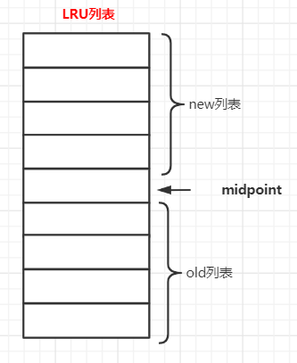

**InnoBD基于页的方式对数据进行管理（页大小默认16KB）**


* **缓冲池**：以页为单位进行空间分配

  * 一个InnoDB内存可以有多个缓冲池——通过**参数innodb_buffer_pool_instances**设置

  ```
  show engine innodb status;//查看缓冲池的使用情况
  
  显示的信息中
  Buffer pool size //缓冲池大小
  Free buffers //Free列表的可用页数量
  DataBase pages //LRU列表中的页数
  Modified db pages //Flush列表中的页数
  Page made young XX,non-young XX //发生page made young，page not made young的次数
  Buffer pool hit rate //表示缓冲池的命中率，最好95%以上
  ```

  

* **Free列表**：缓存池中的可用页

* **LRU列表**：因为其采用LRU算法，存储已经缓存的数据页/索引页

  * 最频繁使用的页，放在LRU列表的首端，最少使用的页放在LRU列表的尾端

  * 当Free列表没有可用页了，那么就释放LRU列表尾端的页，空出位置来

  * **优化**：LRU插入新页的时候，不是直接放在LRU的首端，而是插入LRU列表的midpoint位置

    * **参数innodb_old_blocks_pct**：决定midpoint的位置

    * midpoint位置前的部分——new列表(new列表中的页都是活跃的热点页)

    * midpoint位置后的部分——old列表

    * **参数innodb_old_blocks_time**：规定 页读取到LRU列表的midpoint位置后，经过多少时间后，从old列表加入到new列表

    * 页从 LRU列表的**old部分**加入到**new部分**时，该操作称为 **page made young**

    * 页无法从 LRU列表的**old部分**加入到**new部分**，称为 **page not made young**

      

* **Flush列表**

  LRU列表中的页被修改后——称为**脏页**

  脏页除了会存储在LRU列表外，还会复制一份存储在Flush列表——Flush列表也程**脏页列表**

  数据库通过**CHECKPOINT机制**将Flush列表中的脏页刷新到磁盘


* **读数据**

  先判断LRU列表是否有要读取的数据所在的页

  * 如果有，从LRU列表直接读取。

  * 如果没有从磁盘读取对应的页A，查看Free列表是否有可用页
    * 如果有，那么从Free列表中移除一个可用页，分配给页A，然后放入LRU列表
    * 如果没有，淘汰LRU列表末尾的页，将该页分配给A

* **修改数据**

  先修改LRU列表上的页，使其成为脏页，并将脏页复制到Flush列表中

  然后通过**CHECKPOINT机制**将Flush列表中的脏页刷新到磁盘上