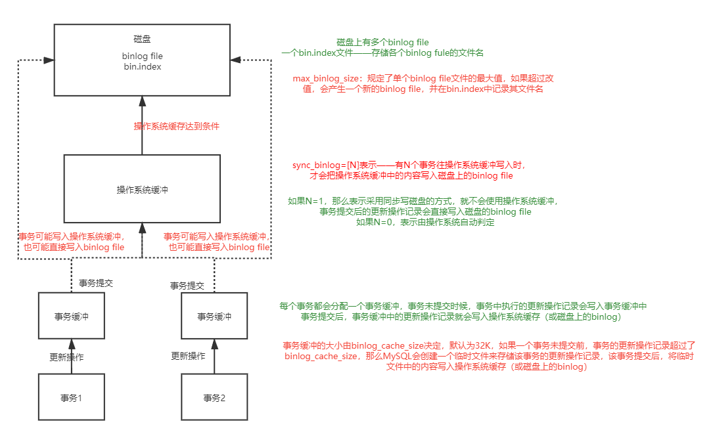

#### 二进制日志

binlog记录了对MySQL数据库所有的更新操作(增，改，删)


* **binlog有两种文件**
  * **binlog file文件**——**名字为X-bin.num **：记录更新操作的信息   
    * X默认为主机名
    * num为序号
    * 一个binlog file写满后，会创建一个新的binlog file，序号+1，并在bin.index记录新的binlog file的路径
  * **bin.index文件**——名字为X-bin.index：记录所有的二进制日志的路径


* **查看当前的binlog file的文件信息**

  ```
  show master status;
  ```


* **查看指定binlog file中记录的更新操作信息**

  ```
  show binlog events in <binlog file文件名>;
  ```


* **二进制日志的作用**
  * **恢复数据**
  * **主从复制**
  * **审计**：用户可以通过二进制日志中的信息进行审计，判断是否有对数据库进行注入的攻击。


* **二进制日志的使用和参数**

  

  * **max_binlog_size**

  * **binlog_cache_size**

    该属性的设置大小必须要合理，可以通过**binlog_cache_use**和**binlog_cache_disk_use**的值来判断binlog_cache_size的大小是否合理

    * **binlog_cache_size**：使用事务缓冲写入binlog的次数，最好尽可能大
    * **binlog_cache_disk_use**：使用临时文件来写入binlog的次数，最好尽可能小

  * **sync_binlog**

  * **binlog-do-db**和**binlog-ignore-db**

    哪些库中的表的更新操作要写入binlog

    哪些库中的表的更新操作不要写入binlog

    两个都默认为空，表示所有数据库的表，其更新操作都要写入binlog

  * **binlog_format**

    二进制日志的格式

    * **STATEMENT**

      二进制日志的格式——基于SQL语句的，但是在主从复制中，如果主服务器运行rand，uuid等函数或者使用了触发器，那么可能会导致主从服务器数据不一致

      同样的，如果隔离等级为READ COMMITTED，也可能导致主从服务器数据不一致

    * **ROW**

      二进制日志的格式——记录表的行的更改情况

      **优点：数据库的恢复和复制有更好的可靠性**

      **缺点：增加二进制日志文件的大小，增加了主从复制的网络开销**

    * **MIXED**

      MySQL在默认情况下采用STATEMENT，一些情况下使用ROW

      * 表的存储引擎为NDB
      * 使用了UUID(),USER(),CURRENT_USER(),FOUND_ROWS(),ROW_COUNT()等不确定函数
      * 使用了 insert delay语句
      * 使用了用户自定义函数
      * 使用了临时表