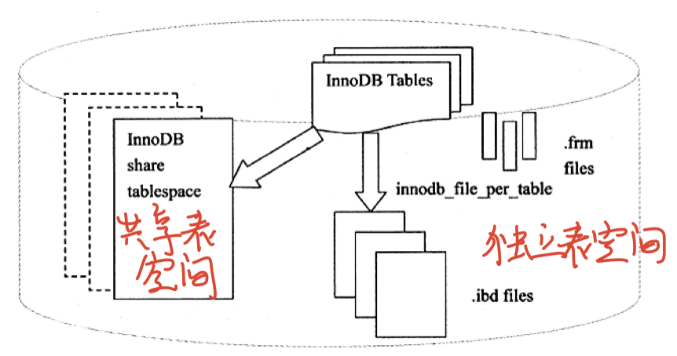

#### 表空间文件

InnoDB将表中的数据按**表空间**进行存放

**两个参数**

* **innodb_data_file_path**

  默认的共享表空间文件的信息

  所有使用了InnoDB引擎的表，其数据都会存储到共享表空间中

  默认的共享表空间文件是一个初始大小为10MB，名为ibdata1的文件

* **innodb_file_per_table**

  设置了该参数后，每个使用了InnoDB引擎的表，都会产生一个独立的表空间文件，名字为**表名.ibd**

* **独立表空间和共享表空间同时使用**

一般情况下，是共享表空间文件和独立表空间文件同时使用

一张使用了InnoDB引擎的表

* 数据，索引和插入缓冲BITMAP等信息存入独立的表空间文件，
* 其余信息存放在共享表空间文件中

