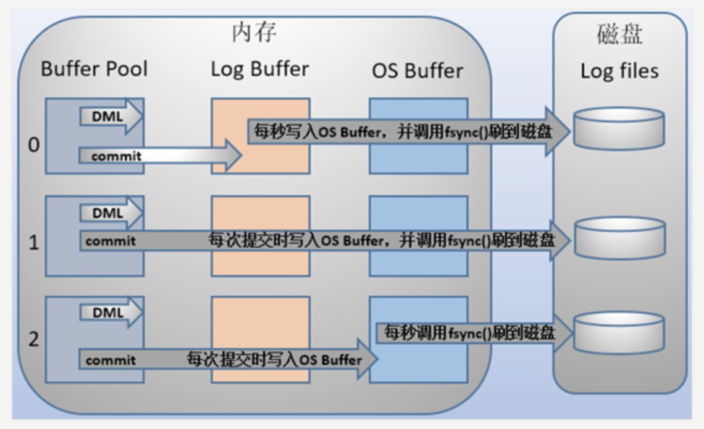

#### 重做日志redo log（只作用于InnoDB表）

* **redo log组成**

  * **redo log buffer**（大小由innodb_log_buffer_size决定）

  * **redo log file**

    InnoBD存储引擎的数据目录下有两个文件——**ib_logfile0**和**ib_logfile1**

    这两个文件就是redo log file

* **redo log的作用**
  1. 记录了事务对每个页做了哪些修改
  2. 保证了事务的持久性——如果数据库宕机了，那么InnoBD存储引擎会使用redo log恢复到数据库宕机前的时刻，来保证数据的完整性

* **innodb_flush_log_at_trx_commit**：指定刷新时机

  * **设置为0**：事务提交时，将log buffer中的内容刷新到
  * **设置为1**：
  * **设置为2**：

  

