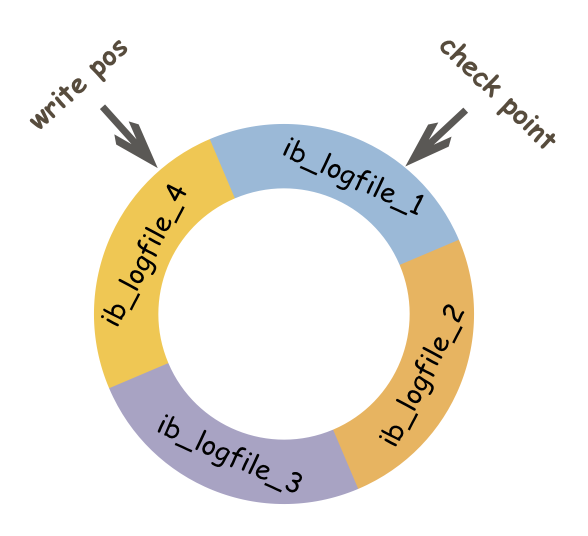

#### 重做日志redo log（只作用于InnoDB表）——保证事务持久性

* **redo log组成**

  * **redo log buffer**（大小由innodb_log_buffer_size决定）

  * **redo log file**

    InnoBD存储引擎的数据目录下有两个文件——**ib_logfile0**和**ib_logfile1**

    这两个文件就是redo log file
    
  * **redo log buffer**和**redo log file**的组成单位都是**redo log block**，一个**redo log block**大小为512字节（与磁盘扇区大小相同，所以对redo log file的写入是原子性的）

  * **redo log block组成**

    * redo log block header（12个字节）
    * redo log block body（0-492个字节）
    * redo log block tailer（8个字节）

* **为什么要有redo log？**

  事务提交时，采用**Write Ahead Log**策略

  ①将修改log写入redo log buffer，redo log buffer按照一定的规则将修改log写入磁盘上的redo log file

  ②修改缓冲池中的页，并复制脏页到Flush列表，当触发Checkpoint条件时，进行Checkpoint操作

  * **redo log是物理日志，记录了使用InnoDB引擎的表的每个数据页更改的物理情况**，如果数据库宕机了，内存中还没刷新到磁盘的脏页丢失，我们也可以通过redo log来恢复数据——保证了**事务的持久性**

* 数据库可以有多个redo log group（InnoDB限制为1个），每个redo log group有多个大小相同的redo log file，采用**循环写入**的策略
  * **redo log file的参数**
    * **innodb_log_file_size**：redo log file文件的大小
    * **innodb_log_files_in_group**：一个redo log group拥有的redo log file个数
    * **innodb_log_group_home_dir**：redo log file的目录

------

接下来我们看两个机制——**redo log的提交机制**  和 **redo log的循环写入机制**

事务commit后，修改log先刷新到内存的redo log buffer中，然后redo log buffer按照一定的规则**（提交机制）**把内容刷新到redo log file中

redo log file有多个，写入redo log file时，采用的是**循环写机制**

* **提交机制**——由**参数innodb_flush_log_at_trx_commit**决定

  * **innodb_flush_log_at_trx_commit**

    * 0：如果数据库宕机，可能导致事务修改的丢失（丧失持久性，最好的性能）

    * 1：如果数据库宕机，不会导致事务修改的丢失（保证持久性，最差的性能）

    * 2：如果数据库宕机，不会导致事务修改的丢失，可以从OS Buffer读取redo log

      ​      如果操作系统也宕机，那么会导致事务修改的丢失（丧失持久性，较好的性能）

* **循环写入机制**

  * **LSN**(Log Sequence Number)：日志序列号，长度为8个字节

    LSN出现的位置有

    * 表示redo log file含有的字节总数
    * 每页的头部有一个值——FIL_PAGE_LSN，记录该页的LSN，表示该页该页最后刷新时的LSN大小
    * checkpoint：最后一个刷新到磁盘的脏页的LSN
    * redo log file中记录了每个页的log与其LSN，根据每个页的LSN与checkpoint的大小关系，来判断页的log是否有效
    * wrtie pos：最后一次写入redo log file的页的LSN

  * **循环写入**

    *  redo log file中如果某页的LSN<checkpoint——该页位于wrtie pos顺时针到checkpoint的位置——该页是无效的，可以被覆写，通过redo log恢复数据时会忽略该页
    * redo log file中如果某页的LSN>checkpoint——该页位于check point顺时针到write pos的位置——该页是有效的，通过redo log恢复数据时会读取该页
    * 修改数据时，会先把修改log写入redo log file，写入的位置从write pos开始——write pos移动
    * 内存缓冲区触发**Checkpoint操作**时，会把脏页刷新到磁盘上，同时会让脏页在redo log file中对应log失效——也就是让check point移动

  

  

  

