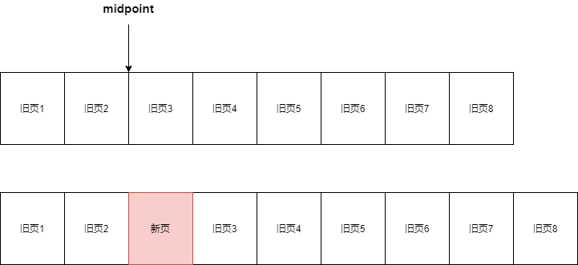
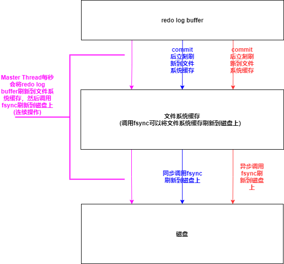
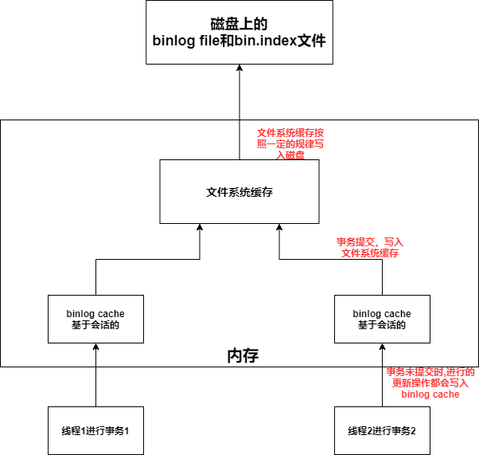
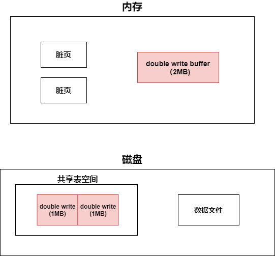

[toc]


## 0. InnoDB整体体系结构，InnoDB存储引擎组成


**InnoDB存储引擎由三个部分组成**

* **后台线程**
* **InnoDB存储引擎内存池**
* **文件**


* **磁盘**以**扇区**为最小存储单位，**一个扇区512B**
* **文件系统**以**块**为最小存储单位，**一个块4KB**
* **InnoDB**以**页**为最小存储单位，**一个页16KB**


## 1. InnoDB组成—后台线程

后台线程——保证缓冲池中的内存缓存时最近的数据；将已修改的数据在合适的时机刷新到磁盘；保证数据库崩溃也能恢复

### 1.1 Master Thread

分为多个循环——**主循环(loop)，后台循环(background loop)，刷新循环(flush loop)，暂停循环**


#### 1.1.1 InnoDB 1.0.X版本之前

```c
void master_thread(){
    goto loop;
        
-----------------------------------------------------------------------------
loop://主循环
//每秒一次的操作
for(int i=0;i<10;i+=1){
    thread.sleep(1);
    
    //将redo log buffer刷新到磁盘(总是)
    do_flush_redo_log_buffer_to_disk;
    
    //如果过去1s的IO次数<5——合并5个insert buffer
    if(last_one_second_io<5){
        merge_at_most_5_insert_buffer;
    }
    
    如果缓冲区中脏页的比例超过了阈值，刷新100个脏页到磁盘中
    
    //如果当前没有用户活跃，跳转到后台循环
    if(no_user_activity){
        goto backgroud loop
    }
}
    
//每10秒一次的操作

如果过去10s的IO<200次,刷新200个脏页到磁盘中

//合并最多5个insert buffer
merge_at_most_5_insert_buffer;
    
//将redo log buffer刷新到磁盘(总是)
do_flush_redo_log_buffer_to_disk;
    
//回收无用的Undo页
do_full_purge;

如果缓冲区中脏页的比例>70%%，刷新100个脏页，否则刷新10个脏页
    
//所有操作再来一次
goto loop;
    
-----------------------------------------------------------------------------------------------------------
//后台循环
background loop:

//回收无用的Undo页
do_full_purge;

//合并20个insert buffer
merge_20_insert_buffer;

如果数据库不闲置，跳转到主循环loop，否则进行刷新循环flush loop

------------------------------------------------------------------------------------------------------
//刷新循环
flush loop:
    将100个脏页刷新到磁盘
    
    如果脏页的比例大于阈值，再次进入flush loop，否则进入 suspend loop暂停循环
-------------------------------------------------------------------------------------------------------
//暂停循环
suspend loop:
将Master Thread挂起，等待事件发生，时间发生后，跳转到loop主循环


}

```

#### 1.1.2 InnoDB 1.0.X版本

* 提供了参数 **innodb_io_capacity**——表示磁盘IO的吞吐量，默认值200
* **innodb_adaptive_flushing**——自适应刷新，影响每秒刷新脏页的数量
* **innodb_purge_batch_size**——每次full purge回收Undo页的数目


### 1.3 Purge Thread

InnoDB存储引擎使用了大量的AIO操作来处理写IO请求，IO Thread负责写IO请求的回调

### 1.3 Purge Thread

Purge Thread负责回收undo页

### 1.4 Page Cleaner Thread

InnoDB1.2.x后出现，分担Master Thread的工作，负责将脏页刷新到磁盘中


## 2. InnoDB组成—InnoDB存储引擎内存池

**InnoDB存储引擎的内存池由以下部分组成**

* **缓冲池**

  缓冲池的基本单位是页，一个页16KB

* **redo log buffer**

* **额外内存池**

* **double write buffer**


### 2.0 内存在读写操作中的使用

#### 2.0.1 读操作

从磁盘读取文件数据是整页整页的读

查询时，先检查要查询的数据所在的页是否在缓冲池中

如果在——命中，从缓冲池读取该页

如果不在——从磁盘读取页数据，将页存放在缓冲池中

#### 2.0.2 写操作

直接修改缓冲池中的页，通过Checkpoint机制将脏页刷新回磁盘


### 2.1 缓冲池组成

* **缓冲池**以**页(默认大小16KB)**为单位来组织数据，其中存放着**各种类型的页**，如下

  * **数据页(data page)**
  * **索引页(index page)**
  * **undo page**
  * **insert buffer**
  * **数据字典信息(data dictionary)**
  * **lock info**
  * **自适应哈希索引**

* 缓冲池的大小由 **innodb_buffer_pool_size**决定

  缓冲池的数目由 **innodb_buffer_pool_instances**决定
  
* 缓冲池中有个**哈希表**，存取缓冲池中的页通过 **哈希表**实现O(1)操作

### 2.2 缓冲池管理

**缓冲池**以**页(一个页16KB)**为单位来组织数据，其中存放着**各种类型的页**，InnoDB通过**LRU列表**，**Free列表**，**Flush列表**对缓冲池进行管理


#### 2.2.1 LRU列表——管理正在使用的页

* 缓冲池中，正在使用的页会形成一个LRU列表

  最频繁使用的页在LRU列表前端，最少使用的页在LRU末端

* 新的页插入LRU列表并不是插入LRU的首部，而是**插入midpoint位置(由参数innodb_old_blocks_pct控制)**

  midpoint前的队列——**new列表(活跃数据)**

  midpoint后的队列——**old列表(不活跃数据)**

  还有一个参数 **innodb_old_blocks_time**：新页插入LRU的midpoint位置后，等待多久才加入new列表

  页由 old列表加入到new列表——称为 **page made young**

  

**InnoDB后面支持压缩页功能，可以将16KB的页压缩为1KB，2KB，4KB和8KB**

对于非16KB的页—— 通过 **unzip_LRU列表**进行管理

**LRU中的页包含了 unzip_LRU列表的页**


#### 2.2.2 Free列表——管理未使用的页

未使用的页构成Free列表

InnoDB向缓冲池中放入新的页时，首先查看Free列表是否有空闲页，如果有使用该空闲页，并将其从Free列表删除；如果没有，释放LRU列表末尾的页，将内存分配给新页

#### 2.2.3 Flush列表——管理脏页

写操作修改LRU列表中的某个页——该页称为脏页

脏页会复制到Flush列表中，脏页通过 **Checkpoint机制**刷新到磁盘上**（脏页刷新到磁盘上的过程使用了duoble write）**

### 2.3 redo log buffer

InnoDB存储引擎会先把 重做日志信息放入缓冲区，然后按照一定频率将其刷新到redo log file

**刷新时机**

* Master Thread每一秒刷新一次（可以调整刷新频率）
* 事务提交时的刷新策略（取决于参数innodb_flush_log_at_trx_commit)
* redo log buffer剩余空间小于 1/2时，刷新一次


## 3. redo log与Checkpoint机制

### 3.1 Write Ahead log策略

事务进行时，就会不断地将重做信息写入 redo log buffer，不管事务是否提交，redo log buffer都会按照一定的规则刷新到redo log file

事务提交时，触发一次redo log buffer的处理机制(见 redo log)，然后才会在缓冲池中修改页，等待 **Checkpoint机制发生**，将脏页刷新到磁盘上

**（脏页刷新到磁盘上的过程使用了duoble write）**


### 3.2 redo log

#### 3.2.1 redo log介绍

**持久性保证**

当MySQL宕机后，内存中的数据会丢失（脏页数据就没了），但是由于Write Ahead Log策略，在修改页之前会先写好redo log，所以InnoDB可以依靠redo log恢复，**保证持久性**


**记录内容**

redo log 记录的是每个页的**更改的物理情况**


**redo log组成**

* 每个InnoDB存储引擎至少有一个 **redo log file group**

* 每个group下至少有**2个redo log file**

* 可以设置多个 **mirrored log groups**


**循环写入机制**

InnoDB采用**循环写入机制**，先写日志文件1，在写日志文件2，日志文件2写满后，再写日志文件1


#### 3.2.2 redo log组成

redo log由以下部分组成

* **redo log buffer（内存）**
* **redo log file（磁盘）**

redo log buffer与redo log file的基本单位都是 redo log block(512B,磁盘一个扇区的大小)，所以redo log buffer同步到redo

log file中的操作是原子性的，保证必定成功，因此同步过程不需要有doublewrite


#### 3.2.3 redo log相关参数

* **innodb_log_file_size**

  指定每个redo log file的大小

  不能太大——太大的话，恢复时间长

  不能太小——太小的话，一个事务的重做日志信息写入可能需要多次切换redo log file，并且可能导致频繁地发生**async flush checkpoint**，导致性能的抖动（redo log file不可用时，必须触发Checkpoint机制，将部分脏页刷新回磁盘，这会导致用户线程阻塞）

* **innodb_log_files_in_group**

  每个group中的redo log file数目

* **innodb_mirrored_log_groups**

  日志镜像文件组的个数

* **innodb_log_group_home_dir**

  日志文件组的路径

* **innodb_flush_at_trx_commit**

  决定事务commit时，redo log buffer的刷新策略


#### 3.2.4 redo log的同步机制

**redo log buffer的刷新时机**

* Master Thread每一秒刷新一次（可以调整刷新频率）
* 事务提交时的刷新策略（取决于参数innodb_flush_log_at_trx_commit)
* redo log buffer剩余空间小于 1/2时，刷新一次


1. **事务进行时**，会不断地将重做日志信息写入 redo log buffer，**不管事务是否提交**，redo log buffer都会按照**一定规律**刷新到磁盘上
2. **事务commit**时，根据**innodb_flush_log_at_trx_commit**的值，做出不同的操作
   * **0**：事务commit时，不做任何操作（摆烂了，让Master Thread去一秒一刷）——丧失持久性，最好的性能
   * **1**：事务commit时，进行同步操作——将redo log buffer刷新到 **文件系统缓存**，同步调用 **fsync()**将文件系统缓存刷新到磁盘上——保持持久性，最差的性能
   * **2**：事务commit时，进行异步操作——将redo log buffer刷新到 **文件系统缓存**，**异步调用 fsync()**将文件系统缓存刷新到磁盘上——丧失持久性，较好的性能



#### 3.2.5 redo log循环写入机制

**LSN(Log Sequence Number)**

日志序列号，长度8B

* **磁盘上的每个页的头部有一个值——FIL_PAGE_LSN**，记录该页的LSN，表示该页该页最后刷新时的LSN大小
* **redo log file中有两个标识符**
  * **check point**：最后一个刷新到磁盘上的脏页的LSN
  * **write pos**：表示最后一个写入redo log file的重做日志信息的LSN

redo log file中记录了每个页的log与其LSN，根据每个页的LSN与checkpoint的大小关系，来判断页的log是否有效


**循环写入**

*  redo log file中如果某页的LSN<checkpoint——该页位于wrtie pos顺时针到checkpoint的位置——该页是无效的，可以被覆写，通过redo log恢复数据时会忽略该页
*  redo log file中如果某页的LSN>checkpoint——该页位于check point顺时针到write pos的位置——该页是有效的，通过redo log恢复数据时会读取该页
*  修改数据时，会先把修改log写入redo log file，写入的位置从write pos开始——write pos移动
*  **Checkpoint操作**时，会把脏页刷新到磁盘上，同时会让脏页在redo log file中对应log失效——也就是让check point移动


**循环写入好处**

* 无效的redo log可以被覆盖，使得整个文件不会过大
* 数据库宕机后使用redo log恢复，只需要使用有效的log，无效的log对应的脏页已经刷新到磁盘上了，不需要恢复，减少恢复需要的时间


### 3.3 Checkpoint机制

#### 3.3.1 Checkpoint触发的时机

* **Sharp Checkpoint**：刷新缓冲区Flush列表中的所有脏页到磁盘（数据库关闭时进行）

* **Fuzzy Checkpoint**：只刷新Flush列表的一部分脏页（InnoDB存储引擎内部使用）

  * **Master Thread Checkpoint(定时Checkpoint)**

    Master Thread每秒或每十秒从Flush列表中按一定比例刷新脏页到磁盘

    **这个操作时异步的，不会阻塞用户线程**

  * **FLUSH_LRU_LIST_Checkpoint(缓冲池空间不够)**

    目的是保证Free列表中至少有100个空闲也可以使用

    检查空闲页个数，如果没有100个，就从LRU列表末尾移除，如果移除的页有脏页就把脏页刷新到磁盘中

    **这个操作会阻塞用户线程**

  * **Async/Sync Flush Checkpoint(redo log file没有可用的空间)**

    redo log file不可用时(有指标衡量)，强制刷新一些脏页到磁盘上

    **该操作会阻塞用户线程**

  * **Dirty Page too much Checkpoint(脏页过多)**
  
    **参数innodb_max_dirty_pages_pct**表示Flush列表允许的最大脏页数
  
    如果Flush列表的脏页数超过这个值，会强制进行Checkpoint


#### 3.3.2 Checkpoint的任务

* 将缓冲池的Flush List中的脏页刷新到磁盘上**（脏页刷新到磁盘上的过程使用了duoble write）**
* 让刷新到磁盘上的脏页在redo log file中对应的log失效（移动redo log file中checkpoint的位置）


## 4. InnoDB组成—文件

文件分为

* **数据库本身的文件**
  * **参数文件**
  * **日志文件**
    * **错误日志**
    * **慢查询日志**
    * **查询日志**
    * **binlog**
  * **socket文件**
  * **pid文件**
  * **表结构定义文件**
* **存储引擎文件**
  * **表空间文件**
  * **重做日志文件**

### 4.1 参数文件

MySQL实例启动时，会读取参数文件，用来寻找数据库的各种文件的位置以及指定某些初始化参数

MySQL实例也可以不需要参数文件，此时会采用默认值

* **如何查看参数**

  ```
  show variables;
  show variables like 'XXX';
  ```

* **参数类型**

  参数分为**动态参数**和**静态参数**

  * **动态参数**：MySQL实例运行时可以更改的参数

  * **静态参数**：MySQL实例运行时不可以更改的参数

    ```
    更改语句
    SET 
    | [global | session] system_var_name= expr
    | [@@gloabl. | @@session. | @@] system_var_bane=expr
    
    global:表示修改的范围是整个MySQL实例
    session:表示修改的范围是当前会话
    ```


### 4.2 日志——错误日志

**错误日志**：记录了MySQL的启动，运行，关闭过程

* 错误日志文件的位置参数——log_error

  ```
  show variables like 'log_error';
  ```

* 当MySQL数据库不能正常启动时，第一个必须查找的文件应该是错误日志文件，该文件记录了错误信息


### 4.3 日志——慢查询日志

**重要参数**

* **log_slow_queries**：是否开启慢查询（默认为OFF）

* **long_query_time**:阈值，运行时间超过该阈值的SQL会记录到慢查询日志，默认为10s
* **log_queries_not_using_indexes**：默认为OFF，开启后，没有使用索引的SQL会记录到慢查询日志
* **log_throttle_queries_not_using_indexes**：配合log_queries_not_using_indexes使用，表示每分钟允许记录到慢查询日志的未使用的SQL数目，默认为0，表示没有任何限制
* **show_query_type**
  * **0**：不将SQL语句记录到slow log
  * **1**：根据运行时间将SQL语句记录到slow log
  * **2**：根据逻辑IO次数将SQL语句记录到slow log
  * **3**：根据运行时间和逻辑IO次数将SQL语句记录到slow log
* **long_query_io**：将超过指定逻辑IO次数的SQL语句记录到slow log中（默认值为100）


**慢查询表**

MySQL为慢查询日志做了一张表——**慢查询表（slow_log)**;

* **慢查询的输出格式**

  **参数log_output**指定了慢查询的输出格式，默认为FILE，可以设置为TABLE

  设置为TABLE后，就可以查询MySQL框架下的slow_log表了

* **查看慢查询表的创建SQL**

  ```
  show create table mysql.slow_log;
  ```

* **从慢查询表查看慢查询SQL**

  ```
  select * from mysql.slow_log;
  ```


### 4.4 日志——查询日志

查询日志记录了所有对MySQL数据库请求的信息

默认文件名：主机名.log

MySQL为查询日志文件也提供了一张表——**general_log**


### 4.5 日志——binlog

#### 4.5.1 binlog作用

bin log记录了数据库所有的更新操作，有以下几个作用

* **恢复数据**
* **主从复制**
* **审计**：通过bin log中的信息进行审计，判断是否有对数据库进行注入的攻击

#### 4.5.2 binlog的组成

bin log由以下三个部分组成

* **binlog cache**：会话级cache，每个会话都会分配一个binlog cache
* **binlog file**：二进制日志文件，写满后会创建一个新的binlog file(后缀+1)，并在bin.index文件中记录新的binlog file
* **bin.index**：记录所有的binlog file的路径

#### 4.5.3 binlog的使用



* 每个会话都会分配一个bin log cache，线程进行事务时，会不断地向其binlog cache中写入

  **参数binlog_cache_size**：指定了binlog cache的大小，如果超过了，会生成一个临时文件来存(降低性能)

* **事务commit后**，binlog_cache中的内容就会写入 **文件系统缓存**

  **文件系统缓存**根据 **参数sync_binlog**的值来决定何时将文件系统缓存刷新到磁盘中

  **参数sync_binlog=[N]**——每往文件系统缓存中写入N次，就会同步到磁盘

  **如果sync_binlog=1**——那么事务每提交一次，就会**立马同步到磁盘**中

  **sync_binlog默认为0**——表示由OS自行判定

* **参数binlog_size**——binlog file的最大大小，超过该大小会生成一个新的binlog file(后缀+1)，并在bin.index文件中记录新的binlog file

* 因为binlog是服务层的文件，redo log是InnoDB层的文件，所以可能出现这种情况，一个事务Commit，bin log写入磁盘了，但是redo log还没有写入，此时MySQL宕机了，重启MySQL，通过redo log重做，这个事务被回滚了，但是binlog记录了该事务

  这种问题可以通过 **参数innodb_support_xa=1**来解决——确保了binlog与InnoDB文件的同步

#### 4.5.4 binlog的格式

binlog的格式由 **参数binlog_format**决定，其值有 **STATEMENT**，**ROW**，**MIXED**

* **STATEMENT**

  二进制日志的格式——基于SQL语句的，但是在主从复制中，如果主服务器运行rand，uuid等函数或者使用了触发器，那么可能会导致主从服务器数据不一致

  同样的，如果隔离等级为READ COMMITTED，也可能导致主从服务器数据不一致

* **ROW**

  二进制日志的格式——记录表的行的更改情况

  **优点：数据库的恢复和复制有更好的可靠性**

  **缺点：增加二进制日志文件的大小，增加了主从复制的网络开销**

* **MIXED**

  MySQL在默认情况下采用STATEMENT，一些情况下使用ROW

  * 表的存储引擎为NDB
  * 使用了UUID(),USER(),CURRENT_USER(),FOUND_ROWS(),ROW_COUNT()等不确定函数
  * 使用了 insert delay语句
  * 使用了用户自定义函数
  * 使用了临时表


### 4.6 socket文件

略

### 4.7 pid文件

MySQL实例启动时，会将自己的进程ID写入pid文件

### 4.8 表结构定义文件

每张表都有一个以 frm为后缀的文件——记录了该表的表结构定义

创建一个a视图——也会产生一个a.frm文件来存放视图的定义

### 4.9 存储引擎——表空间文件

#### 4.9.1 共享的表空间文件

* **默认情况**，有一个初始大小10MB，名为ibdata1的文件——默认的共享表空间文件

* **所有使用InnoDB存储引擎的表的数据**都会记录到该**共享表空间**中

* 通过 **参数innodb_data_filr_path**可以对共享表空间文件进行设置

  ```
  innodb_data_file_path=/db/ibdata1:2000M; /db/ibdata2:2000M:autoextend
  使用/db/ibdata1和/db/ibdata2两个文件组成共享表空间，大小为2000M
  autiextend表示如果用完了这2000M，文件可以自动增长
  ```

#### 4.9.2 表独有的表空间文件

* **参数innodb_file_per_table**：为每张使用InnoDB的表产生一个独立的表空间（表明.ibd)

如果使用了表独有的表空间文件，那么对于一张表来说

* **表的数据，索引，插入缓冲**等信息存储在其**独有的表空间文件**中
* 其余信息放在**共享表空间**中


### 4.10 存储引擎——redo log

看 [3.2 redo log](3.2 redo log)

#### 4.10.1 redo log与binlog的区别

* binlog记录的是所有表的更改操作记录，是在服务层产生的

  redo log只记录InnoDB引擎的表，是在InnoDB存储引擎层产生的

* binlog是一种逻辑日志，记录的是事务对表进行的更新操作的具体操作内容

  redo log是物理日志，记录的是事务对涉及到的数据页的修改情况

* binlog：事务提交与写入binlog file同步

  redo log：事务的提交与写入redo log file异步


## 5. InnoDB特性

### 5.1 Insert Buffer

### 5.2 double write

#### 5.2.1 部分写失效

由 **Write Ahead Log策略** 我们可以知道

事务进行时，就会不断地将重做信息写入 redo log buffer，不管事务是否提交，redo log buffer都会按照一定的规则刷新到redo log file

事务提交时，触发一次redo log buffer的处理机制(见 redo log)，然后才会在缓冲池中修改页，等待 **Checkpoint机制发生**，将脏页刷新到磁盘上


但是当触发 **Checkpoint机制**，将脏页刷新到磁盘中时，可能出现一个页16KB，只刷了4KB，然后发生了宕机——这就是**部分写失效**


#### 5.2.2 double write

写入失效发生时，先通过页的副本来还原该页，再进行重做


#### 5.2.3 double write组成



#### 5.2.4 使用double write的脏页刷新机制


### 5.3 自适应哈希索引

InnoDB存储引擎会监控**对表上各索引页的查询**，如果观察到建立哈希索引可以带来速度的提升——就建立 **哈希索引**

InnoDB存储引擎自动根据访问频率和查询条件来为某些页建立哈希索引

* 以某种查询条件访问了页100次
* 以某种查询条件访问了N次，其中N= 页中的记录数目/16

