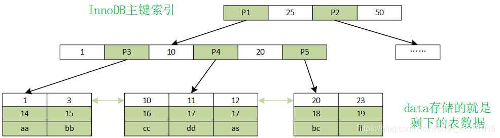
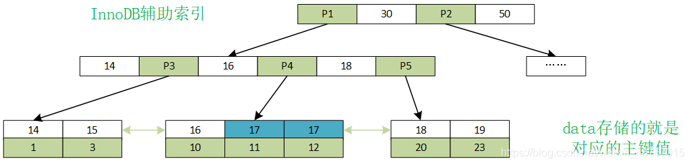
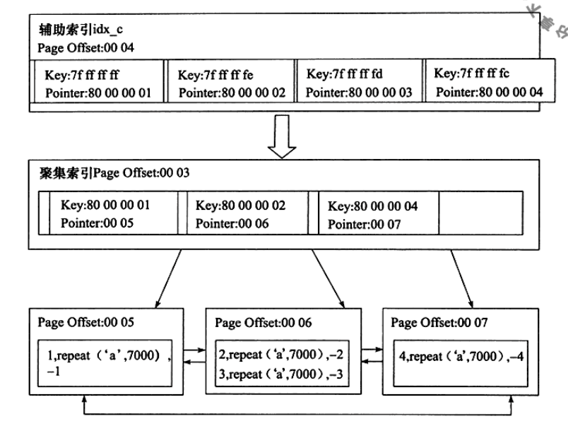
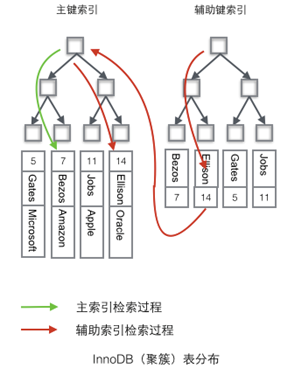
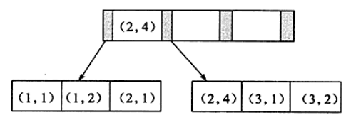
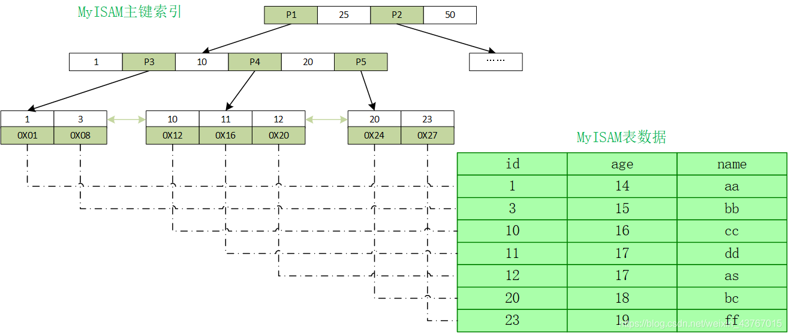

[toc]

## 1. InnoDB索引

### 1.0 什么是索引

索引是一种用于维护数据的数据结构


### 1.1 索引可以使用的结构

* 二叉树
* 红黑树
* 哈希
* B+树


### 1.2 InnoDB支持的索引类型

* **B+树索引**
* **全文索引**
* **哈希索引**


### 1.3 B+树索引分类

* **聚集索引和非聚集索引**
  * **聚集索引**
  * **非聚集索引**
* **按类型分**
  * **主键索引**
  * **唯一索引**
  * **普通索引**
  * **全文索引**
  * **空间索引**
* **按列数分**
  * **单列索引**
  * **组合索引**


### 1.4 B+树索引

**特点**

* **B+树索引**由 **叶子节点**与 **非叶子节点**构成，每个节点的大小都是**16KB(一个页的大小)**，每个节点中都会可以存放多条数据（假设我有10条数据，17KB，那么会分配2个节点来存储）
* B+树索引并不能找到一条具体的数据——它是先找到数据所在的页，然后将页读入内存，再在内存中查找


### 1.5 InnoDB的B+树索引

InnoDB的B+树索引分为——**聚集索引(1个)**和**辅助索引(多个,都是非聚集索引)**


#### 1.5.1 聚集索引

* 每张使用InnoDB的表都一定有且只有**一个聚集索引**，用于**组织表**

* 表中的数据按照**聚集索引的字段顺序**存放

* 每张表都会通过聚集索引字段构建一棵 **B+树**

  * **叶子节点**——**数据页**，存放行记录数据
  * **非叶子节点**——**索引页**，存放字段值和偏移量(用于指向下一层的节点)

  

* **聚集索引**的存储**物理上不连续**，但是**逻辑上连续**

  * 叶子节点通过**双向链表**连接
  * 叶子节点按照 **聚集索引的字段顺序**存放

#### 1.5.2 聚集索引的选择

* **如果有主键**——那么主键作为聚集索引字段
* **如果没有主键**
  * 第一个定义的唯一非空索引为聚集索引
  * 实在不行，生成一个6B的列作为聚集索引字段

#### 1.5.3 辅助索引



InnoDB中除了一个聚集索引外，其他都是辅助索引(非聚集)

* **叶子节点**——存放辅助索引字段值+对应的聚集索引字段值
* **非叶子节点**——存放辅助索引字段值和偏移量(用于指向下一层的节点)


#### 1.5.4 使用辅助索引查询数据

1. 通过辅助索引的B+树，找到对应的叶子节点，取得对应的聚集索引字段值
2. 通过该聚集索引字段值在聚集索引中查找记录所在的叶子节点






### 1.6 查看索引信息与Cardinality

#### 1.6.1 查询索引信息的指令

```
show index from table_name;//查看表上的所有索引信息
有以下信息
Table:索引所在的表名
Non_unique:是否不是唯一索引
Key_name:索引名
Seq_in_index:索引中列的位置
Column_name:索引列的名称
Collation:列以什么方式存储在索引中,A或NULL(B+树索引总是A)
Cardinality:表示索引字段的选择性高低
Sub_part:
Packed:关键字是否呗压缩
Index_type:索引是什么类型(BTREE)
```


#### 1.6.2 Cardinality

如果一个字段，其可取值的范围很小——低选择性，可取值的范围很大——高选择性

低选择性的字段没有加索引的必要，高选择性的字段适合加索引

Cardnality表示索引中该索引的字段在所有记录中不重复的估计数目——用于衡量索引字段的选择性高低

Cardnality/rows_in_table越接近1越好，如果非常小，那么索引字段的选择性低，那么可以考虑删除索引（优化器根据改值决定一条查询SQL走不走索引）


### 1.7 索引创建

#### 1.7.1 MySQL5.5前

1. 创建一张新的临时表（表结构为新的结构）
2. 将原表数据导入
3. 删除原表
4. 将临时表重命名为原表

#### 1.7.2 InnoDB1.0.x后支持Fast Index Creation(FIC)

* **添加索引**

  给要要添加索引的列加上S锁，创建索引（这会阻塞写操作，只能读）

* **删除索引**

  InnoDB更新内部视图，将索引的空间标记为可用，同时删除MySQL内部视图上对该索引的定义

#### 1.7.3 MySQL5.6支持——Online DDL

创建索引的同时，允许DML操作（允许写操作）

* 辅助索引的创建和删除
* 改变自增长值
* 增加和删除外键约束
* 列的重命名

**上面四个都可以使用Online DDL**

```
ALTER TABLE table_name | ADD {INDEX|KEY} [index_name]
{index_type} (index_col_name,...) [index_option] ...
ALGORITHM [=] {DEFAULT|INPLACE|COPY}
LOCK [=] {DEFAULT|NONE|SHARED|EXCLUSIVE}
```

* ALGORITHM指定创建或删除缩印的算法
  * COPY：使用创建临时表的方法
  * INPLACE：索引创建和删除不需要创建临时表
  * DEFAULT：让InnoDB根据old_alter_table来判断使用COPY还是INPLACE（默认使用INPLACE）
* **LOCK**指定创建或删除索引时，对表的加锁情况
  * NONE：不加锁
  * SHARE：加S锁（不阻塞读，阻塞写）
  * EXCLUSIVE：加X锁（阻塞读，阻塞写）
  * DEFAULT：优先级NONE>SHARE>EXCLUSIVE(如果一个模式不行就换下一个)

**Online DDl原理**

在创建或删除索引时，将所有的DML操作日志写到一个缓存中（缓存大小由参数innodb_online_alter_log_max_size控制，默认128MB），待操作完成后，再应用到表上


### 1.8 哈希索引

InnoDB也支持哈希索引——**缓冲池中有哈希索引**，**自适应哈希索引**

**InnoDB的哈希索引**

* 冲突机制采用链表方式

* 哈希函数采用除法散列方式——每个表空间都有一个space_id，用户要查找的页在其表空间中偏移量为offset

  index=(space_id<<20 +space_id+offset)%哈希槽数

**以缓冲池中的哈希索引为例**

* 缓冲池中存在哈希表，哈希表中槽的数目为 (略大于2倍的缓冲池页数目的质数)

* 假设缓冲池大小为10M，由640个页组成（一个页16KB），那么哈希表会为其分配640*2=1280个槽，但由于不是质数，所以分配1399个槽

* 缓冲池中的页都有一个chain指针，指向其他相同哈希值的页，缓冲池中的页会放入哈希表，我们从缓冲池中存取某个页的时，就可以通过哈希表了


### 1.9 联合索引

对表上的多个列进行索引

联合索引本质上也是一棵B+树，不过存储的索引值有多个

**最左前缀原则**



### 1.10 覆盖索引

覆盖索引不是一种结构，而是一种优化手段

InnoDB引擎如果使用辅助索引，那么根据先在辅助索引树中获取的聚集索引值，然后再到聚集索引检索真正的数据，该过程称为回表查询。回表查询需要更多的磁盘IO，对性能影响很大。

如果**辅助索引的叶子节点**中已经包含了我们要查询的所有数据，那么还有什么必要再回表查询呢？

如果一个索引包含所有需要查询的字段的值，我们就称之为“覆盖索引”


## 2. MyISAM索引

#### 2.1 索引特点



* 所有的索引都是 **非聚集索引**
* **数据**与**索引**是分开存储（InnoDB是索引组织表）
* 所有索引的叶子节点存储的是 **索引字段值+对应记录的地址**

#### 2.2 使用索引的查询过程

1. 在索引中查询到目标记录的地址
2. 根据地址取出数据
