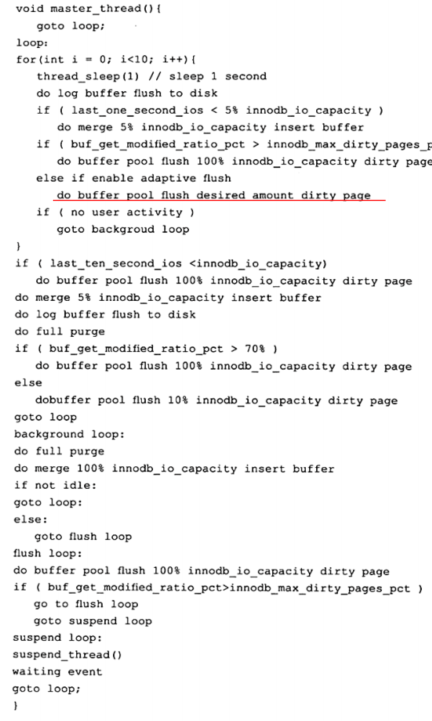

后台线程——保证缓冲池中的内存缓存时最近的数据；将已修改的数据在合适的时机刷新到磁盘；保证数据库崩溃也能恢复

## 1. Master Thread

分为多个循环——**主循环(loop)，后台循环(background loop)，刷新循环(flush loop)，暂停循环**


### 1.1 InnoDB 1.0.X版本之前

```c
void master_thread(){
    goto loop;
        
-----------------------------------------------------------------------------
loop://主循环
//每秒一次的操作
for(int i=0;i<10;i+=1){
    thread.sleep(1);
    
    //将redo log buffer刷新到磁盘(总是)
    do_flush_redo_log_buffer_to_disk;
    
    //如果过去1s的IO次数<5——合并5个insert buffer
    if(last_one_second_io<5){
        merge_at_most_5_insert_buffer;
    }
    
    如果缓冲区中脏页的比例超过了阈值，刷新100个脏页到磁盘中
    
    //如果当前没有用户活跃，跳转到后台循环
    if(no_user_activity){
        goto backgroud loop
    }
}
    
//每10秒一次的操作

如果过去10s的IO<200次,刷新200个脏页到磁盘中

//合并最多5个insert buffer
merge_at_most_5_insert_buffer;
    
//将redo log buffer刷新到磁盘(总是)
do_flush_redo_log_buffer_to_disk;
    
//回收无用的Undo页
do_full_purge;

如果缓冲区中脏页的比例>70%%，刷新100个脏页，否则刷新10个脏页
    
//所有操作再来一次
goto loop;
    
-----------------------------------------------------------------------------------------------------------
//后台循环
background loop:

//回收无用的Undo页
do_full_purge;

//合并20个insert buffer
merge_20_insert_buffer;

如果数据库不闲置，跳转到主循环loop，否则进行刷新循环flush loop

------------------------------------------------------------------------------------------------------
//刷新循环
flush loop:
    将100个脏页刷新到磁盘
    
    如果脏页的比例大于阈值，再次进入flush loop，否则进入 suspend loop暂停循环
-------------------------------------------------------------------------------------------------------
//暂停循环
suspend loop:
将Master Thread挂起，等待事件发生，时间发生后，跳转到loop主循环


}

```

### 1.2 InnoDB 1.0.X版本

* 提供了参数 **innodb_io_capacity**——表示磁盘IO的吞吐量，默认值200
* **innodb_adaptive_flushing**——自适应刷新，影响每秒刷新脏页的数量
* **innodb_purge_batch_size**——每次full purge回收Undo页的数目




## 2. IO Thread

InnoDB存储引擎使用了大量的AIO操作来处理写IO请求，IO Thread负责写IO请求的回调

## 3. Purge Thread

Purge Thread负责回收undo页，以及最终删除记录

## 4. Page Cleaner Thread

InnoDB1.2.x后出现，分担Master Thread的工作，负责将脏页刷新到磁盘中