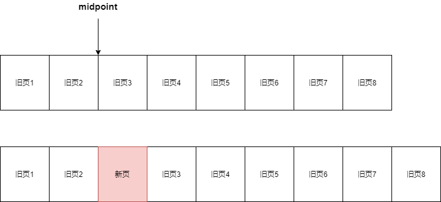

**InnoDB存储引擎的内存池由以下部分组成**

* **缓冲池**

  缓冲池的基本单位是页，一个页16KB

* **redo log buffer**

* **额外内存池**

* **double write buffer**

## 1. 内存在读写操作中的使用

### 1.1 读操作

从磁盘读取文件数据是整页整页的读

查询时，先检查要查询的数据所在的页是否在缓冲池中

如果在——命中，从缓冲池读取该页

如果不在——从磁盘读取页数据，将页存放在缓冲池中

### 1.2 写操作

直接修改缓冲池中的页，通过Checkpoint机制将脏页刷新回磁盘

## 2. 缓冲池组成

* **缓冲池**以**页(默认大小16KB)**为单位来组织数据，其中存放着**各种类型的页**，如下

  * **数据页(data page)**
  * **索引页(index page)**
  * **undo page**
  * **insert buffer**
  * **数据字典信息(data dictionary)**
  * **lock info**
  * **自适应哈希索引**

* 缓冲池的大小由 **innodb_buffer_pool_size**决定

  缓冲池的数目由 **innodb_buffer_pool_instances**决定

* 缓冲池中有个**哈希表**，存取缓冲池中的页通过 **哈希表**实现O(1)操作

## 3. 缓冲池管理

**缓冲池**以**页(一个页16KB)**为单位来组织数据，其中存放着**各种类型的页**，InnoDB通过**LRU列表**，**Free列表**，**Flush列表**对缓冲池进行管理

### 3.1 LRU列表——管理正在使用的页

* 缓冲池中，正在使用的页会形成一个LRU列表

  最频繁使用的页在LRU列表前端，最少使用的页在LRU末端

* 新的页插入LRU列表并不是插入LRU的首部，而是**插入midpoint位置(由参数innodb_old_blocks_pct控制)**

  midpoint前的队列——**new列表(活跃数据)**

  midpoint后的队列——**old列表(不活跃数据)**

  还有一个参数 **innodb_old_blocks_time**：新页插入LRU的midpoint位置后，等待多久才加入new列表

  页由 old列表加入到new列表——称为 **page made young**

  

**InnoDB后面支持压缩页功能，可以将16KB的页压缩为1KB，2KB，4KB和8KB**

对于非16KB的页—— 通过 **unzip_LRU列表**进行管理

**LRU中的页包含了 unzip_LRU列表的页**

### 3.2 Free列表——管理未使用的页

未使用的页构成Free列表

InnoDB向缓冲池中放入新的页时，首先查看Free列表是否有空闲页，如果有使用该空闲页，并将其从Free列表删除；如果没有，释放LRU列表末尾的页，将内存分配给新页

### 3.3 Flush列表——管理脏页

写操作修改LRU列表中的某个页——该页称为脏页

脏页会复制到Flush列表中，脏页通过 **Checkpoint机制**刷新到磁盘上**（脏页刷新到磁盘上的过程使用了duoble write）**

## 4. redo log buffer

InnoDB存储引擎会先把 重做日志信息放入缓冲区，然后按照一定频率将其刷新到redo log file

**刷新时机**

* Master Thread每一秒刷新一次（可以调整刷新频率）
* 事务提交时的刷新策略（取决于参数innodb_flush_log_at_trx_commit)
* redo log buffer剩余空间小于 1/2时，刷新一次