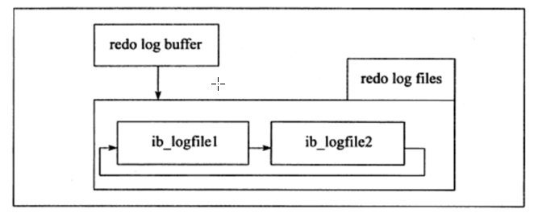
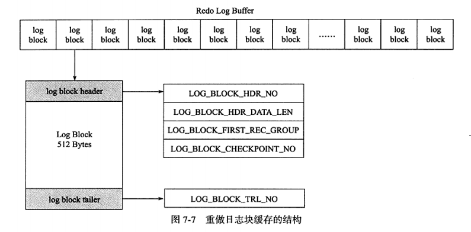

## 1. Write Ahead log策略

事务进行时，就会不断地将重做信息写入 redo log buffer，不管事务是否提交，redo log buffer都会按照一定的规则刷新到redo log file

事务提交时，触发一次redo log buffer的处理机制(见 redo log)，然后才会在缓冲池中修改页，等待 **Checkpoint机制发生**，将脏页刷新到磁盘上

**（脏页刷新到磁盘上的过程使用了duoble write）**

## 2. redo log

### 2.1 redo log介绍

**持久性保证**

当MySQL宕机后，内存中的数据会丢失（脏页数据就没了），但是由于Write Ahead Log策略，在修改页之前会先写好redo log，所以InnoDB可以依靠redo log恢复，**保证持久性**

**记录内容**

redo log 记录的是每个页的**更改的物理情况**

**redo log组成**

* 每个InnoDB存储引擎至少有一个 **redo log file group**

* 每个group下至少有**2个redo log file**

* 可以设置多个 **mirrored log groups**

**循环写入机制**

InnoDB采用**循环写入机制**，先写日志文件1，在写日志文件2，日志文件2写满后，再写日志文件1

### 2.2 redo log组成

redo log由以下部分组成

* **redo log buffer（内存）**
* **redo log file（磁盘）**

#### 2.2.1 redo log block

**redo log buffer**与**redo log file**的基本单位都是 **redo log block**(512B,磁盘一个扇区的大小)，所以redo log buffer同步到redo

log file中的操作是**原子性**的，保证必定成功，因此同步过程**不需要有doublewrite**

#### 2.2.2 redo log buffer结构

redo log buffer由一个个redo log block组成，就像一个redo log block数组

每个redo log block512B(重做日志头12B,重做日志尾8B,日志内容512B)

### 2.3 redo log相关参数

* **innodb_log_file_size**

  指定每个redo log file的大小

  不能太大——太大的话，恢复时间长

  不能太小——太小的话，一个事务的重做日志信息写入可能需要多次切换redo log file，并且可能导致频繁地发生**async flush checkpoint**，导致性能的抖动（redo log file不可用时，必须触发Checkpoint机制，将部分脏页刷新回磁盘，这会导致用户线程阻塞）

* **innodb_log_files_in_group**

  每个group中的redo log file数目

* **innodb_mirrored_log_groups**

  日志镜像文件组的个数

* **innodb_log_group_home_dir**

  日志文件组的路径

* **innodb_flush_at_trx_commit**

  决定事务commit时，redo log buffer的刷新策略

### 2.4 redo log的同步机制

**redo log buffer的刷新时机**

* Master Thread每一秒刷新一次（可以调整刷新频率）
* 事务提交时的刷新策略（取决于参数innodb_flush_log_at_trx_commit)
* redo log buffer剩余空间小于 1/2时，刷新一次

1. **事务进行时**，会不断地将重做日志信息写入 redo log buffer，**不管事务是否提交**，redo log buffer都会按照**一定规律**刷新到磁盘上
2. **事务commit**时，根据**innodb_flush_log_at_trx_commit**的值，做出不同的操作
   * **0**：事务commit时，不做任何操作（摆烂了，让Master Thread去一秒一刷）——**丧失持久性**，最好的性能
   * **1**：事务commit时，进行同步操作——将redo log buffer刷新到 **文件系统缓存**，并且会同步调用 **fsync()**将文件系统缓存刷新到磁盘上——**保持持久性**，最差的性能
   * **2**：事务commit时，进行异步操作——将redo log buffer刷新到 **文件系统缓存**，**不会调用fsync()**，由OS**异步调用 fsync()**将文件系统缓存刷新到磁盘上——**丧失持久性**，较好的性能

### 2.5 redo log循环写入机制

**LSN(Log Sequence Number,日志序列号)**

日志序列号，长度8B

* **磁盘上的每个页的头部有一个值——FIL_PAGE_LSN**，记录该页的LSN，表示该页该页最后刷新时的LSN大小
* **redo log file中有两个标识符**
  * **check point**：最后一个刷新到磁盘上的脏页的LSN
  * **write pos**：表示最后一个写入redo log file的重做日志信息的LSN

redo log file中记录了每个页的log与其LSN，根据每个页的LSN与checkpoint的大小关系，来判断页的log是否有效

**循环写入**

*  redo log file中如果某页的LSN<checkpoint——该页位于wrtie pos顺时针到checkpoint的位置——该页是无效的，可以被覆写，通过redo log恢复数据时会忽略该页
*  redo log file中如果某页的LSN>checkpoint——该页位于check point顺时针到write pos的位置——该页是有效的，通过redo log恢复数据时会读取该页
*  修改数据时，会先把修改log写入redo log file，写入的位置从write pos开始——write pos移动
*  **Checkpoint操作**时，会把脏页刷新到磁盘上，同时会让脏页在redo log file中对应log失效——也就是让check point移动

**循环写入好处**

* 无效的redo log可以被覆盖，使得整个文件不会过大
* 数据库宕机后使用redo log恢复，只需要使用有效的log，无效的log对应的脏页已经刷新到磁盘上了，不需要恢复，减少恢复需要的时间

## 3. Checkpoint机制

### 3.1 Checkpoint触发的时机

* **Sharp Checkpoint**：刷新缓冲区Flush列表中的所有脏页到磁盘（数据库关闭时进行）

* **Fuzzy Checkpoint**：只刷新Flush列表的一部分脏页（InnoDB存储引擎内部使用）

  * **Master Thread Checkpoint(定时Checkpoint)**

    Master Thread每秒或每十秒从Flush列表中按一定比例刷新脏页到磁盘

    **这个操作时异步的，不会阻塞用户线程**

  * **FLUSH_LRU_LIST_Checkpoint(缓冲池空间不够)**

    目的是保证Free列表中至少有100个空闲也可以使用

    检查空闲页个数，如果没有100个，就从LRU列表末尾移除，如果移除的页有脏页就把脏页刷新到磁盘中

    **这个操作会阻塞用户线程**

  * **Async/Sync Flush Checkpoint(redo log file没有可用的空间)**

    redo log file不可用时(有指标衡量)，强制刷新一些脏页到磁盘上

    **该操作会阻塞用户线程**

  * **Dirty Page too much Checkpoint(脏页过多)**

    **参数innodb_max_dirty_pages_pct**表示Flush列表允许的最大脏页数

    如果Flush列表的脏页数超过这个值，会强制进行Checkpoint

### 3.2 Checkpoint的任务

* 将缓冲池的Flush List中的脏页刷新到磁盘上**（脏页刷新到磁盘上的过程使用了duoble write）**
* 让刷新到磁盘上的脏页在redo log file中对应的log失效（移动redo log file中checkpoint的位置）