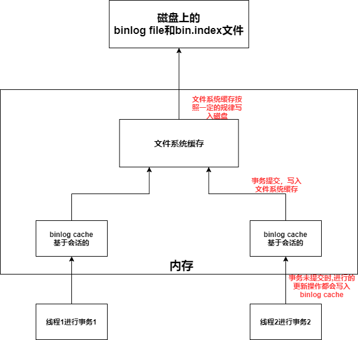
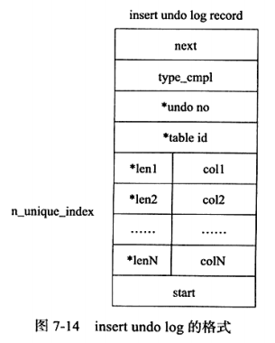
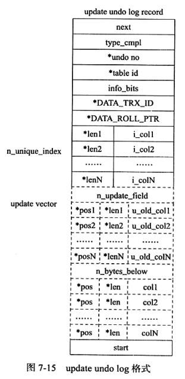
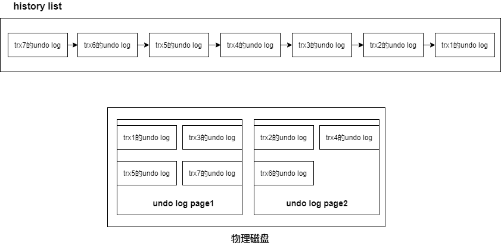
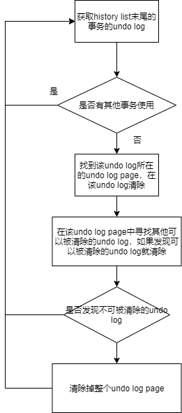

文件分为

* **数据库本身的文件**
  * **参数文件**
  * **日志文件**
    * **错误日志**
    * **慢查询日志**
    * **查询日志**
    * **binlog**
  * **socket文件**
  * **pid文件**
  * **表结构定义文件**
* **存储引擎文件**
  * **表空间文件**
  * **重做日志文件**

## 1. 参数文件

MySQL实例启动时，会读取参数文件，用来寻找数据库的各种文件的位置以及指定某些初始化参数

MySQL实例也可以不需要参数文件，此时会采用默认值

* **如何查看参数**

  ```
  show variables;
  show variables like 'XXX';
  ```

* **参数类型**

  参数分为**动态参数**和**静态参数**

  * **动态参数**：MySQL实例运行时可以更改的参数

  * **静态参数**：MySQL实例运行时不可以更改的参数

    ```
    更改语句
    SET 
    | [global | session] system_var_name= expr
    | [@@gloabl. | @@session. | @@] system_var_bane=expr
    
    global:表示修改的范围是整个MySQL实例
    session:表示修改的范围是当前会话
    ```


## 2. 日志——错误日志

**错误日志**：记录了MySQL的启动，运行，关闭过程

* 错误日志文件的位置参数——log_error

  ```
  show variables like 'log_error';
  ```

* 当MySQL数据库不能正常启动时，第一个必须查找的文件应该是错误日志文件，该文件记录了错误信息


## 3. 日志——慢查询日志

**重要参数**

* **log_slow_queries**：是否开启慢查询（默认为OFF）

* **long_query_time**:阈值，运行时间超过该阈值的SQL会记录到慢查询日志，默认为10s
* **log_queries_not_using_indexes**：默认为OFF，开启后，没有使用索引的SQL会记录到慢查询日志
* **log_throttle_queries_not_using_indexes**：配合log_queries_not_using_indexes使用，表示每分钟允许记录到慢查询日志的未使用的SQL数目，默认为0，表示没有任何限制
* **show_query_type**
  * **0**：不将SQL语句记录到slow log
  * **1**：根据运行时间将SQL语句记录到slow log
  * **2**：根据逻辑IO次数将SQL语句记录到slow log
  * **3**：根据运行时间和逻辑IO次数将SQL语句记录到slow log
* **long_query_io**：将超过指定逻辑IO次数的SQL语句记录到slow log中（默认值为100）


**慢查询表**

MySQL为慢查询日志做了一张表——**慢查询表（slow_log)**;

* **慢查询的输出格式**

  **参数log_output**指定了慢查询的输出格式，默认为FILE，可以设置为TABLE

  设置为TABLE后，就可以查询MySQL框架下的slow_log表了

* **查看慢查询表的创建SQL**

  ```
  show create table mysql.slow_log;
  ```

* **从慢查询表查看慢查询SQL**

  ```
  select * from mysql.slow_log;
  ```


## 4. 日志——查询日志

查询日志记录了所有对MySQL数据库请求的信息

默认文件名：主机名.log

MySQL为查询日志文件也提供了一张表——**general_log**


## 5. 日志——binlog

### 5.1 binlog作用

bin log记录了数据库所有的更新操作，有以下几个作用

* **恢复数据**
* **主从复制**
* **审计**：通过bin log中的信息进行审计，判断是否有对数据库进行注入的攻击

### 5.2 binlog的组成

bin log由以下三个部分组成

* **binlog cache**：会话级cache，每个会话都会分配一个binlog cache
* **binlog file**：二进制日志文件，写满后会创建一个新的binlog file(后缀+1)，并在bin.index文件中记录新的binlog file
* **bin.index**：记录所有的binlog file的路径

### 5.3 binlog的使用



* 每个会话都会分配一个bin log cache，事务执行过程中将逻辑日志记录写入binlog cache

  **参数binlog_cache_size**：指定了binlog cache的大小，如果超过了，会生成一个临时文件来存(降低性能)

* **事务commit后**，binlog_cache中的内容就会写入 **文件系统缓存**

  **文件系统缓存**根据 **参数sync_binlog**的值来决定何时将文件系统缓存刷新到磁盘中

  **参数sync_binlog=[N]**——每往文件系统缓存中写入N次，就会同步到磁盘

  **如果sync_binlog=1**——那么事务每提交一次，就会**立马同步到磁盘**中

  **sync_binlog默认为0**——表示由OS自行判定

* **参数binlog_size**——binlog file的最大大小，超过该大小会生成一个新的binlog file(后缀+1)，并在bin.index文件中记录新的binlog file

* 因为binlog是服务层的文件，redo log是InnoDB层的文件，所以可能出现这种情况，一个事务Commit，bin log写入磁盘了，但是redo log还没有写入，此时MySQL宕机了，重启MySQL，通过redo log重做，这个事务被回滚了，但是binlog记录了该事务

  这种问题可以通过 **参数innodb_support_xa=1**来解决——确保了binlog与InnoDB文件的同步

### 5.4 binlog的格式

binlog的格式由 **参数binlog_format**决定，其值有 **STATEMENT**，**ROW**，**MIXED**

* **STATEMENT**

  二进制日志的格式——基于SQL语句的，但是在主从复制中，如果主服务器运行rand，uuid等函数或者使用了触发器，那么可能会导致主从服务器数据不一致

  同样的，如果隔离等级为READ COMMITTED，也可能导致主从服务器数据不一致

* **ROW**

  二进制日志的格式——记录表的行的更改情况

  **优点：数据库的恢复和复制有更好的可靠性**

  **缺点：增加二进制日志文件的大小，增加了主从复制的网络开销**

* **MIXED**

  MySQL在默认情况下采用STATEMENT，一些情况下使用ROW

  * 表的存储引擎为NDB
  * 使用了UUID(),USER(),CURRENT_USER(),FOUND_ROWS(),ROW_COUNT()等不确定函数
  * 使用了 insert delay语句
  * 使用了用户自定义函数
  * 使用了临时表


## 6. socket文件

略

## 7. pid文件

MySQL实例启动时，会将自己的进程ID写入pid文件

## 8. 表结构定义文件

每张表都有一个以 frm为后缀的文件——记录了该表的表结构定义

创建一个a视图——也会产生一个a.frm文件来存放视图的定义

## 9. 存储引擎——表空间文件

### 9.1 共享的表空间文件

* **默认情况**，有一个初始大小10MB，名为ibdata1的文件——默认的共享表空间文件

* **所有使用InnoDB存储引擎的表的数据**都会记录到该**共享表空间**中

* 通过 **参数innodb_data_filr_path**可以对共享表空间文件进行设置

  ```
  innodb_data_file_path=/db/ibdata1:2000M; /db/ibdata2:2000M:autoextend
  使用/db/ibdata1和/db/ibdata2两个文件组成共享表空间，大小为2000M
  autiextend表示如果用完了这2000M，文件可以自动增长
  ```

### 9.2 表独有的表空间文件

* **参数innodb_file_per_table**：为每张使用InnoDB的表产生一个独立的表空间（表明.ibd)

如果使用了表独有的表空间文件，那么对于一张表来说

* **表的数据，索引，插入缓冲**等信息存储在其**独有的表空间文件**中
* 其余信息放在**共享表空间**中


## 10. 存储引擎——redo log

看  **4.redo log与checkpoint机制**

### 10.1 redo log与binlog的区别

* binlog记录的是所有表的更改操作记录，是在服务层产生的

  redo log只记录InnoDB引擎的表，是在InnoDB存储引擎层产生的

* binlog是一种逻辑日志，记录的是事务对表进行的更新操作的具体操作内容

  redo log是物理日志，记录的是事务对涉及到的数据页的修改情况

* binlog：事务提交与写入binlog file同步，事务提交后进行一次写入

  redo log：事务的提交与写入redo log file异步（事务提交后，redo log不一定写入）

* redo log是循环写

  binlog是追加写

## 11. 存储引擎——undo log

### 11.1 undo log作用

* **保证事务的原子性**
* **提供事务回滚**
* **实现MVCC功能**

### 11.2 undo log介绍

1. InnoDB存储引擎有**rollback segment**,每个rollback segment有**1024个undo log segment**

   **undo log**存放在**undo log segment**中**(segment位于表空间中)**

   **多个事务并发操作时，为了让各个事务写各自的undo log时不产生冲突，一个事务操作一个 undo log segment**

   * InnoDB1.1前，只有**一个rollback segment**，只可以支持同时在线**1024个事务**
   * InnoDB1.1开始，InnoDB支持最大**128个rollback segment**，最高支持**128*1024个事务**

2. **undo log是逻辑日志，记录每条记录的内容**

3. **undo log也会产生redo log**

4. 事务开始时，会向undo log segment(位于表空间)申请页，并在事务执行过程中不断向其中写入undo log，随着undo log写入，表空间不断变大

   * 若事务提交，进行如下操作

     * 事务提交后，不会马上删除undo log和undo log所在的页,而是将将undo log放入一个**链表**中，是否可以最终删除undo log和undo log所在页由purge线程判断**（提供MVCC机制，可能有其他事务需要通过undo log获取行记录之前的版本）**

       delete和update操作——不会删除原来的记录，而是将其标记为已删除，最终的删除操作由purge完成**（提供MVCC机制，可能有其他事务需要获取旧的记录信息）**

     * 判断undo log所在页是否可以重用，若可以，分配给下个事务使用

   * 若事务回滚

     表空间大小不会收缩，InnoDB存储引擎回滚时，实际上做的是与之前相反的工作（对于Insert，完成一个Delete；对于Delete，完成一个Insert；对于Updata，完成一个相反的Updata）

### 11.3 不同操作下的undo log

**undo log分为——insert undo log 和 update undo log**

#### 11.3.1 insert操作——insert undo log

insert操作产生insert undo log——事务提交后，undo log和undo log所在的页直接删除，不需要后续的purge操作



* **next**：记录下一个undo log的位置
* **type_cmpl**：记录的是undo的类型，insert undo log的该值默认为 **TRX_UNDO_INSERT_REC(11)**
* **undo no**：该undo log是由事务中第几个操作产生的
* **table_id**：记录undo log对应的表的id
* **start**：记录undo log的开始位置
* **剩下的len和col**：记录所有主键的长度和内容


#### 11.3.2 delete和update——update undo log

delete和update产生update undo log

* 事务提交时不会删除undo log和undo log所在页（提供MVCC机制，可能有其他事务需要通过undo log获取行记录之前的版本）

  将undo log放入一个**链表**中，是否可以最终删除undo log和undo log所在页由purge判断

* 原记录不会被删除，而是被标记为已删除，最终的删除操作由purge完成


**delete操作**

产生一条update undo log

不会直接删除记录，而是将记录标记为已删除，最终的删除也是在purge中完成


**update操作**

* 没有update主键

  产生一条update undo log，记录了对非主键列的修改

* update主键

  产生两条undo log——先将原记录标记为删除(一条update undo log)，然后插入一条新的记录(一条insert undo log)



* **type_cmpl**有以下值
  * 12——更新non-delete-mark的记录
  * 13——将记录标记为not delete
  * 14——将记录标记为delete
* **DATA_TRX_ID**：事务ID
* **DATA_ROLL_PTR**：回滚指针
* **n_unique_index**：记录所有主键的长度和值
* **n_update_field**：更新的字段数目
* **剩下的pos,len,col**：记录修改字段的位置，长度和值


### 11.4 purge

**purge的作用**

* 事务提交后，不会马上删除undo log和undo log所在的页,而是将将undo log放入一个**链表**中，是否可以最终删除undo log和undo log所在页由**purge线程**判断**（提供MVCC机制，可能有其他事务需要通过undo log获取行记录之前的版本）**
* delete和update操作——不会删除原来的记录，而是将其标记为已删除，最终的删除操作由**purge**完成**（提供MVCC机制，可能有其他事务需要获取旧的记录信息）**


### 11.5 undo对MVCC的支持

MVCC根据undo实现的，用户读取一行记录时，若该记录已经被其他事务占用，那么事务通过undo来读取该记录之前的版本信息，以此实现非锁定读取

**undo对MVCC的支持**

* 事务提交后，不会马上删除undo log和undo log所在的页,而是将将undo log放入一个**链表**中，是否可以最终删除undo log和undo log所在页由**purge线程**判断**（提供MVCC机制，可能有其他事务需要通过undo log获取行记录之前的版本）**
* delete和update操作——不会删除原来的记录，而是将其标记为已删除，最终的删除操作由**purge**完成**（提供MVCC机制，可能有其他事务需要获取旧的记录信息）**


**purge执行过程**

一个undo log page中允许存放多个事务产生的undo log

InnoDB有一个**history list(逻辑概念)**，按照事务提交的顺序对各个事务的undo log进行组织(先提交的事务的undo log放在末尾)



