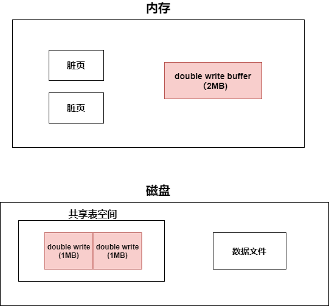
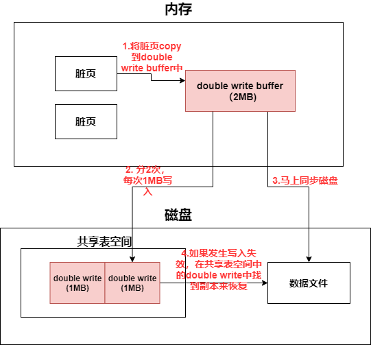

## 1. Insert Buffer

## 2. double write

### 2.1 部分写失效

由 **Write Ahead Log策略** 我们可以知道

事务进行时，就会不断地将重做信息写入 redo log buffer，不管事务是否提交，redo log buffer都会按照一定的规则刷新到redo log file

事务提交时，触发一次redo log buffer的处理机制(见 redo log)，然后才会在缓冲池中修改页，等待 **Checkpoint机制发生**，将脏页刷新到磁盘上

但是当触发 **Checkpoint机制**，将脏页刷新到磁盘中时，可能出现一个页16KB，只刷了4KB，然后发生了宕机——这就是**部分写失效**

### 2.2 double write

写入失效发生时，先通过页的副本来还原该页，再进行重做

### 2.3 double write组成

### 2.4 使用double write的脏页刷新机制

## 3. 自适应哈希索引

InnoDB存储引擎会监控**对表上各索引页的查询**，如果观察到建立哈希索引可以带来速度的提升——就建立 **哈希索引**

InnoDB存储引擎自动根据访问频率和查询条件来为某些页建立哈希索引

* 以某种查询条件访问了页100次
* 以某种查询条件访问了N次，其中N= 页中的记录数目/16