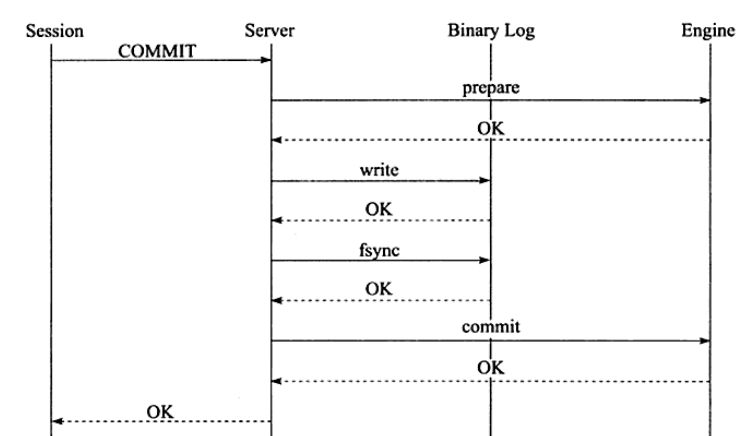

## 1. 事务四大特性

事务有ACID四大特性

* **原子性(atomicity)**——原子性指事务时不可分割的工作单位，只有事务中所有的操作都执行成功，整个事务才算成功，事务中任何一个操作执行失败，已经执行成功的操作也必须要撤销

* **一致性(consistency)**——一致性指事务将数据库从一种状态转变为下一种一致的状态，在事务开始之前和事务结束之后，数据库的完整性约束没有被破坏

  >在表中有一个字段为name，为唯一约束，如果一个事务对name字段进行了修改，但是在事务提交or回滚后，name变为非唯一，这就破坏了事务的一致性

* **隔离性(isolation)**

* **持久性(durability)**——持久性指的是事务一旦提交，其结果是永久的，即使发生宕机等故障，数据库也能将数据恢复

## 2. 事务四大特性的实现

**原子性**—— **undo log**，在事务里任何对数据的修改都会写一个undo log，然后进行数据的修改，如果出现错误，存储引擎会利用undo log的备份数据恢复到事务开始之前的状态。

**一致性**——**事务的原子性，隔离性，持久性保证了数据的一致性**

**隔离性**——**锁机制，MVCC**

**持久性**——**redo log**，InnoDB存储引擎在启动时不管上次数据库运行时是否正常关闭，都会尝试通过redo log进行恢复操作。

## 3. 事务的两阶段提交和group commit

### 3.1 两阶段提交

如果我们开启了binlog，就必须保证**binlog与redo log的一致性**——采用**两阶段提交**

**两阶段提交分为两个阶段——prepare和commit**

1. Session发出Commit命令

2. 将最新生成的redo log从redo log buffer刷新到磁盘(具体刷新策略由**innodb_flush_at_trx_commit**决定)

   生成事务ID(XID)，此时redo log处于**prepare阶段**

3. 将**逻辑操作记录**到binlog cache中，并调用fsync()刷新到磁盘上(具体刷新策略由**参数sync_binlog**决定)

4. 将redo log标记为**commit状态**

5. 成功完成事务的Commit

### 3.2 group commit

#### InnoDB1.2前的版本

redo log的写入分为两个阶段

1. 事务将redo log写入redo log buffer
2. 事务提交时，根据刷新策略将redo log buffer刷新到磁盘

2相对于1是缓慢的，所以当一个事务正在进行2时，其他事务完成1，然后再次进行2时，可以同时将多个事务的redo log刷新到磁盘上

**开启binlog后，两阶段提交会使group commit失效，因为在两阶段提交中使用了prepare_commit_mutex锁，一个事务在进行2时，其他事务无法进行1**

#### InnoDB1.2后的版本—Binary Log Group Commit(BLGC)

将事务按照提交顺序放入一个队列，队列的第一个事务为leader，其他事务为follower

1. **Flush阶段**，每个事务将binlog写入文件系统缓存

2. **Sync阶段**，将文件系统缓存刷新到磁盘，若队列中有多个事务，那么一次fsync操作就完成了多个事务binlog的刷盘

3. **Commit阶段**：leader根据顺序调用存储引擎层事务的提交

   (当一组事务正在进行Commit阶段时，另一组事务可以进行Flush阶段)

## 4. 事务隔离等级

### 4.1 SQL标准的隔离等级

|            | serializable | repeatable read | read committed | read uncommitted |
| ---------- | ------------ | --------------- | -------------- | ---------------- |
| 脏读       | 避免         | 避免            | 避免           | 无法避免         |
| 不可重复读 | 避免         | 避免            | 无法避免       | 无法避免         |
| 幻读       | 避免         | 无法避免        | 无法避免       | 无法避免         |

### 4.2 InnoDB的隔离等级

InnoDB默认的隔离等级是repeatable read——使用Next-Key Lock算法，避免了幻读；支持MVCC，可以进行非锁定读

InnoDB在read committed下——除了唯一性的约束检查和外键约束的检查支持Gap Lock算法，其他都不支持Gap Lock算法，只使用Record Lock算法，无法避免幻读；支持MVCC，可以进行非锁定读

InnoDB在 serializable下——查询默认加共享锁，不支持非锁定读