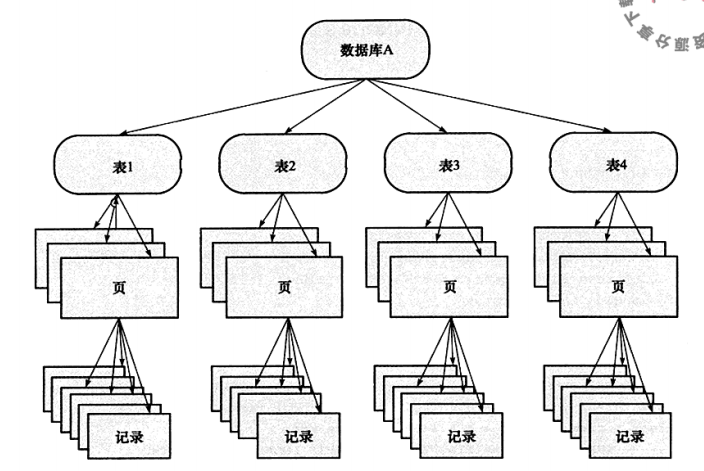
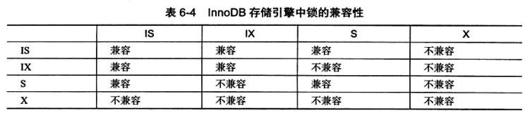
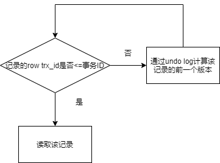
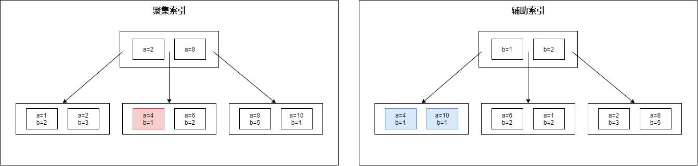
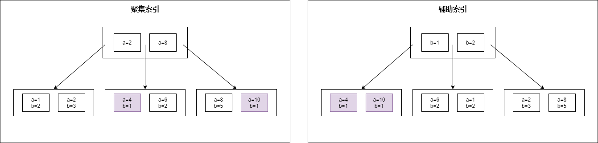

## 1. 锁的类型

MySQL Server层——支持表锁

InnoDB——支持行锁，意向锁

### 1.0 锁兼容

一个事务想要访问某个资源，需要先获得该资源对象的锁

如果事务想要获取资源的A锁，但是该资源的B锁已经被其他事务获取，A锁与B锁不兼容——当前事务阻塞等待B锁的释放

如果事务想要获取资源的A锁，但是该资源的B锁已经被其他事务获取，A锁与B锁兼容——当前事务成功获得A锁访问资源

### 1.1 全局锁

对整个数据库实例加锁，MySQL提供了一个加全局读锁的方法—— **Flush Table with Read Lock**

该命令让整个数据库实例处于只读状态，其他事务的写操作语句都会被阻塞

全局锁的典型使用场景—— **做全库逻辑备份**，也就是把整库每个表都select出来存成文本

但是让整库都只读，听上去就很危险：

* 如果你在主库上备份，那么在备份期间都不能执行更新，业务基本上就得停摆
* 如果你在从库上备份，那么备份期间从库不能执行主库同步过来的 binlog，会导致主从延迟。

### 1.2 表级锁

#### 1.2.1 表锁

- **共享锁(S Lock)**：允许事务对表进行读操作
- **排他锁(X Lock)**：允许事务对表进行写操作

**表锁的使用——lock tables ... read/write**

#### 1.2.2 元数据锁

MDL(metadata Lock)，MDL不需要显示使用，访问一个表的时候自动加上

* 对一个表做增删改查时，加MDL读锁
* 更改表结构时，加MDL写锁

* 读锁之间不互斥，因此你可以有多个线程同时对一张表增删改查
* 读写锁之间、写锁之间是互斥的，用来保证变更表结构操作的安全性。因此，如果有两个线程要同时要更改一个表的表结构，其中一个要等另一个执行完才能开始执行。

### 1.3 行级锁

InnoDB支持两种行锁

- **共享锁(S Lock)**：允许事务读取一行数据
- **排他锁(X Lock)**：允许事务删除or更新一行数据

**两阶段锁协议**——行锁是在需要的时候才加上的，但并不是不需要了就立刻释放，而是要等到事务结束时才释放

### 1.4 意向锁

因为使用InnoDB时，可能同时存在表锁和行锁，为了支持不同粒度上的加锁，引入了意向锁

意向锁也是一种表锁

- **意向共享锁(IS Lock)**：事务想获得一张表中某几行的共享锁
- **意向排他锁(IX Lock)**：事务想获得一张表中某几行的排他锁

### 1.5 锁的使用与兼容问题

我们把上锁的对象看作一棵树

那么我们如果想给粒度最小的对象上锁，就需要先给粒度较大的对象上锁

**给记录加上行级S(X) Lock**

1. 给数据库加IS(IX) Lock
2. 给表加上IS(IX) Lock
3. 给页加上IS(IX) Lock
4. 给记录加上S(X) Lock

（任何一步出现锁不兼容的情况，就需要等待资源上不兼容的锁释放）

**给表加上S(X) Lock**——直接给表加上S(X) Lock

## 2. 一致性非锁定读(MVCC)

通过undo log——使得每个行都可以有多个版本

**一致性非锁定读**——通过**多版本并发控制(MVCC)**的方式来读取当前执行时间数据库中行的数据

一个事务想要读取行C，但是行C的X锁被另一个事务获取，那么该事务不需要等待X锁的释放，可以通过**undo段**来获取该行之前版本的数据

事务隔离等级为 **READ COMMITTED**和 **REPEATABLE READ**下——支持MVCC，**一致性非锁定读**是默认的读取方式

### 2.1 当前读(current read)

读取记录当前的值

**更新数据——一定是先进行当前读，然后再写**

如果select语句加了锁，那么也是当前读

### 2.2 MVCC实现

MVCC的实现依赖于**undo log**

* InnoDB中每个事务都有一个唯一的事务ID

* 事务的每个写操作，都会在undo log中记录一条逻辑相反的日志

* 每行记录可以有多个版本，每个数据版本都有一个row trx_id（导致该版本产生的事务的事务ID）

最新版本的记录和其row trx_id是可以直接获取到的，旧版本的记录和其row trx_id需要通过undo log计算得到

>下图显示了一条记录的4个版本
>
>V4是最新版本的记录，是可以直接获取的
>
>U1,U2,U3是undo log
>
>V3可以通过最新版本的V4和undo log U3计算得到
>
>

### 2.3 REPEATABLE，READ COMMITED与MVCC

- **READ COMMITED下**，任何时候，如果行未被锁定，那么直接读取行当前的数据，如果行被锁定了，那么读取最近的版本的数据

- **REPEATABLE READ下**

  * **读**

    读取事务开始时的版本的数据（即使行未被锁定，也是读取事务开始时的版本的数据）

    

  * **写**

    更新数据——先进行当前读，然后再写

### 2.4 通过一致性视图来理解REPEATABLE和READ COMMITTED的区别

REPEATABLE——在事务开始时，创建一个一致性视图，后续的所有操作都使用该视图

READ COMMITTED——在每条SQL执行前，都会重新计算一个新的视图

## 3. 一致性锁定读

用户显示地对读取操作进行加锁——保证数据逻辑的一致性——这就是一致性锁定读

- select ... for update：主动给读取的记录加上X锁
- select ... lock in share mode：主动给读取的记录加上S锁

## 4. 锁的算法

InnoDB有三种锁算法

- **Record Lock**：只会对聚集索引中的行记录上锁
- **Gap Lock**：在辅助索引中锁住一个范围，不会对聚集索引中的行记录上锁
- **Next-Key Lock**：等于Record Lock+Gap Lock，锁定一个范围的同时，对行记录本身也上锁

> 下图中，红色表示Record Lock(锁住了a=4的记录)，蓝色表示Gap Lock(锁住了b<=1的记录)
>
> 
>
> 紫色代表Next-Key Lock
>
> 

### 4.1 REPEATABLE READ隔离等级下

- 在**REPEATABLE READ**下，**InnoDB对行的查询都使用Next-Key Lock锁定算法**

  假设通过辅助索引b进行查询，索引b的可能值有10,11,13,20，那么可以锁定的区间有(-∞,10),[10,11),[11,13),[13,20),[20,+∞)

  InnoDB除了会对目标值所在区间加上锁之外，还会对下一个区间加上gap lock

  > 辅助索引b值为1,1,3,6,8，查询b=3的记录
  >
  > 使用Next-Key Lock，锁定的范围为(1,3)，InnoDB还会对辅助索引下一个区间加上gap lock(即给(3,6)加上gap lock)

- 如果是查询使用的索引具有唯一属性——将Next-Key Lock降级为 Record Lock

- **使用了Gap Lock**——阻止多个事务将记录插入同一个范围，避免了幻读

### 4.2 READ COMMITTED隔离等级下

- 在 **READ COMMITED**下，除了外键约束和唯一性检查需要Gap Lock，其余情况仅使用 Record Lock进行锁定，无法防止幻读

## 5. 锁问题

### 5.1 脏读

读取到另一个事务中未提交的数据

### 5.2 不可重复读

是指一个事务读取数据库中的数据后，另一个事务则修改或删除数据，当第一个事务再次执行同一查询时，就会发现数据已经发生了改变，这就是不可重复读

### 5.3 幻读

一个事务内执行2次同样的SQL，第二次的SQL可能返回第一次SQL不存在的行

### 5.4 丢失更新

一个事务的更新操作被另一个事务的更新操作覆盖，从而导致数据的不一致

## 6. 死锁

死锁指两个或两个以上的事务在执行过程中，因争夺锁资源而造成的一种互相等待的现象

**解决死锁的方法**

### 6.1 超时(InnoDB不使用)

两个事务相互等待时，当事务的等待时间超过设置的某一阈值时会进行回滚

### 6.2 wait-for graph(InnoDB使用)

InnoDB使用wait-for graph的方式来进行死锁检测

wait-for graph要求数据库保存两种信息—— **锁的信息链表**，**事务等待链表**

通过上述链表可以构造一张图，若在这个图中存在回路，就代表存在死锁

**wait-for graph是一种主动的死锁监测机制，每个事务请求锁并发生等待时会判断是否存在回路，若存在则有死锁——InnoDB会选择回滚undo量最小的事务**