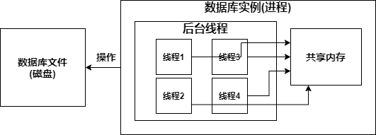
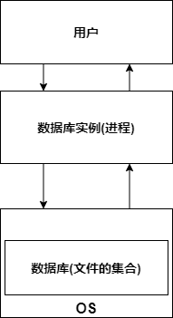

[toc]

### 1. 数据库

操作系统中文件的集合（数据库文件的集合）

### 2. 数据库实例

MySQL**数据库实例**在系统上表现是一个 **进程**

* **数据库实例**由 **后台线程**和 **共享内存**组成
* **共享内存**被**后台线程**共享
* **数据库实例**是用于操作**数据库文件**的

### 3. 数据库与数据库实例的关系

* 数据库是文件的集合

* 数据库实例是进程，是用户与OS之间的一层数据管理软件，用户想与数据库打交道，只能通过数据库实例

### 4. 配置文件(以Linux为例)

MySQL按照以下顺序读取配置文件(如果发生冲突，以读取的最后一个为准)

* **/etc/my.cnf**
* **/etc/mysql/my.cnf**
* **/usr/local/mysql/etc/my.cnf**
* **~/.my.cof**

### 5. 配置文件中的参数

* **datadir**：指定数据库文件所在的路径(默认为/usr/local/mysql/data)