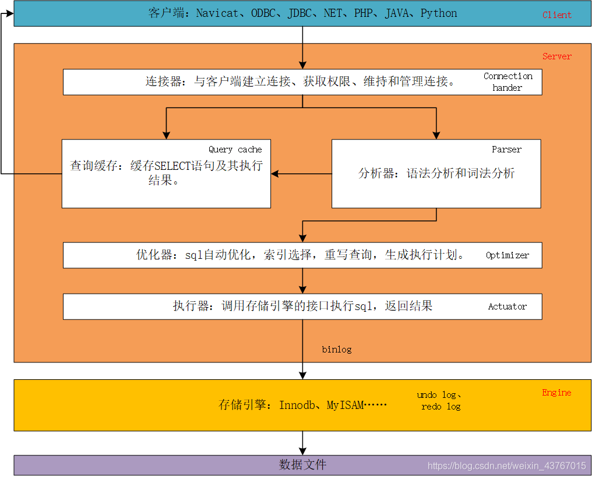

1. 首先通过`连接器`连接到数据库，进行身份验证，然后校验是否有执行当前查询的权限，如果没有权限，则直接返回错误信息，如果有权限，则执行下一步；

2. 在MySQL 5.6之前还会`查询缓存（Query Cache）`，以这条 sql 语句为 key 在内存中查询是否有结果，如果有直接缓存，如果没有找到缓存，则执行下一步。MySQL 5.6及其之后默认都不会查询缓存，直接执行下一步

   **MySQL不建议使用缓存**

   * 查询缓存的失效非常频繁，只要有对一个表的更新，这个表上所有的查询缓存都会被清空。因此很可能你费劲地把结果存起来，还没使用呢，就被一个更新全清空了。对于更新压力大的数据库来说，查询缓存的命中率会非常低。除非你的业务就是有一张静态表，很长时间才会更新一次。比如，一个系统配置表，那这张表上的查询才适合使用查询缓存
   
3. 通过`分析器`进行**词法分析**，识别出这条sql语句字符串里面的字符串分别是什么，代表什么意思，比如到底是操作的哪个表，哪个字段等等

   随后进行**语法分析**，校验sql语法比如关键词的使用是否有误等。如果分析器检查没问题就执行下一步

4. 通过 **优化器**对sql进行各种优化，优化器会选择它认为最优的执行方案去执行，但优化器的选择也并不一定是最优的

   优化器的作用是

   * 在sql中可以使用多个索引的时候，决定使用哪个`最优索引`
   * 在一个语句有多表关联（join）的时候，决定各个表的连接顺序
   * 重写查询，消除冗余的操作，选择子任务最优的策略。比如在WHERE之后根一个1=1的条件，显然，查询条件中的 1=1 是完全多余的。在经过优化器优化之后的sql中这个条件将被去除。但有时候优化器的选择并不是最好的。
   * 将外连接转换为内连接。并非所有的outer join都必须以外连接的方式执行，优化器能够识别等价条件并重写查询。
   * 优化count()、min()和max()，比如MyISAM就维护了一个变量来记录总数，比如mix()和max()的字段如果有索引，则直接取索引树的最左边和最右边的值即可。
   * 提前终止查询。查询已经满足条件时，MySQL总是能够立刻终止查询，比如使用了limit字句的时候。
   * 索引覆盖扫描。如果索引中包含需要返回的所有数据，则无需回表查询对应的数据行。
   * 负责生成执行计划，也就是常说的通过EXPLAIN看到的内容。

5. 经过了优化器之后可以说这个语句具体该如何执行就已经定下来，接下来就进入`执行器`，

   首先会进行权限校验，如果没有权限就会返回错误信息

   如果有权限就会调用存储引擎接口，最后返回引擎的执行结果（如果有查询缓存则还会将结果存入缓存中）

   sql执行结束

