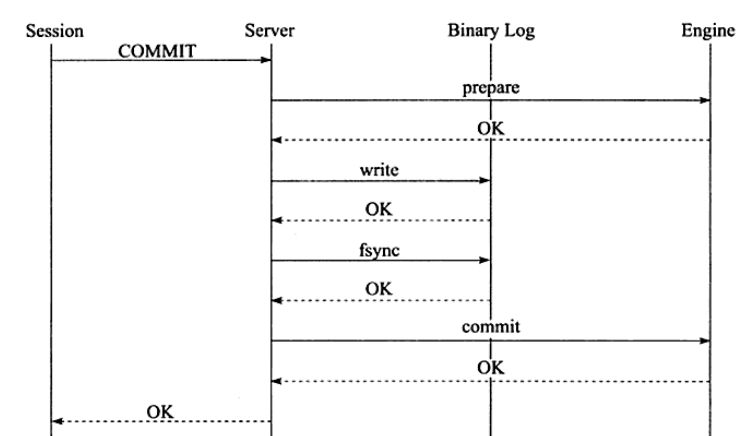
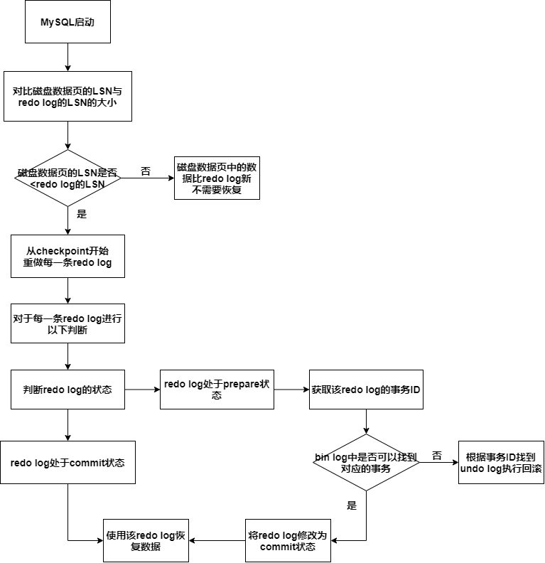

## 1. 事务四大特性

事务有ACID四大特性

* **原子性(atomicity)**——原子性指事务时不可分割的工作单位，只有事务中所有的操作都执行成功，整个事务才算成功，事务中任何一个操作执行失败，已经执行成功的操作也必须要撤销

* **一致性(consistency)**——一致性指事务将数据库从一种状态转变为下一种一致的状态，在事务开始之前和事务结束之后，数据库的完整性约束没有被破坏

  >在表中有一个字段为name，为唯一约束，如果一个事务对name字段进行了修改，但是在事务提交or回滚后，name变为非唯一，这就破坏了事务的一致性

* **隔离性(isolation)**

* **持久性(durability)**——持久性指的是事务一旦提交，其结果是永久的，即使发生宕机等故障，数据库也能将数据恢复

## 2. 事务四大特性的实现

**原子性**—— **undo log**，在事务里任何对数据的修改都会写一个undo log，然后进行数据的修改，如果出现错误，存储引擎会利用undo log的备份数据恢复到事务开始之前的状态。

**一致性**——**事务的原子性，隔离性，持久性保证了数据的一致性**

**隔离性**——**锁机制，MVCC**

**持久性**——**redo log**，InnoDB存储引擎在启动时不管上次数据库运行时是否正常关闭，都会尝试通过redo log进行恢复操作。

## 3. 事务的两阶段提交和group commit

### 3.1 两阶段提交

如果我们开启了binlog，由于binlog是Server层日志，redo log是InnoDB的日志，两个日志的写入时机时不同的

必须保证**binlog与redo log的一致性**——采用**两阶段提交**

**两阶段提交分为两个阶段——prepare和commit，下述过程以innodb_flush_at_trx_commit=1和sync_binlog=1进行阐述**

1. Session发出Commit命令

2. InnoDB存储引擎将redo log buffer写入文件系统缓存，然后调用fsync()刷新到磁盘**（这里采用的是innodb_flush_at_trx_commit=1的刷新策略）**

   生成**事务ID(XID)**，此时redo log处于**prepare阶段**

3. 执行器将binlog cache写入文件系统缓存，然后fsync()刷新到磁盘上**（这里采用的是sync_binlog=1的刷新策略）**

4. 将redo log标记为**commit状态**

5. 成功完成事务的Commit

#### 3.2.1 为什么要保证redo log和bin log一致

redo log影响主数据库的完整性

bin log影响从数据库的完整性

redo log和bin log一致才能保证主从数据库的一致性

#### 3.2.1 为什么要两阶段提交

举反例——不用两阶段提交会怎么样

* **先写redo log，后写binlog**

  假设redo log写完，但是bin log还没写完，MySQL宕机了

  此时重启MySQL，主数据库可以恢复到更新后的状态，但是由于bin log没写完就crash了，从数据库无法恢复到更新后的状态

* **先写bin log，后写redo log**

  假设bin log写完，但是redo log还没写完，MySQL宕机了

  如果在binlog写完之后crash，由于redo log还没写，崩溃恢复以后这个事务无效，表中的数据根本没有改变

  但是binlog里面已经记录了该无效事务，所以，在之后用binlog来恢复从数据库的时候，从数据库中会包含该无效事务

  而主数据库通过redo log来恢复，就不会包含该无效事务

#### 3.2.2 两阶段提交如何保证数据一致性

两阶段提交分为三步

1. 预提交redo log (redo log处于prepare状态)
2. 提交bin log
3. 真正提交redo log(redo log处于commit状态)

四种情况

* 第一步完成前宕机——redo log刷盘失败，事务回滚，保证数据一致性
* 第二步完成前宕机——redo log已刷盘，状态为prepare，但是bin log刷盘失败
* 第三步完成前宕机——redo log已刷盘，状态为prepare，bin log已刷盘

* 正常完成——redo log已刷盘，状态为commit，bin log已刷盘

**MySQL启动时，有如下过程**

### 3.2 group commit

group commit是在保证数据一致性的前提下为了优化写日志时的刷盘性能

#### 3.2.1 InnoDB1.2前的版本—不使用bin log才支持group commit

redo log的写入分为两个阶段

1. 事务将redo log写入redo log buffer
2. 事务提交时，根据刷新策略将redo log buffer刷新到磁盘

2相对于1是缓慢的，所以当一个事务正在进行2时，其他事务完成1，然后再次进行2时，可以同时将多个事务的redo log刷新到磁盘上

**开启binlog后，两阶段提交会使得group commit失效，因为在两阶段提交中使用了prepare_commit_mutex锁，一个事务获得锁后才能进入prepare状态，直到最终commit后才会释放锁，这就导致每次只有一个事务可以进行刷盘操作**

#### 3.2.2 InnoDB1.2后的版本—Binary Log Group Commit(BLGC)

**BLGC允许两阶段提交的同时使用group commit**

* **prepare阶段**

一个事务获得**prepare_commit_mutex锁**后，将redo log buffer写入操作系统缓存，然后fsync刷新到磁盘上，然后释放锁

* **commit阶段**

  > **以下每个阶段都有自己的队列，队列中的第一个事务为leader，其他为follower，leader控制follower的行为，完成后通知队内其他事务操作结束**
  >
  > **leader会带领当前队列中所有的follower进入下一个阶段**
  >
  > **三个阶段是并发的，一组事务在commit阶段时，可以有另一组事务在Sync阶段**

  * **Flush阶段**

    队列中的leader持有 **Lock_log_mutex锁**

    将队列中所有事务的binlog cache写入文件系统缓存

  * **Sync阶段**

    leader释放**Lock_log_mutex锁**，持有**Lock_sync_mutex锁**，将文件系统缓存刷新到磁盘，若队列中有多个事务，那么一次fsync操作就完成了多个事务binlog的刷盘

  * **commit阶段**

    leader释放**Lock_sync_mutex锁**，持有**Lock_commit_mutex锁**

    遍历队列中的事务，按照逐一顺序调用存储引擎层事务的提交（将redo log标记为commit状态）

    释放Lock_commit_mutex锁

## 4. 事务隔离等级

### 4.1 SQL标准的隔离等级

|            | serializable | repeatable read | read committed | read uncommitted |
| ---------- | ------------ | --------------- | -------------- | ---------------- |
| 脏读       | 避免         | 避免            | 避免           | 无法避免         |
| 不可重复读 | 避免         | 避免            | 无法避免       | 无法避免         |
| 幻读       | 避免         | 无法避免        | 无法避免       | 无法避免         |

### 4.2 InnoDB的隔离等级

* **REPEATABLE READ**
  * 使用Next-Key Lock算法，**避免了幻读**
  
  * 支持MVCC，通过 MVCC机制，进行非锁定读
  
    MVCC的readview在事务执行第一条SQL时生成，一定程度上避免了幻读
* **READ COMMITTED**
  
  * 除了唯一性的约束检查和外键约束的检查支持Gap Lock算法，其他都不支持Gap Lock算法，只使用Record Lock算法，**无法避免幻读**
  
  * 支持MVCC，通过 MVCC机制，进行非锁定读
  
    但是MVCC的readview每条SQL重新生成一次，**无法避免幻读**
* **SERIALIZABLE**
  * 查询默认加共享锁，不支持非锁定读
  * 读写直接加锁，直接使用加锁的方式来避免并行访问