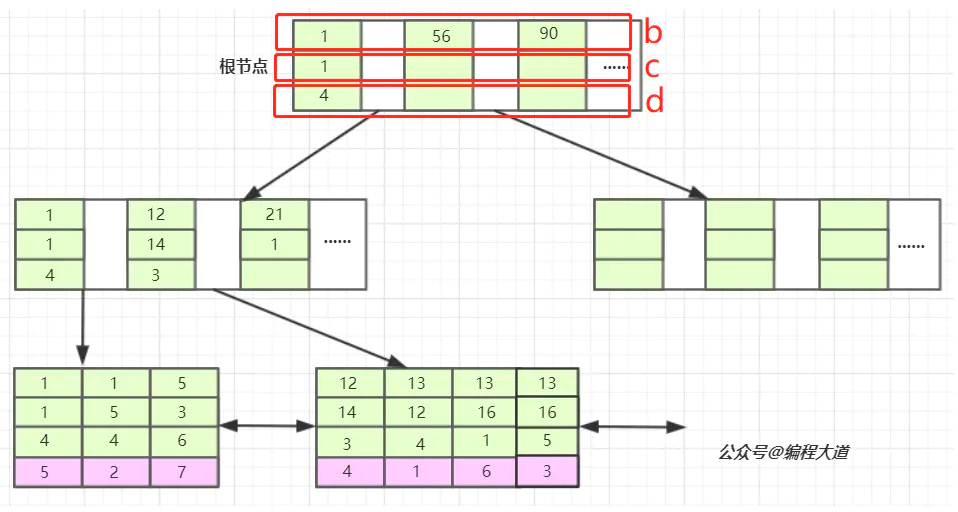

* **覆盖索引(我只拿组合索引来说，单值索引，主键索引也是一样的原理)**   
  如果一条查询语句的执行，我们只从组合索引的B+树中获取数据，而不从数据表中获取——**使用了覆盖索引**       
  
  组合索引一定是二级索引，InnoDB中组合索引的B+树如下   
  组合索引(a,c,d)，叶子节点中的红色部分是**主键**  
  


* **如何才能使用覆盖索引**
    * **①select查询的字段只能为组合索引中的字段，主键**    
      如果是其他的字段，由于组合索引的B+树中不存在，得去数据表中查询，这就不是覆盖索引了   
      **②where中，只能使用组合索引里面的字段作为条件  
      (即使组合索引失效也行，只要只使用了组合索引里的字段就都可以)**


* **select *  一定不会使用覆盖索引**

```
组合索引(c1,c2,c3,c4),主键id    
explain select id,c5 from test03 where c1='a1';——>select后的c5不在索引树中，不使用覆盖索引  
explain select id,c1,c2,c3 from test03 where c2='a2';——>组合索引失效，但是满足使用覆盖索引的条件，使用覆盖索引   
explain select * from test03 where c1='a1';——>使用了select *，一定不是用组合索引
```
  
***

* **对于单值索引**    
* 单值索引的B+索引树，跟上图复合索引的B+索引树近似(唯一区别在于只有一个字段充当索引，叶子节点中同样含有主键)
* **如何才能使用覆盖索引**  
  * ①select后只能有该索引字段，主键
    ②where中，只能使用该索引字段作为条件   
***    
* **对于主键索引**   
单值主键，同单值索引    
复合主键，同复合索引   
**！基本没用**  

