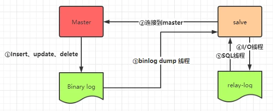

* **主从复制目的**   
  * 为数据库提供并发支持，提高并发性能     
  * 可以达到读写分离(Master写数据，Slave读数据)

* **主从复制原理**   
    
  * ①主数据库(Master)进行insert,update,delete时，会把操作按顺序写入Binary log  
  * ②当从数据库(salve)连接Master时，有n个salve，那么Master就会创建n个binlog dump线程  
  * ③当Master的Binary log发生变化时，binlog dump会通知连接的salve，并将Binary log中的修改内容推送给salve
  * ④salve的IO线程会把接收到的binary log内容写入salve的relay-log中    
  * ⑤salve中，SQL线程会根据relay-log中的内容，对数据库进行相关操作  