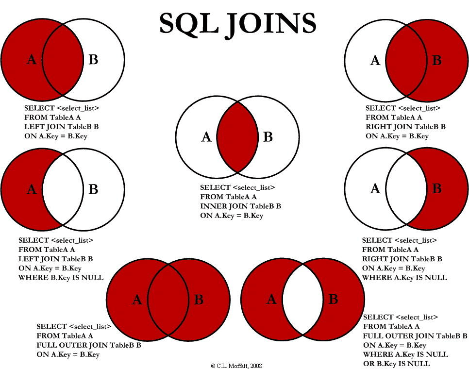

* 内连接   
两张表中符合条件的记录才会进行拼接    
  
* 左外连接/右外连接   
分为主表+从表   
主表的每条记录都会输出，规则如下      
①主表的每一条记录会根据条件在从表中寻找符合条件的从表记录   
②找到了，拼接输出
③没找到，那么主表中的这条记录会拼接NULL输出   

  
    

!!MySQL不支持全连接，一般采用 **左连接UNION右连接** 来替代  
  