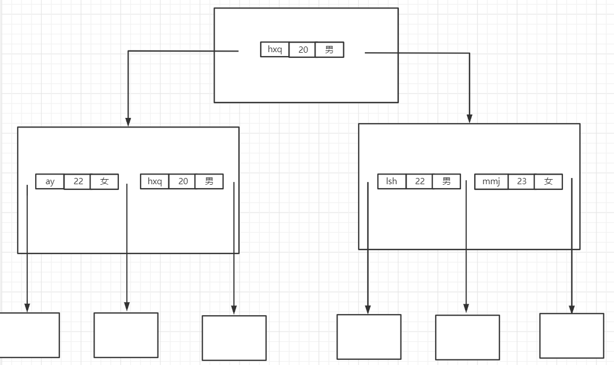

* Join语句优化
  * 尽可能减少Join语句中嵌套循环的循环总次数(减少Join连接的表的数量)——永远用小的结果集驱动大的结果集   
  * 优先优化嵌套循环的内层循环
  * 保证Join语句中，被驱动表上的Join条件字段已经被索引  
    * 外连接，索引加从表的Join条件字段上(加主表——index，加从表——ref)
      * 左连接，索引加右表的Join条件字段上
      * 右连接，索引加左表的Join条件字段上
    * 内连接——一张表的Join条件字段加索引—ref，两张表的Join条件字段都加索引(一个ref，一个index)  
  

* **最佳左前缀法则(复合索引)**     
  * 复合索引(name,age,sex)，那么MySQL在建立B+树时，每个内节点都会有(name,age,sex)这三个字段，并且顺序是从左到右的，如下图   
      
    如果我们查询('lsh',23,男),会先通过比较name来确定方向，如果name相同，再依次比较age和sex，最后得到要检索的数据  
    如果我们查询(23,男),由于没有name，B+树不知道下一步要查哪一个节点——**导致索引失效**——**带头大哥不能死**    
    如果我们查询('lsh’,男)，首先会根据name来确定方向，找到所有name为lsh的数据，但是由于age缺失，所以sex的索引功能失效，只能对所有name为lsh的数据进行扫描——**中间兄弟不能断**
  * 对于组合索引(a,b,c,d)  
    * **带头大哥不能死**——如果查询没有用到a，那么**组合索引失效**   
    * **中间兄弟不能断**——如果查询用了a，c，d，没用到b，那么会根据a来查询所有满足a条件的数据，但是由于缺失了b，所以c，d的索引失效，只能对所有满足a条件的数据进行扫描  
  
  


* **索引失效**  
  * 全值匹配我最爱(查询使用的条件字段，与组合索引完全匹配)
  * 违背最佳左前缀法则
  * 不要再索引列上做任何操作(计算，函数，类型转换),会导致索引失效而转向全表扫描  
  * 复合索引中，某个索引字段如果进行比较操作，那么该索引字段右边的所有索引字段都失效     
    index(name,age,pos)   
    查询(name='z3',age>25,pos='dev')   
    首先在B+树中，根据‘z3'进行来确定方向，找到所有name='z3'的数据，然后根据age确认方向，查询所有age>25的数据，pos会失效   
    
  * 尽量使用覆盖索引，减少使用select * ,因为如果出现select *，那么一定不会使用覆盖索引   
  * is null,is not null无法使用索引
  * like模糊查询(百分like加右边)   
    * ①where name like '%July%'——索引失效
    * ②where name like '%July'——索引失效 
    * ③where name like 'July%'——索引不会失效  
    * 对于①②索引失效的情况，可以**通过覆盖索引让索引不失效**   
      复合索引(name,age,pos)，主键id   
      select name,age from staffs where name like '%July%';——索引不失效   
      select age,pos from staffs where name like '%July%';——索引不失效   
      select id from staffs where name like '%July%';——索引不失效   
      select id,pos from staffs where name like '%July%';——索引不失效   
      索引不会失效——type为index，遍历name所在的索引B+树，来查找满足条件的记录  
  * 字符串不加单引号会导致索引失效  
  * or连接组合索引内的字段会导致索引失效 对于组合索引(a,b,c),  where a条件 or b条件 or c条件——导致组合索引失效       
    or连接同一个单列索引，不会使索引失效 where id=2 or id=3 ——仍然可以使用索引     
    or连接不同的索引，不会使索引失效 where id=2 or name='z3'——仍然可以使用索引   
    

* **Order by 问题**   
  * order by单个字段  
     * 如果order by使用的字段加上了单值索引    
       where中没有使用该字段会出现filesort    
       where中使用了该字段来查找——order by的排序也会通过索引  
     * 如果order by使用的字段是组合索引中的一部分     
       在where中，组合索引的(order by使用的字段)前面的所有字段都索引有效，并且order by使用的字段的索引不失效——order by的排序通过索引
       否则——filesort
        ```
        组合索引(c1,c2,c3,c4)  
        explain select * from test03 where c1='a1' and c2='a2' order by c3;——>order by的排序通过索引
        explain select * from test03 where c1='a1' and c2='a2' order by c4;——>组合索引中，c4前面所有字段并没有都索引有效，filesort  
        explain select * from test03 where c1='a1' and c2='a2' and c4='a4' order by c3;——>order by的排序通过索引  
        explain select * from test03 where c2='a2' and c3='a3' order by c4;——>组合索引失效，filesort  
        explain select * from test03 where c1='a1' and c2>'a2' order by c2;——>通过索引排序  
        explain select * from test03 where c1='a1' and c2>'a2' order by c3;——>c3的索引失效了——>filesort
        ```  
  * order by多个字段 
     * 多个字段都来自同一个组合索引    
       order by后的**每一个字段Ai**，都满足，在where中，组合索引的Ai前的所有的字段都索引有效,并且Ai的索引不失效——>通过索引排序   
       否则——>filesort  
        ```
        组合索引(c1,c2,c3,c4)  
        explain select * from test03 where c1='a1' and c2='a2' order by c3,c4——>通过索引排序    
        explain select * from test03 where c1='a1' and c2='a2' order by c3,c2——>通过索引排序
        explain select * from test03 where c1='a1' and c2='a2' order by c4,c3——>组合索引c4前的所有字段，只有c1和c2索引有效，filesort
        explain select * from test03 where c1='a1' and c2='a2' order by c4,c5——>组合索引中c4前的所有字段只有c1和c2索引有效，filesort
        ```  
     * 多个字段来自不同索引 
       因为多个字段来自不同的索引，所以查询和排序时要用不同的索引B+树     
       只要每个索引用来order by的字段满足条件，那么order by就会通过索引排序   
       否则，filesort   
  

* **group by问题** 
  group by几乎与order by一致，group by如果没有通过索引进行，导致Using temporary，导致性能急剧下降