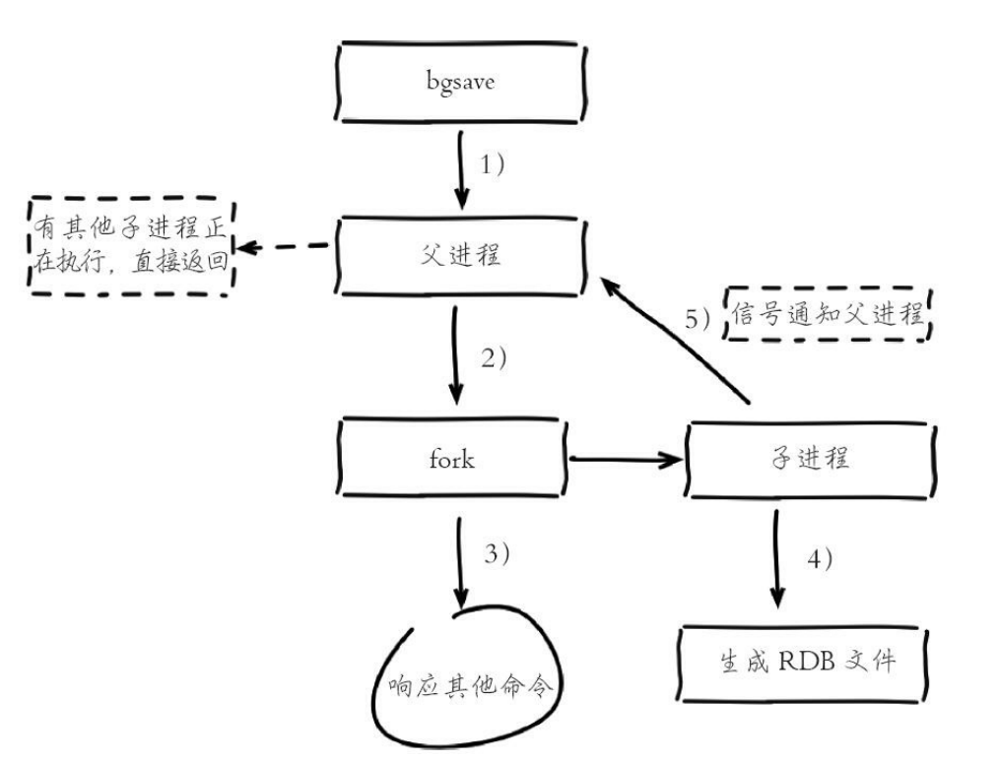
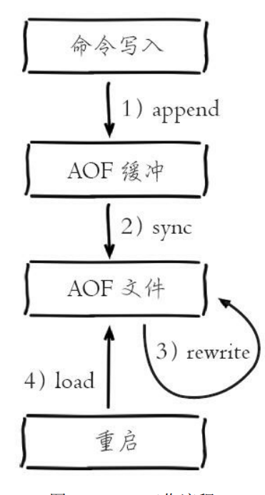
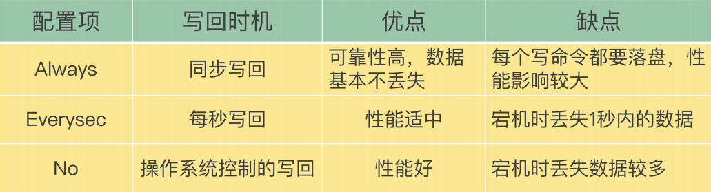
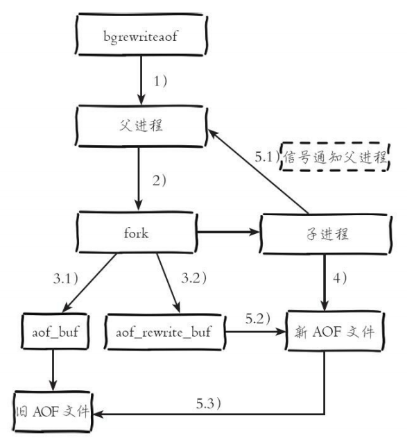
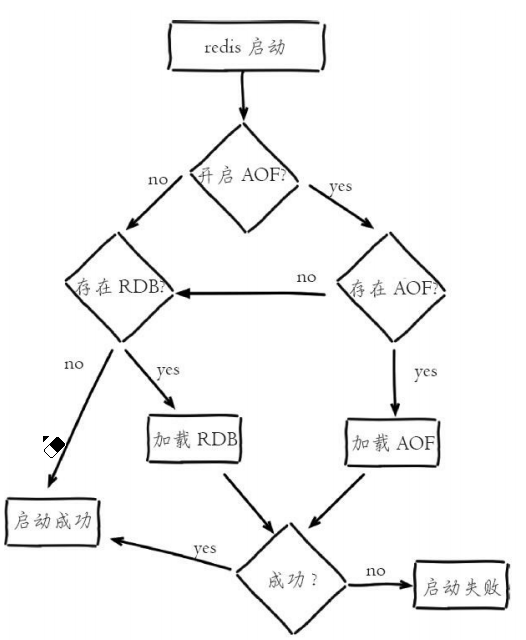
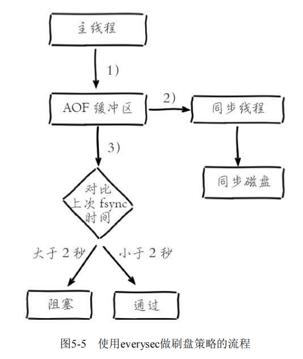
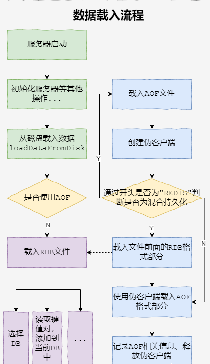

[toc]

Redis有三种持久化机制

* RDB
* AOF
* 混合持久化(RDB+AOF,Redis4.0引入)

# 1. RDB

RDB持久化——将当前进程数据生成快照保存到磁盘

Redis默认使用LZF算法对RDB文件进行压缩处理——压缩后的文件远远小于内存大小

## 1.1 RDB触发机制

* **手动触发**
  * **save命令**：阻塞主线程，直到RDB完成为止(已废除)
  * **bgsave命令**：Redis进程执行fork操作创建子进程，RDB持久化由子进程负责，完成后自动结束
* **自动触发**
  * **save配置**——配置文件中配置 save m n，达到条件后自动触发
  * **debug reload命令**——执行该命令，会自动触发
  * **shutdown**——默认情况下执行shutdown命令，如果没有开启AOF，那么自动执行bgsave

## 1.2 bgsave执行流程

1. 执行bgsave命令，Redis父进程判断当前是否存在正在执行的子进程(如RDB子进程,AOF子进程)，如果存在，bgsave直接返回
2. 父进程执行fork操作创建子进程，fork操作执行过程中会阻塞父进程
3. 父进程fork完成后，可以继续响应其他命令；由子进程负责RDB持久化
4. 子进程创建RDB文件，根据父进程内存生成临时快照文件，完成后对原有的RDB文件进行原子替换
5. 子进程发送信号通知父进程

## 1.3 RDB优缺点

### 1.3.1 优点

* RDB是一个紧凑压缩的二进制文件，代表Redis在某个时间点上的快照数据，非常适用于备份，全量复制等场景
* Redis加载RDB恢复数据远远快于AOF

### 1.3.2 缺点

* RDB方式下，数据没办法做到实时持久化/秒级持久化——因为bgsave每次都要fork一个子进程，属于重量级操作

* RDB文件使用特定二进制格式保存

  

# 2. AOF

AOF默认不开启，可以配置 **appendonly yes**来开启AOF

AOF是写后日志，先执行命令，后写AOF

## 2.1 AOF工作流程

1. **所有的写命令都会写入aof_buf中**
2. **AOF缓冲区根据对应的策略向磁盘做同步操作**
3. 随着AOF文件越来越大，**需要定期对AOF文件进行重写**
4. **Redis重启时，可以加载AOF进行数据恢复**

### 2.1.1 命令写入

每执行一条写命令，都会将该写命令写入aof_buf中，采用的是RESP协议

### 2.1.2 文件同步

首先我们先看下系统调用 **write**和 **fsync**

* **write**：将aof_buf中的内容写入操作系统缓存
* **fsync**：将操作系统缓存中的内容同步到磁盘上

Redis提供了多种文件同步策略——由 **参数appendfsync**控制

* **always**：命令写入aof_buf后立刻调用fsync同步到AOF文件中，fsync完成后线程返回
* **everysec**：命令写入aof_buf后调用write写入操作系统缓存，write完成后线程返回；有专门的线程每秒调用一次fsync同步文件
* **no**：命令写入aof_buf后调用write写入操作系统缓存，write完成后线程返回；由操作系统决定何时调用fsync同步文件

### 2.1.3 重写机制

#### 2.1.3.1 触发时机

* **手动触发**：直接调用 **bgrewriteaof命令**

* **自动触发**：根据 **auto-aof-rewrite-min-size**和 **auto-aof-rewrite-percentage**参数确定自动触发时机

  * **auto-aof-rewrite-size**：AOF重写时的最小文件体积(默认64MB)
  * **auto-aof-rewrite-percentage**：当前AOF文件空间和上一次重写后AOF文件空间的比值

  > 自动触发时机=aof_current_size>auto>aof-rewrite-min-size && (aof_current_size-aof_base_size)/aof_base_size>=auto-aof-rewrite-percentage

#### 2.1.3.2 重写流程

1) 执行AOF重写请求

2) 父进程执行fork创建子进程

3) 父进程fork操作完成后，继续响应其他命令

* 3.1) 写命令依然写入aof_buf并根据appendfsync策略同步到磁盘上的旧AOF文件

* 3.2) 父进程将写命令写入aof_rewrite_buf，防止新AOF文件生成期间丢失这部分数据

4) 子进程根据内存快照，按照命令合并规则写入新AOF文件中

5.1) 新的AOF文件写入完成后，子进程发送信号给父进程，父进程更新统计信息

5.2) 父进程将aof_rewrite_buf中的数据写入新AOF文件

5.3) 使用新AOF文件替换旧AOF文件

### 2.1.4 重启加载

该流程为不支持混合持久化时的重启加载流程

## 2.2 AOF追加阻塞

AOF持久化采用**everysec**作为同步磁盘策略——**命令写入aof_buf后调用write写入操作系统缓存，write完成后线程返回；有专门的线程每秒调用一次fsync同步文件**

但是该策略，在系统磁盘资源繁忙时，会造成**Redis主线程阻塞**

1. 主线程将命令写入aof_buf后调用write写入操作系统缓存
2. AOF线程负责每秒执行一次fsync同步磁盘操作，并记录最近一次同步时间
3. 主线程会对比上次AOF同步时间
   * 如果距离上次同步成功在2秒内——主线程返回
   * 如果距离上次同步成功超过2秒——主线程阻塞，直到同步操作完成

# 3. Redis4.0混合持久化

重启Redis时——很少使用RDB来恢复数据（因为会丢失大量数据），通常使用AOF日志重放，但是AOF速度慢

所以Redis4.0引入了**混合持久化**

* **RDB以一定的频率执行，在两次RDB之间，使用AOF来记录这段时间的所有命令操作**
* 重启Redis时，先加载最近一次RDB，再重放该RDB以后的AOF

## 3.1 混合持久化下的重启加载

# 4. 拓展

## 4.1 fork操作

生成RDB文件和AOF重写都用到了fork操作来创建子线程

* 子进程通过fork操作产生，理论上子进程占用的内存大小=父进程
* 但是Linux有写时复制机制(copy-on-write)，父进程和子进程会共享相同的物理内存页
* 父进程处理写请求时，会为要修改的内存页创建副本，然后对副本进行修改，而子进程看到的是子进程产生的那一刻的内存快照

### 改善fork操作

* 优先使用物理机或者高效支持fork操作的虚拟化技术
* 控制Redis最大可用内存，fork耗时与内存量成正比，线上建议每个Redis内存控制在10GB内
* 合理配置Linux内存分配策略，避免物理内存不足导致fork失败
* 降低fork操作的频率
* 避免在大量写入时进行fork操作，这样会导致父进程维护大量的副本也，造成内存消耗
* 如果部署多个Redis，尽量保证同一时刻只有一个子进程在工作

## 4.2 持久化运维建议

Redis主节点不进行持久化——持久化交由从节点执行