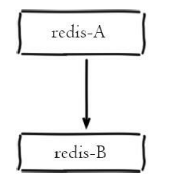
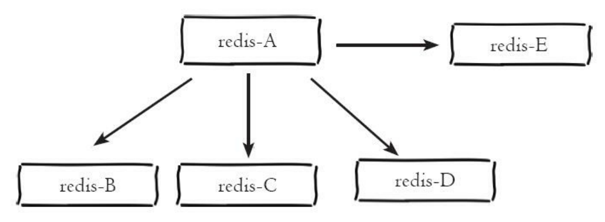
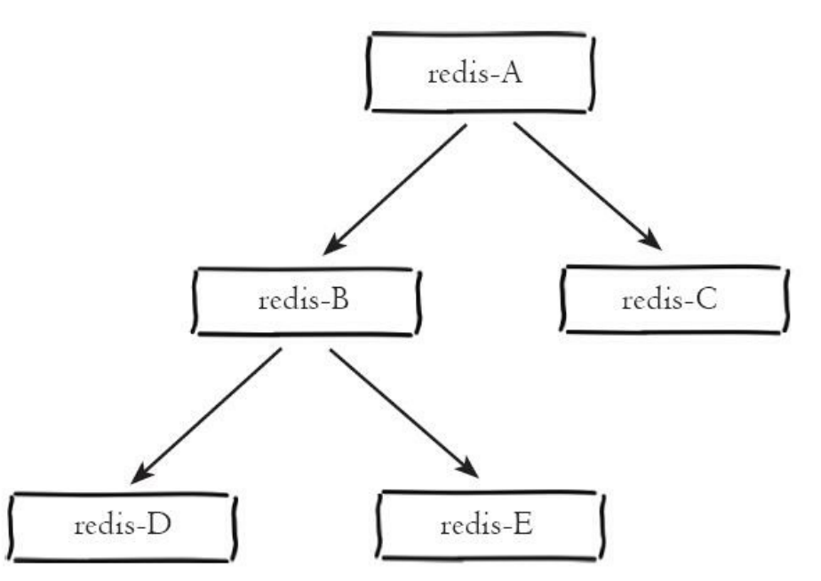

[toc]

# 1. 主从复制介绍

* 主从复制，就是将一台Redis服务器的数据，复制到其他Redis服务器，前者称为master，后者称为slav

* 数据的复制是单向的，只能由master到slaver

* master以写作主，slaver只读不写

  master可写，slave只能读不能写

  master中所有的数据和信息都会自动被slave保存

* 如果master宕机，slave仍能提供读服务，master重启后会再次加入集群

* 如果slave宕机后，slave重启会自动同步master数据

* 默认情况下，每个Redis都是master，我们只需要配置从机即可

# 2. 主从复制作用

1. 数据冗余：主从复制实现了数据的热备份
2. 故障恢复：当master出现问题时，可以由slave提供服务，实现快速的故障恢复
3. 负载均衡：在主从复制的基础上，配合读写分离，可以由master提供写服务，slave提供读服务，分担服务器负载
4. 高可用基石：主从复制是哨兵模式和集群模式能够实施的基础

# 3. 主从复制相关命令

## 3.1 查看集群信息

> info replication

## 3.2 建立复制

>1. 配置文件中加入 slaveof {masterHost} {masterPort}
>2. redis-server启动命令后加入 --slaveof {masterHost} {masterPort}
>3. 直接使用命令 slaveof {masterHost} {masterPort}

## 3.3 断开连接

> slaveof no one
>
> 断开连接后，从节点变为主节点
>
> 从节点断开复制后不会抛弃原有数据，但是无法再获得主节点的数据变化

# 4. 传输延迟

Redis提供 **repl-disable-tcp-nodelay**——控制是否关闭TCP_NODELAY，默认关闭

* **关闭时**——主节点产生的命令数据无论大小都会及时发送给从节点，主从之间延迟变小，但是网络带宽消耗增加
* **开启时**——主节点会合并较小的TCP数据报从而节省带宽

# 5. 拓扑结构

## 5.1 一主一从

* 提供故障转移支持
* 写命令并发高并且需要持久化——只在从节点开启AOF

## 5.2 一主多从

* 从节点分担主节点的读请求压力

## 5.3 树状主从结构

* 从节点不但可以复制主节点数据，同时可以作为其他从节点的主节点继续向下层复制

# 6. 复制原理

## 6.1 复制过程

从节点执行slaveof命令后

1. 执行slaveof后，slaver只保存master的地址信息便直接返回

2. slave内部通过每秒的定时任务尝试与master建立连接

   如果slave无法与master建立连接，那么定时任务会无限重试直到连接成功or执行slaveof no one取消复制

3. slave成功与master建立连接后，会向master发送ping请求进行首次通信

   * 检测主从节点之间的网络套接字是否可用
   * 检测主节点当前是否可接受处理命令

   如果slave发送ping后，没有收到master的pong回复or超时——slave断开连接，下次定时任务发起重连

4. 权限验证

   如果master设置了requirepass参数，则需要密码验证，slave必须配置masterauth保证与master相同的密码才能通过验证

   如果验证失败，复制将终止，slave重新发起复制流程

5. 同步数据集

   master将所有的数据发送给slave（第一次复制一定为全量复制），master把数据都发给slave后，就完成了复制的建立流程

6. 命令持续复制

   master持续地把写命令发送给slave，保证主从数据一致性

## 6.2 数据同步

* Redis2.8前用 sync——仅支持全量复制
* Redis2.8后使用psync——支持全量复制+部分复制

### 6.2.1 三个概念

psync需要以下组件支持

* 主从节点各自的复制偏移量
* 主节点复制积压缓冲区
* 主节点运行id

#### 6.2.1.1 复制偏移量

每个节点都会维护自身的复制偏移量

* 主节点处理完写入命令后，会将命令的字节长度做累加记录——主节点的复制偏移量
* 从节点接受到主节点发送的命令后，也会累加记录自身的偏移量，并且上报给主节点——从节点的复制偏移量

通过对比主从节点的复制偏移量，可以判断主从节点数据是否一致

#### 6.2.1.2 复制积压缓冲区

* **所有的从节点共享复制积压缓冲区**

* 复制积压缓冲区是保存在master上的**一个固定长度的FIFO队列**(默认大小1MB，**由repl-backlog-size参数控制**)——保存最近已复制的数据，用于**部分复制**和**复制命令丢失后的数据补救**

* 当master响应写命令时，不但会把写命令发送给slave，还会将命令写入复制积压缓冲区

#### 6.2.1.3 主节点运行id

每个Redis节点都会动态分配一个运行id——用于唯一标识Redis节点

Redis重启会重新分配一个运行id——debug reload重启就不会改变运行id

当slave发现master的运行id发生变化——会进行全量复制

### 6.2.2 psync命令执行过程

从节点使用psync命令实现全量复制和部分复制

1. 从节点向主节点发送psync命令

   > psync {runId} {offset}
   >
   > * runId：从节点保存的master的runId，如果没有则默认值为？
   > * offset：从节点保存的复制偏移量，如果是第一次参与复制则默认值为-1

2. master根据psync和自身数据情况来决定响应结果

   * 如果回复 **+FULLRESYNC {runId} {offset}**——从节点触发全量复制流程
   * 如果回复 **+CONTINUE**——从节点触发部分复制流程
   * 如果回复 **+ERR**——主节点版本低于Redis2.8，无法识别psync命令，从节点将发送旧版的sync命令

### 6.2.3 全量复制

#### 6.2.3.1 流程

1. 从节点发送psync命令请求进行数据同步，由于是第一次进行复制，slave没有master的runId和offset，所以发送 **psync ? -1**

2. 主节点根据 **psync ？ -1**解析出当前为全量复制请求，回复 **+FULLRESYNC**

3. 从节点接受到master的runId和offset，保存起来

4. master执行bgsave保存RDB文件到本地

5. master发送RDB文件给slave，slave将接收到的RDB文件保存到本地作为slave自己的数据文件

6. 从节点开始接收RDB文件到接收完成期间，master扔继续响应写请求

   master会将这期间的写命令保存在 **复制客户端缓冲区**

   当slave接收完RDB文件后，master将 **复制客户端缓冲区**内的数据发送给slave

7. 从节点接收完master传送来的全部数据后会清空自身旧数据

8. 从节点开始加载RDB文件

9. 从节点成功加载完RDB后，如果从节点开启了AOF持久化功能，它会立刻做bgrewriteaof操作——保证AOF持久化文件立刻可用

#### 6.2.3.2 全量复制过程中的问题

* 第5步——**如果生成的RDB文件过大,那么要格外小心，这一步非常耗时，如果传输时间超过repl-timeout所配置的值(默认60s)，从节点将放弃接收到的RDB文件并清除已经下载的临时文件，导师全量复制失败**

* 第6步——**如果master传输RDB文件时间过长，那么对于高并发写入场景，容易导致master复制客户端缓冲区溢出，默认配置为client-output-buffer-limie slave 256MB 64MB 60——如果60秒内缓冲区消耗持续大于64MB或者直接超过256MB，主节点将直接关闭复制客户端连接，全量复制失败**

* 对于读写分离场景，从节点负责响应读命令，如果从节点此时处于全量复制or复制中断，那么从节点在响应读命令时可能拿到过期or错误的数据

  Redis提供 **slave-server-stale-data参数**，默认开启——开启时，从节点依然响应所有命令，对于无法容忍不一致的场景，可以设置no来

* **全量复制耗时操作**

  * 主节点bgsave
  * RDB文件网络传输
  * 从节点清除旧数据
  * 从节点加载RDB
  * 可能的AOF重写

* 全量复制非常耗时，除了第一次复制采用全量复制外，其余场景应该尽量避免全量复制

### 6.2.4 部分复制

当slave正在复制master时，如果出现网络闪断or命令丢失等异常情况，slave会向master要求补发丢失的命令数据

如果master的复制积压缓冲区中存在这部分数据就直接发送给slave，如果不存在，**退化为全量复制**

* slave会将自身的偏移量和master的runID作为psync参数发送给master
* master会校验参数runID是否与自身runID一直，如果一致，那么根据参数offset在自身复制积压缓冲区中查找，如果参数offset之后的数据存在于复制积压缓冲区中，那么就将该数据发送给从节点

## 6.3 心跳

主从节点在建立复制后，彼此之间维护着**长连接**并彼此发送**心跳命令**

**主从节点心跳判断机制**

1. 主从节点彼此都有心跳检测机制，各自模拟成对方的Client进行通信

2. 主节点**默认10s(参数repl-ping-slave-period控制频率)**对从节点发送ping命令，判断从节点的存活性和连接状态

3. 从节点在主线程中每隔1s发送 **replconf ack {offset}命令**，给主节点上报自身的偏移量

   replconf有以下作用

   * 实时检测主从节点网络状态
   * 上报自身复制偏移量，检查复制数据是否丢失，如果从节点数据丢失，再从主节点的复制积压缓冲区中拉取数据
   * 保证从节点的数目和延迟性功能

4. 如果超过 **repl-timeout配置的值(默认60s)**，主节点将判断从节点下线并断开复制客户端连接

## 6.4 异步复制

主从节点在建立复制后，后续主节点将写命令发送给从节点——采用 **异步复制**

**流程**

1. 主节点接受并处理写命令
2. 主节点处理完写命令后返回结果
3. 主节点将写命令**异步**发送给从节点，从节点在主线程中执行复制

* 由于主从复制是异步的——造成从节点的数据相对主节点存在延迟——通过主从节点的复制偏移量判断

# 7. 主从复制在各场景下的问题

## 7.1 读写分离

将一部分读流量分摊给slave，来减轻master的压力

但可能遇到以下问题

### 7.1.1 复制数据延迟(主从数据不一致)

由于异步复制特性，数据延迟是无法避免的——可能出现刚在主节点写入数据后立刻在从节点上读取，获取不到数据的情况

**可以增加一个监控程序，循环判断从节点与主节点偏移量的差值，如果差值过大，就不让客户端连接这个从库**

### 7.1.2 读到过期数据

Redis3.2前——从节点有可能会读到过期数据

**从节点永远不会主动删除超时数据，但是在Redis3.2后，从节点在每次读取数据之前会检查key的过期时间来决定是否返回**

Redis有两种**过期键删除策略**—— **惰性删除** 和 **定时删除**

#### 7.1.2.1 惰性删除

主节点每次处理读命令时，都会检查key是否超时，如果超时——执行del命令删除key，然后将del命令异步发送给从节点

#### 7.1.2.2 定时删除

主节点在内部定时任务会循环采样一定数量的key，发现过期的key会执行del命令，然后将del命令异步发送给从节点

