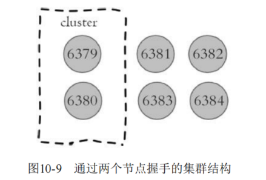
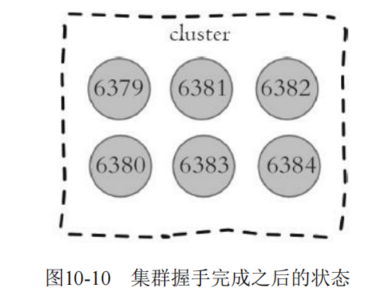
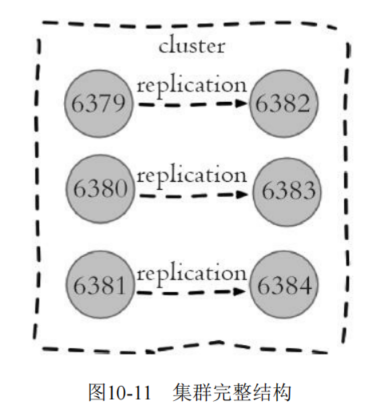
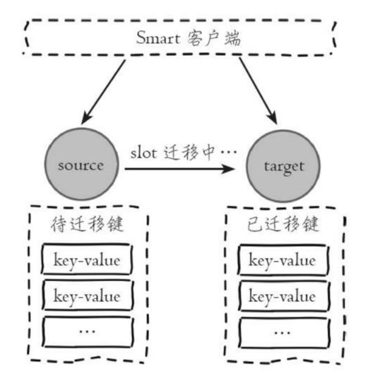
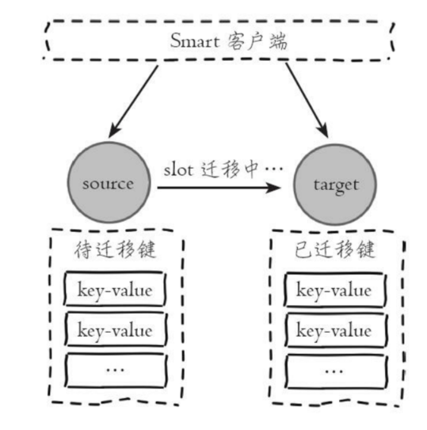
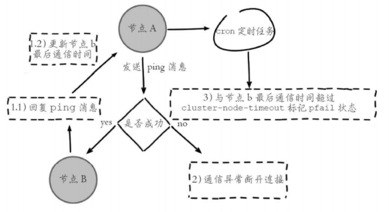
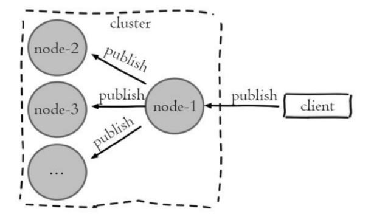

# 1. Redis Cluster的虚拟槽分区

Redis Cluster采用虚拟槽分区

* slot是Redis Cluster数据管理和数据迁移的基本单位

* Redis Cluster一共有0—16383,16384个slot

* 所有的key根据哈希函数映射到0—16383中

  > slot_index=CRC16(key)&16384


# 2. Redis Cluster功能限制

* key批量操作支持有限——只支持具有相同slot值的key执行批量操作
* key事务操作支持有限——只支持多key在同一node上的事务操作
* key作为数据分区的最小粒度——不能将一个大的键值对象映射到不同node
* 不支持多数据库哦空间——只使用Redis的0号数据库
* 复制结构只支持一层——不支持嵌套树状复制结构


# 3. 搭建Redis Cluster

## 3.1 准备节点并切动

配置如下

> port 6379
>
> cluster-enabled yes //开启集群模式
>
> cluster-node-timeout  15000 //节点超时时间
>
> cluster-config-file "node-6379.conf" //集群配置文件

* 如果启动Redis时存在集群配置文件，Redis会使用集群配置文件内容初始化集群信息，否则会创建一份集群配置文件
* Redis启动后会分配一个节点ID，并记录到集群配置文件中（重启会重新读取集群配置文件，所以节点ID不会改变）


## 3.2 节点握手

各个节点启动后，节点之间彼此不知道对方，无法构建一个集群——我们要通过节点握手让节点之间感知对方，构建一个集群


* 客户端向6379发出cluster meet命令，让6379向6380发出节点握手
* 6379向6380发送meet消息
* 6380收到meet消息后，保存6379的信息，并回复pong消息
* 之前6379与6380之间通过ping/pong进行节点通信



* 我们只需要在集群内任意一个及诶单上执行cluster meet命令加入新node，握手状态会通过消息在集群内传播，集群中的其他节点会自动发现新节点并发起握手流程



## 3.3 分配槽

握手完成后，集群仍然不能工作——处于下线状态，需要16384个slot都被分配后，集群才会进入在线状态

#### 主节点

我们给主节点分配槽

> cluster addslots {begin ..end}

#### 从节点

从节点不分配槽，作为主节点的从节点

> cluster replicate master_node_id



# 4. 集群内节点通信

Redis Cluster采用P2P的 **Gossip协议**

Gossip协议——**节点之间彼此不断通信交换信息**，一段时间后所有节点都会直到集群的完整信息（只要节点之间可以正常通信，最终一定会达到一致的状态）

## 4.1 Gossip消息

Gossip消息结构

* 消息头——包含发送节点自身的状态数据
* 消息体

Gossip分类

* **ping**——集群内的每个节点每秒向多个其他节点发送ping消息，用于 **检测节点是否在线**和 **交换彼此状态信息** 
  * **ping封装了节点自身的状态数据 和 部分其他节点(集群1/10的节点)的状态数据**
* **pong**——收到ping，meet时，作为响应消息回复给发送方确认信息
  * **pong封装了节点自身的状态数据**
* **meet**——用于通知新节点加入，消息发送者通知接受者加入集群
* **fail**——当节点判定集群中另一个节点下线时，会向集群内广播一个fail，其他节点收到fail，将对应节点更新为下线状态


## 4.2 节点选择

Redis Cluster中**节点之间彼此不断通信交换信息**——通过ping/pong消息

* 节点采用固定频率进行通信交换信息（每秒10次）
* 每次通信都要选择要进行通信的节点列表

**定时任务**

* **每秒1次的定时任务**

  每秒会随机选取5个node，然后找出最久没有通信的node发送ping消息，用于保证Gossip信息交换的随机性

* **每秒10次的定时任务**

  每100毫秒扫描本地节点列表，如果发现某个节点最近一次接受pong消息的时间 > cluster_node_timeout/2，那么立即发送ping消息，防止该节点信息太长时间未更新


# 5. 集群伸缩

集群的水平伸缩的上层原理——集群伸缩=槽和数据在node之间的移动

## 5.1 扩容集群

### 5.1.1 准备Redis节点

准备好一台Redis节点用于作新的主节点

### 5.1.2 迁移槽和数据

#### 5.1.2.1 槽迁移计划

slot是Redis集群管理数据的基本单位，迁移计划要确保每个节点负责相似数目的slot，从而保证各个主节点的数据均匀

#### 5.1.2.2 迁移数据

数据迁移是逐个slot进行的

> 1. 向target node发送 cluster setslot {slot} importing {sourceNodeId}
> 2. 向source node发送 cluster setslot {slot} migrating {targetNodeId}
> 3. source node循环执行 cluster getkeysinslot {slot} {count}命令，获取count个属于 槽{slot}的键
> 4. 在source node上执行 migrate {targetIp} {targetPort} "" 0 {timeout} keys {keys ...}命令，将获取的key通过pipeline机制批量迁移到target node
> 5. 重复步骤3和步骤4直到所有的键值数据迁移到target node
> 6. 向集群内所有主节点发送 cluster setslot {slot} node {targetNodeId}命令——告知其余主节点，这些槽分配给了targetNode 

### 5.1.3 添加从节点

为新的主节点添加一台从节点


## 5.2 收缩集群

1. 确定下线的节点是否有负责的slot，如果有，需要把slot迁移到其他节点，保证该节点下线后整个集群slot映射的完整性
2. 当下线节点不再负责槽或者本身是从节点时——通知集群内其他节点**忘记下线节点**，当所有节点忘记该节点后就可以正常关闭

#### 忘记节点

* 集群内的节点不停地通过Gossip信息彼此交换节点状态——要让其他节点不要再与下线节点进行Gossip信息交换——Redis提供 **cluster forget {downNodeId}**来实现忘记节点

* 当节点收到cluster forget命令后，会把nodeID指定的节点加入禁用列表，在禁用列表中的节点不再发送Gossip信息

  （禁用列表有效期60s，超过60s会再次参与信息交换）


# 6. 请求路由

## 6.1 MOVED重定向

* Redis Cluster下，Redis接受任何key相关命令时，首先计算key对应的slot，再根据slot找到对应的节点

  如果节点是自身——处理命令；否则恢复MOVED重定向错误，通知Client请求正确的节点

* MOVED重定向信息包含了键所对应的slot，slot所在的节点地址

* 节点对于不属于它的键命令只回复重定向响应，并不负责转发

### 6.1.1 计算槽

> slot_index=CRC16(key)&16384

### 6.1.2 槽所在节点查找

集群内通过消息交换——每个节点都会直到所有节点的槽信息，保存在 clusterState结构中

```c
typedef struct clusterState{
    clusterNode* myself;  //自身
    clusterNode* slots[CLUSTER_SLOTS];  //16384个槽和节点的映射数组
}
```


根据计算出的槽可以很容易直到其所在的节点

## 6.2 ASK重定向

如果slot对应的数据正在进行迁移，此时客户端请求访问该slot的数据，该slot的数据可能一部分在source node，一部分在target node



此时客户端会进行以下过程

1. Client访问source node，如果存在键对象就直接执行命令并返回结果

2. 如果键对象不在source node上，那么source node回复 ASK重定向异常

   > (error) ASK {slot} {targetIP}:{targetPort}

3. 客户端从ASK重定向异常中提取出targetNode信息，发送asking命令给targetNode建立连接，然后再执行命令



## 6.3 MOVED和ASK的区别

* ASK重定向说明集群正在进行slot迁移，客户端无法知道什么时候迁移完成，因此只是临时重定向
* MOVED重定向说明slot已经明确在确定的节点上，是永久重定向


# 7. 故障转移

## 7.1 故障发现

故障发现通过 **消息传播机制**实现——主要环节包括 **主观下线(pfail)**和 **客观下线(fail)**

* **主观下线(pfail)**——某个节点认为另一个节点不可用
* **客观下线(fail)**——标记一个节点真正的下线，集群内多个节点都认为该节点不可用

### 7.1.1 主观下线



每个节点内的 **clusterState结构**都会保存其他节点信息，用于**从自身视角判断其他节点的状态**

```c
typedef struct clusterState{
    clusterNode* myself; //自身节点
    dict* nodes;    //集群中所有node的字典结合，key为nodeID，value为对应节点的clusterNode结构
}

typedef struct clusterNode{
    int flags;  //节点的状态——主从角色，是否下线等
    mstime_t ping_sent;  //最后一次向该节点发送ping的时间
    mstime_t pong_received; //最后一次收到该节点pong的时间
    list* fail_reports;  //该节点的下线报告列表，记录集群中所有节点对该节点的下线报告
}

typedef struct clusterNodeFailReport{
    struct clusterNode* node; //报告该节点主观下线的节点
    mstime_t time; //收到下线报告的时间
}
```


### 7.1.2 客观下线

* 当某个节点判断另一个节点主观下线后，相应的节点状态会跟随**消息**在集群内传播

* 当节点1收到的节点3的ping消息，ping消息中含有节点2的pfail状态，会判断ping消息的发送节点节点3的状态

  * 如果发送节点是主节点，就对ping中的pfail进行处理
  * 如果发送节点是从节点，就忽略

* 节点1在本地找到**自己的clusterState结构**，从clusterState中找到pfail节点节点2的clusterNode结构，更新其**下线报告列表**（每个下线报告都存在有效期，每次在尝试触发客观下线时，都会检测下线报告是否过期，过期的报告要删除）

* 节点1根据更新后的下线报告列表**尝试进行客观下线**

  * 遍历下线报告列表，删除过期的下线报告，计算有效的下线报告数目

  * 有效的下线报告数目 > 主节点的一半？

    * 是——更新主观下线节点的状态为客观下线，**向集群广播客观下线节点的fail消息**

      **fail消息有2个作用**

      * 通知集群中的所有节点标记故障节点为客观下线
      * 通知**故障节点的从节点**触发**故障转移**流程

    * 否——退出

## 7.2 故障恢复

下线主节点的所有从节点承担故障恢复的义务——从节点内部通过定时任务发现自身复制的主节点进入客观下线时，**触发故障恢复**

**故障恢复流程**

* 资格检查
* 准备选举时间
* 发起选举
* 选举投票
* 替换主节点

### 7.2.0 配置纪元

* 配置纪元是一个只增不减的整数，每个主节点自身都会维护一个配置纪元**(clusterNode.configEpoch)**——标识当前主节点的版本

* 所有主节点的配置纪元都不相等，从节点会复制主节点的配置纪元
* 整个集群又维护一个全局的配置纪元**(clusterState.currentEpoch)**——记录集群中所有主节点配置纪元的最大值
* 主节点的配置纪元会随着ping/pong消息在集群内传播，当发送方与接收方都是主节点且配置纪元发生了冲突时，nodeID更大的一方会递增全局配置纪元，并赋予自己

#### 配置纪元的作用

* 标识集群内每个主节点的不同版本和当前集群的最大版本

* 每次集群发送重要事件——出现新的主节点(新加入的or从节点转换而来)

  都会递增全局的配置纪元，并赋予相关的主节点

* 具有更大配置纪元的主节点代表了更新的集群状态——当节点之间通过ping/pong消息交换时，如果出现了信息不一致，以配置纪元更大的一方为准

### 7.2.1 资格检查

下线主节点的每个从节点都会检查最后与主节点的断线时间，如果从节点与主节点的断线时间超过 **cluster-node-time* cluster-slave-validity-factor**，那么该从节点不具备故障转移资格

### 7.2.2 准备选举时间

确定节点的**选举的延迟触发时间**——只有达到该时间才会进行后续流程

1. 获取主节点的所有从节点
2. 获取自己的偏移量在所有从节点中的排名rank（偏移量越大，排名越小，排名从0开始）
3. **选举的延迟触发时间**=500+random()%500+ rank*1000

这里采用延迟触发机制——对多个从节点使用不同的延迟选举时间来支持优先级问题，复制偏移量越大的从节点，优先级越高，延迟越低


### 7.2.3 发起选举

从节点定时任务检测到到达了 **选举的延迟触发时间**——发起选举流程

1. 自增集群的全局配置纪元，保存在clusterState.failover_auth_epoch中——用于表示本次从节点发起选举的版本

2. 广播选举消息

   在集群内**广播选举消息(FAILOVER_AUTH_REQUEST)**，并记录已经发送过的消息的状态，保证从节点在一个配置纪元内只能发起一次选举

### 7.2.4 选举投票

* 只有持有槽的主节点才能处理选举消息

* 每个持有槽的主节点在一个配置纪元内都有唯一的一张选票

* 当接受到第一个请求投票的从节点消息时，就会回复 **FAILOVER_AUTH_ACK**消息作为投票，之后相同配置纪元内其他从节点的选举消息会被忽略

* 当从节点收集到了 N/2+1个持有槽的主节点的投票——从节点可以执行替换主节点操作**（N为持有槽的主节点总数，包括客观下线的主节点）**

#### 投票作废

* 每个配置纪元代表一次选举周期，如果在开始投票后的 cluster-node-timeout*2 时间内，从节点没有获得足够的投票，本次选举作废
* 从节点自增集群的全局配置纪元，保存在clusterState.failover_auth_epoch中，发起下一轮投票

### 7.2.5 替换主节点

* 从节点取消复制变为主节点
* 执行 clusterDelSlot操作撤销故障主节点负责的槽，并执行clusterAddSlot将这些槽委派给自己
* 向集群广播自己的pong消息，通过集群内所有的节点——当前节点变为主节点并接管了故障主节点的槽


# 8. 集群运维

## 8.1 集群完整性

* 为了保证集群完整性，默认情况下，当集群16384个槽中任何一个槽没有指派到节点时，整个集群不可用

* 从故障发现到自动完成转移期间，整个集群不可用

  如果无法容忍这种情况——将 **参数cluster-require-full-coverage**配置为no——主节点故障只会影响它负责的槽的命令执行，不会影响其他主节点

## 8.2 Pub/Sub广播问题



集群模式下所有的publish命令都会向所有的节点进行广播——避免Pub/Sub功能在大量节点的集群内使用

## 8.3 集群读写分离

### 8.3.1 只读模式

集群模式下，从节点不接受任何读写请求，发送过来的命令会重定向到负责槽的主节点上

如果想要让从节点分担主节点的读压力——**使用readonly命令**

### 