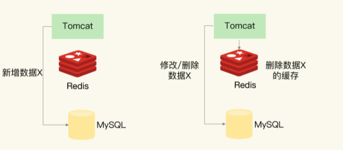
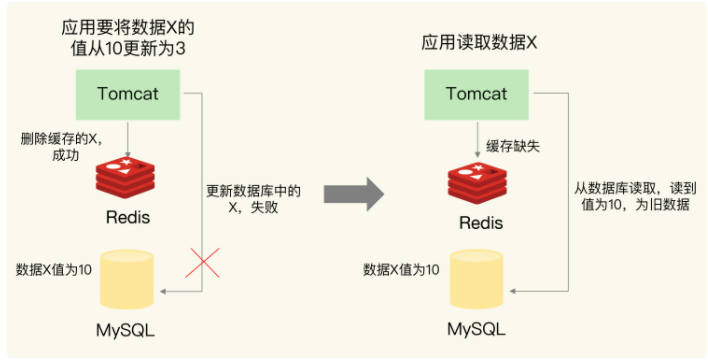
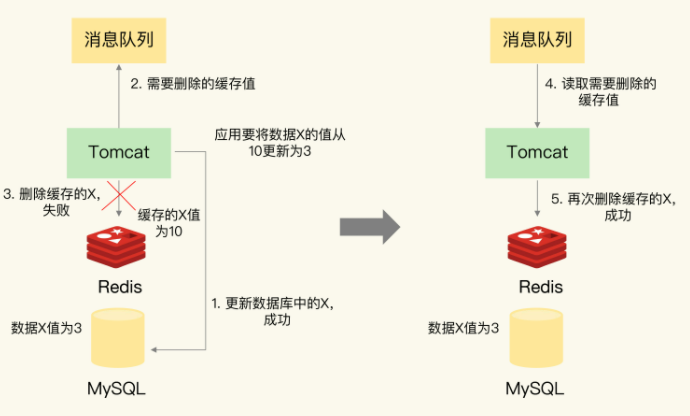
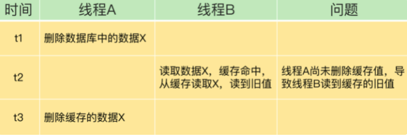

# 1. 数据一致性

数据一致性包含2种情况

* 缓存中有数据——缓存中的数据必须与数据库中的数据相同
* 缓存中无数据——数据库中的值必须是最新的

如果不符合这两种情况，那么缓存与数据库中的数据就不一致了

# 2. 缓存分类

根据是否接收写请求，缓存分为**只读缓存**与**读写缓存**

## 2.1 读写缓存

对于读写缓存

如果要对数据进行修改，就需要先缓存中进行，同时还要根据采取的 **写回策略**，决定如何写回到数据库中

* **写回策略**
  * **同步直写策略**
    * 写缓存时，同步写数据库，缓存与数据库中的数据一致
    * 适用于强一致性的业务场景
    * 在业务上使用时——要使用 **事务机制**，**保证缓存和数据库的更新具有原子性**
  * **异步写回策略**
    * 写缓存时，不同步写数据库，等待缓存中的数据被淘汰时，再写回数据库
    * 如果数据还没有写回缓存，缓存发生了故障，那么数据库就会丢失最新的数据
    * 适用于一致性要求没有那么高的业务场景

## 2.2 只读缓存

* 数据新增——直接写入数据库，不对缓存做任何操作
* 数据删除——直接写入数据库，删除缓存中的数据**（这两个操作要保证原子性）**
* 数据修改——直接写入数据库，删除缓存中的数据**（这两个操作要保证原子性）**

# 3. Redis作缓存

Redis一般是作为只读缓存

* 数据新增——直接写入数据库，不对缓存做任何操作
* 数据删除——直接写入数据库，删除缓存中的数据**（这两个操作要保证原子性）**
* 数据修改——直接写入数据库，删除缓存中的数据**（这两个操作要保证原子性）**

Redis作为只读缓存时，**插入操作**不会有什么问题(因为只设计对MySQL的操作，不会对Redis进行操作)，但是**删改操作**会有以下问题

## 3.1 先操作Redis再操作MySQL

有三种情况

1. 操作Redis失败，流程终止(没有任何数据改变，不会有任何问题)

2. 操作Redis成功，操作MySQL失败

3. 操作Redis成功，操作MySQL成功

第2种和第3种情况，会出现以下问题

### 3.1.1 操作Redis成功，操作MySQL失败

我们先在Redis中成功删除了旧数据，但是修改MySQL失败了

如果有其他线程要读取该数据时，会发生缓存缺失，然后从数据库中读取到 **旧数据**

#### 解决方案——重试机制

> 将要删除的缓存值或者要更新的数据库值暂存在消息队列中
>
> 如果操作失败，就从消息队列读取值，重试
>
> 

### 3.1.2 操作Redis成功，操作MySQL也成功

因为操作Redis和操作MySQL这两个操作之间是有时间差的，在高并发下这种情况会出现问题

#### 解决方案——延时双删

>操作Redis—操作MySQL—等待—再次操作Redis

## 3.2 先操作MySQL再操作Redis

有三种情况

1. 操作MySQL失败，流程终止(没有任何数据改变，不会有任何问题)
2. 操作MySQL成功，操作Redis失败
3. 操作MySQL成功，操作Redis成功

第2种和第3种情况，会出现以下问题

### 3.2.1 操作MySQL成功，操作Redis失败

我们现在MySQL中更新了数据，但是删除Redis失败，Redis中还存有旧数据

如果有其他线程要读取该数据时，会在Redis中获取到**旧数据**

#### 解决方案——重试机制

>将要删除的缓存值或者要更新的数据库值暂存在消息队列中
>
>如果操作失败，就从消息队列读取值，重试
>
>

### 3.2.2 操作MySQL成功，操作Redis成功

因为操作Redis和操作MySQL这两个操作之间是有时间差的，在高并发下这种情况会出现问题

#### 问题

> 在操作完Redis，到操作完MySQL这段时间内，会有数据不一致的情况

## 3.3 建议

**我们一般使用Redis作为只读缓存**——建议优先使用**先更新数据库再删除缓存**

* 先删除缓存再更新数据库，有可能导致请求缺失缓存而访问数据库，给数据库带来压力
* 如果业务中读取数据库和写缓存的时间不好估算，延迟双删的等待时间不好设置