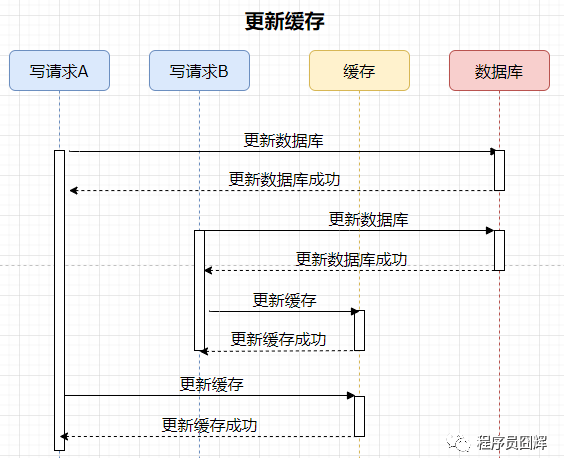
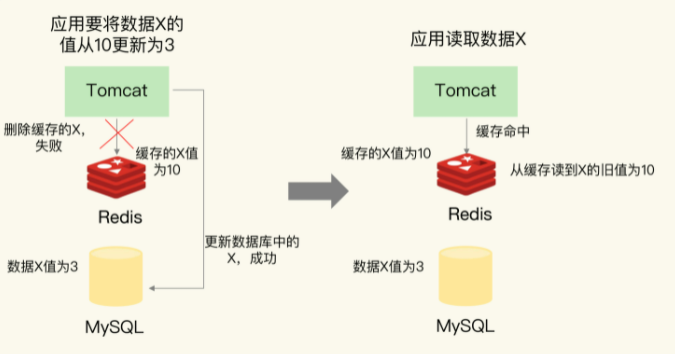

# 1. 数据一致性

数据一致性包含2种情况

* 缓存中有数据——缓存中的数据必须与数据库中的数据相同
* 缓存中无数据——数据库中的值必须是最新的

如果不符合这两种情况，那么缓存与数据库中的数据就不一致了

# 2. 缓存分类

根据是否接收写请求，缓存分为**只读缓存**与**读写缓存**

## 2.1 读写缓存

对于读写缓存

* **读**：从缓存中获取，如果缓存没有，就从数据库获取，然后放入缓存
* **写**：只会对缓存进行写入，由缓存根据 **写回策略**，决定如何将数据写到数据库中
  * **写回策略**
    * **同步直写策略**
      * 写缓存时，同步写数据库，缓存与数据库中的数据一致
      * 适用于强一致性的业务场景
      * 在业务上使用时——要使用 **事务机制**，**保证缓存和数据库的更新具有原子性**
    * **异步写回策略**
      * 写缓存时，不同步写数据库，等待缓存中的数据被淘汰时，再写回数据库
      * 如果数据还没有写回缓存，缓存发生了故障，那么数据库就会丢失最新的数据
      * 适用于一致性要求没有那么高的业务场景

## 2.2 只读缓存

* **读**——直接从缓存中读，如果缓存没有，就从数据库获取，然后放入缓存
* **写**
  * **增**——直接插入数据库，不对缓存操作
  * **删**——让缓存中数据失效 and 删除数据库中的数据
  * **改**——让缓存中数据失效 and 修改数据库中的数据

### 为什么是让缓存失效而不是更新缓存

>在并发下，更新缓存可能会出现下面的情况
>
>在该情况下，数据库的数据是写请求B，缓存的数据是写请求A，数据不一致
>
>但是如果让缓存失效就不会出现这种数据不一致的情况
>
>
>
>

# 3. Redis作只读缓存

Redis作为只读缓存时，**插入操作**不会有什么问题(因为只设计对MySQL的操作，不会对Redis进行操作)，但是**删改操作**会有以下问题

## 3.1 先操作Redis再操作MySQL

有三种情况

1. 操作Redis失败，流程终止(没有任何数据改变，不会有任何问题)（失败情况）

2. 操作Redis成功，操作MySQL失败（失败情况）

3. 操作Redis成功，操作MySQL成功（成功情况）

第2种和第3种情况，会出现以下问题

### 3.1.1 操作Redis成功，操作MySQL失败

我们先在Redis中成功删除了旧数据，但是修改MySQL失败了

如果有其他线程要读取该数据时，会发生缓存缺失，然后从数据库中读取到 **旧数据**

#### 解决方案——重试机制

> 操作Redis成功，但是操作MySQL失败——整个流程是失败的，MySQL中的数据并没有被修改，需要我们重试
>
> 其他线程读取到旧数据是可以接受的，因为数据的修改操作还未成功

### 3.1.2 操作Redis成功，操作MySQL也成功

因为操作Redis和操作MySQL这两个操作之间是有时间差的，在高并发下这种情况会出现问题

#### 问题

> 整个操作完成后，会出现Redis中是旧数据，MySQL中是新数据的情况（这种情况持续到下一次对该数据进行更新）

#### 解决方案——延时双删

>操作Redis—操作MySQL—等待—再次操作Redis，可以保证了Redis和MySQL在延时双删后的数据一致性
>
>但是还在延时双删过程中还是会有一段时间的数据不一致

## 3.2 先操作MySQL再操作Redis

有三种情况

1. 操作MySQL失败，流程终止(没有任何数据改变，不会有任何问题)（失败情况）
2. 操作MySQL成功，操作Redis失败（失败情况）
3. 操作MySQL成功，操作Redis成功（成功情况）

第2种和第3种情况，会出现以下问题

### 3.2.1 操作MySQL成功，操作Redis失败

我们现在MySQL中更新了数据，但是删除Redis失败，Redis中还存有旧数据

如果有其他线程要读取该数据时，会在Redis中获取到**旧数据**

#### 解决方案——重试机制

### 3.2.2 操作MySQL成功，操作Redis成功

因为操作Redis和操作MySQL这两个操作之间是有时间差的，在高并发下这种情况会出现问题

#### 问题

> 在操作完Redis，到操作完MySQL这段时间内，会有数据不一致的情况，但是这个时间范围很小（只有几毫秒）

## 3.3 建议

**我们一般使用Redis作为只读缓存**——建议优先使用**先更新数据库再删除缓存**

* 先删除缓存再更新数据库，有可能导致请求缺失缓存而访问数据库，给数据库带来压力
* 如果业务中读取数据库和写缓存的时间不好估算，延迟双删的等待时间不好设置