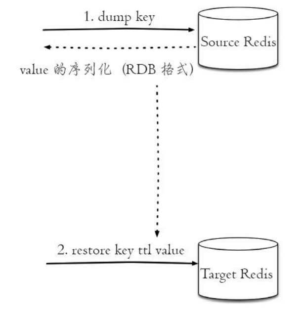
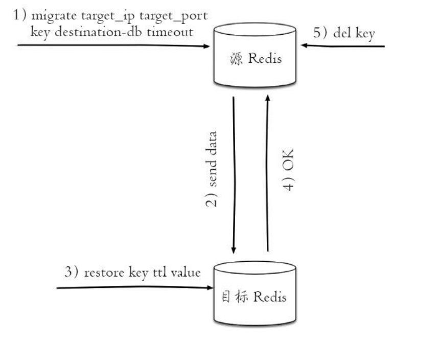
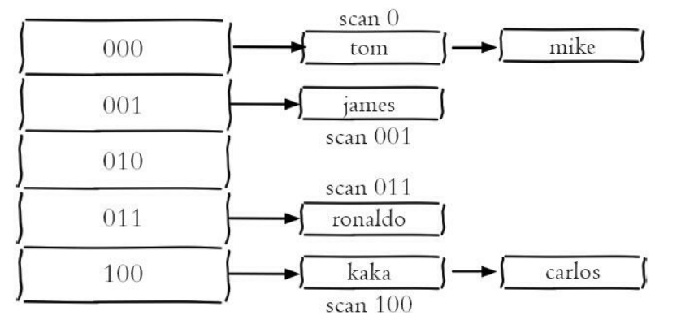
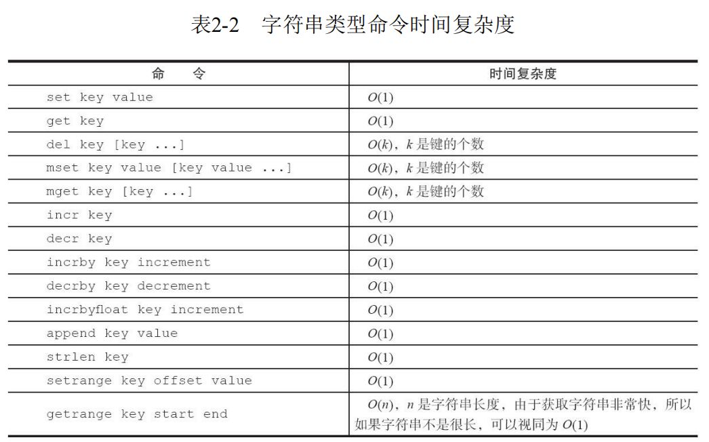
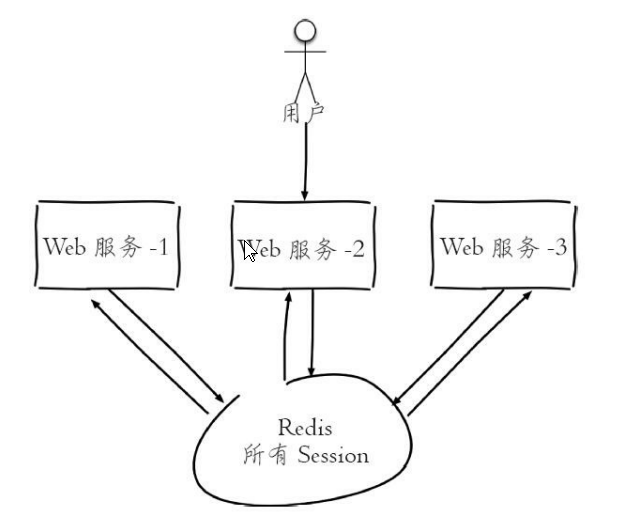
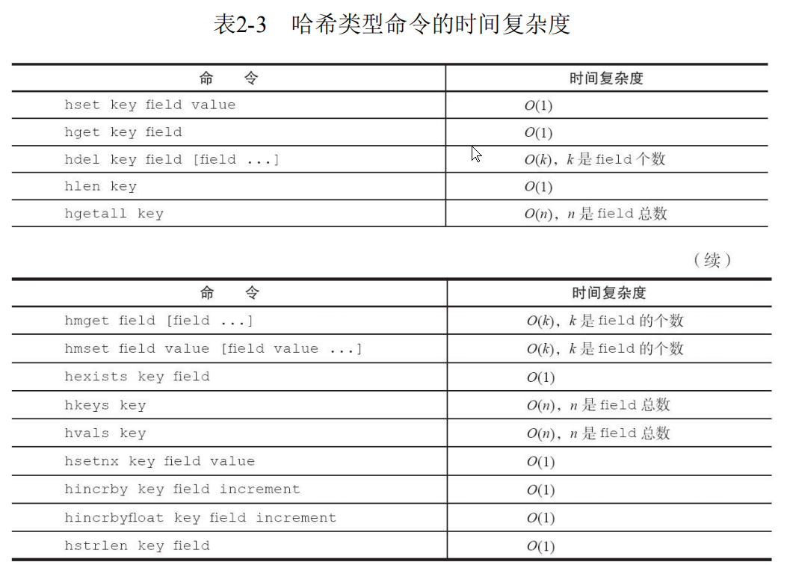
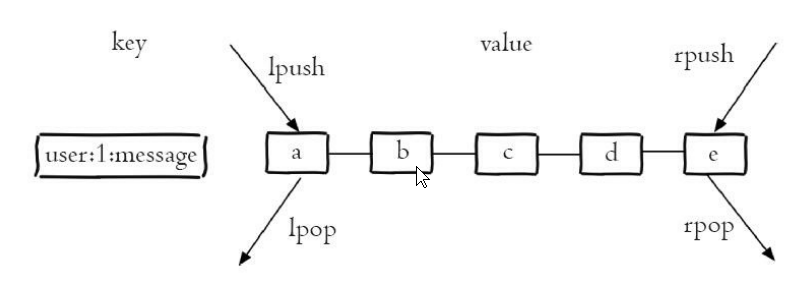
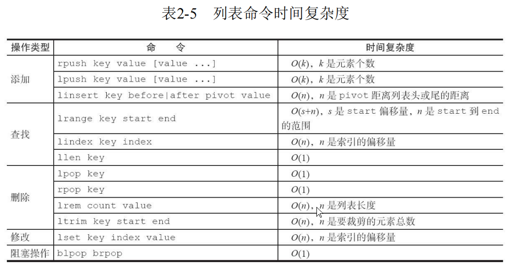
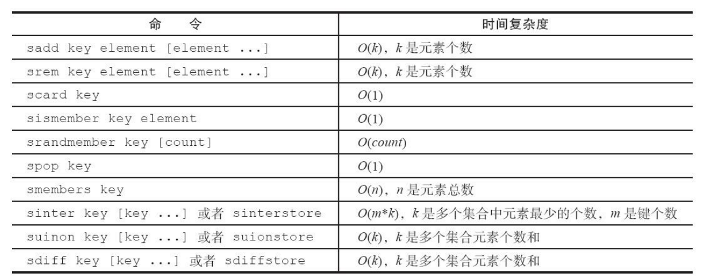
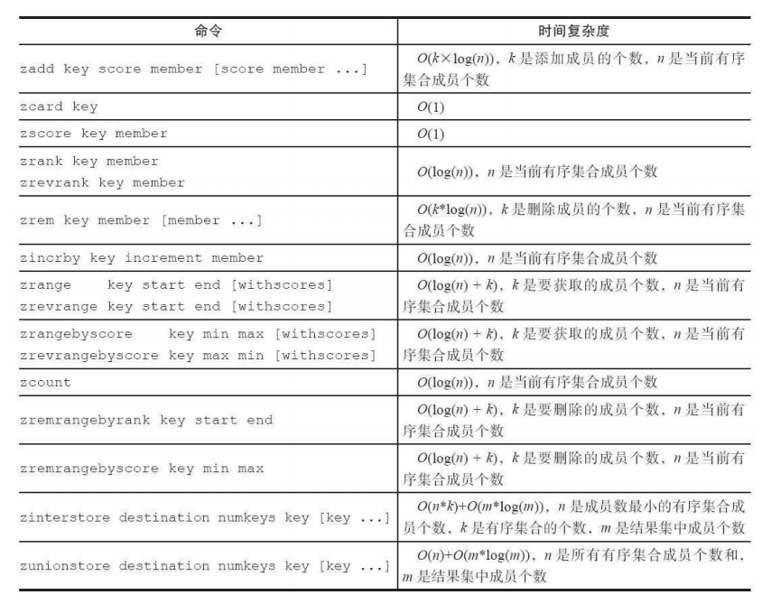

[toc]


# 1. Redis数据类型及其内部编码

Redis根据**value的不同**，分为以下类型（每种类型都有多种内部编码）

* **常见**
  * **string**
    * raw
    * int
    * embstr
  * **hash**
    * hashtable
    * ziplist
  * **list**
    * hashtable
    * ziplist
    * quicklist
  * **set**
    * hashtable
    * intset
  * **zset**
    * skiplist
    * ziplist

* **少用**
  * geospatial
  * hyperloglog
  * bitmap


## Redis使用内部编码的好处

>1. 可以改进内部编码，而对外的数据结构和命令没有影响，一旦开发出了更优秀的内部编码，无序改动外部数据结构和命令
>2. 多种内部编码可以在不同的场景下发挥各自的优势


# 2. Redis Key

## 2.1 查看所有Key

>keys *

## 2.2 Key是否存在

> exists key

## 2.3 移除Key

>move key 1
>del key

## 2.4 键过期

> expire key seconds——键在seconds秒后过期
>
> expireat key timestamp——键在秒级时间戳timestamp后过期
>
> pexpire key milliseconds——键在milliseconds毫秒后过期
>
> pexpireat key milliseconds-timestamp——键在毫秒级时间戳timestamp后过期
>
> persist key——清除过期时间
>
> * 如果expire设置的key不存在——返回0
> * 如果过期时间设置为负数——key立即被删除
> * 对于字符串类型键，执行set命令会去掉过期时间

## 2.5 查询过期时间

>ttl key
>//如果key不存在，返回-2
>//如果key存在，但没有设置过期时间，返回-1
>//返回剩余过期时间，单位s

## 2.6 查看数据类型类型

> type key 

## 2.7 查看内部编码

> object encoding key

## 2.8 key重命名

> rename key newName——如果newName原本存在，那么newName的值会被覆盖
>
> renamenx key newName——只有newName不存在时，才可以rename

## 2.9 随机返回一个key

> randomkey

## 2.10 迁移键

### 2.10.1 move

> move key db——Redis内部进行数据迁移

### 2.10.2 dump+restore

> dump key
>
> restore key ttl value



#### 2.10.2.1 过程

dump+restore可以实现在不同Redis实例之间进行数据迁移

* 在源Redis上，dump命令会将键值序列化，格式采用的是RDB格式
* 在target Redis上，restore会将上面序列化的值进行复原
  * ttl：过期时间，如果ttl=0代表没有过期时间

#### 2.10.2.2 缺点

* 整个迁移过程不是原子性的，而是通过Client分步完成
* 迁移过程中开启了2个Client连接，dump的结果通过Client由Source Redis传输给Target Redis

#### 2.10.2.3 伪代码

```java
Redis sourceRedis=new Redis("sourceMachine",6379);
Redis targetRedis=new Redis("targetMachine",6379);
targetRedis.restore("hello",0,sourceRedis.dump(key));
```


### 2.10.3 migrate

> migrate host port key|"" destination-db timeout [copy] [replace] [keys key [key ...] ]
>
> * host：目标Redis的IP
> * port：目标Redis的port
> * key|""：如果迁移一个键，那么此处为要迁移的key；如果要迁移多个key，那么此处为""
> * destination-db：目标Redis的数据库索引
> * timeout：迁移的超时时间(单位毫秒)
> * [copy]：如果添加该选项，那么迁移完成后，Source Redis不删除源key
> * [replace]：如果添加该选项，那么目标Redis如果存在同名Key，会进行数据覆盖
> * [keys key [key ...] ]：迁移多个Key



* migrate将dump，restore，del三个明亮进行组合，简化了操作流程
* migrate具有原子性，整个过程是原子执行的，不需要在多个Redis实例上开启Client，只需要在Source Redis上执行migrate命令即可


## 2.11 遍历键

### 2.11.1 全量遍历

> keys pattern——支持pattern匹配，对key进行全量遍历
>
> * pattern使用glob风格的通配符
>   * *代表匹配任意字符
>   * ？代表匹配一个字符
>   * [ ]代表匹配部分字符

**缺点(生产环境不建议使用)**

* 执行keys命令，很可能会导致Redis阻塞

### 2.11.2 渐进式遍历

* scan采用渐进式的方式来解决keys命令可能带来的阻塞问题

* 每次scan的时间复杂度是O(1)

* Redis存储键值对实际使用的是hashtable

  

  > scan cursor [match pattern] [count number]
  >
  > * cursor：游标，第一次遍历从0开始，每次scan遍历完都会返回当前游标的值，直到游标值为0，表示遍历结束
  > * count number：每次要遍历的key个数(默认是10)
  >
  > 
  >
  > hscan：遍历hash
  >
  > sscan：遍历set
  >
  > zscan：遍历zset

  

  

# 3. string

* key都是string类型
* string最大不能超过512MB


## 3.1 API

### 3.1.1 设置值

>set key value [ex secnods] [px milliseconds] [nx|xx]
>
>* ex seconds: 为键设置秒级过期时间
>* px milliseconds：为键设置毫秒级过期时间
>* nx：键必须不存在才能设置成功
>* xx：键必须存在才能设置成功
>
>
>
>setex key seconds value——同上ex选项
>
>setnx key value——同上nx选项

### 3.1.2 追加

> append key content——如果key不存在，相当如set；如果key存在，往value后追加

### 3.1.3 获取值

>get key

### 3.1.4 自增和自减

>incr key——自增1
>
>decr key——自减1
>
>incrby key n——自增n
>
>decrby key n——自减n

### 3.1.5 批量操作

> msetnx/msetex/mset key value[key value.....]——批量设置
>
> mget key [key ...]——批量获取

### 3.1.6 获取长度

>strlen key

### 3.1.7 获取子串

>getrange key begin end——获取字符串 [begin,end]构建的子串,end=-1表示到结尾

### 3.1.8 替换子串

>setrange key begin xxx——将字符串从begin开始，往后替换为xxx

### 3.1.9 getset

>getset key value——先get再set


## 3.2 string API的时间复杂度




## 3.3 内部编码

* **int**：8B的长整型

* **embstr**：小于等于39B的字符串
* **raw**：大于39B的字符串

## 3.4 应用场景

### 3.4.1 缓存

```java
UserInfo getUserInfo(long id){
    userRedisKey="user:indo:"+id;
    value=redis.get(userRedisKey);
    UserInfo userInfo;
    if(value!=null){
        userInfo=deserialize(value);
    }else{
        userInfo=mysql.get(id);
        if(userInfo!=null){
            redis.setex(userRedis,3600,serialize(userInfo));
        }
    }
    return userInfo;
}
```

### 3.4.2 计数器

### 3.4.3 共享Session



### 3.4.4 限速

```java
phoneNum="138XXXXXXX";
key="shortMsg:limit:"+phoneNum;
isExists=redis.set(key,1,"EX 60","NX");
if(isExists!=null || redis.incr(key)<=5){
    //通过
}else{
    //限速
}
```


# 4. hash

hash——key-Map

## 4.1 API

### 4.1.1 设置值

>hset key field value [field value ...]

### 4.1.2 获取值

>hget key field

### 4.1.3 删除field

>hdel key field [field ...]

### 4.1.4 获取field个数

> hlen key

### 4.1.5 批量操作

>hmset key field value [field value ...]
>
>hmget key field [field....]

### 4.1.6 判断field是否存在

> hexists key field

### 4.1.7 获取所有的field

> hkeys key

### 4.1.8 获取所有的value

> hvals key

### 4.1.9 获取所有的field-value

> hgetall key

### 4.1.10 字段自增长

>hincrby key field count
>
>hincrbyfloat key field count

### 4.1.11 计算value的长度

> hstrlen key field


## 4.2 hash API的时间复杂度



## 4.3 内部编码

* **zpilist**

  * **使用场景**

    当元素个数< hash-max-ziplist-entries(默认配置512)&&所有的value都< hash-max-ziplist-value(默认配置64B)

    使用ziplist

  * **特点**

    * 节约内存——使用更紧凑的结构实现多个元素的连续存储
    * 元素个数太多时，读写效率低下

* **hashtable**

  * **使用场景**

    无法使用ziplist时，使用hashtable

  * **特点**

    * 占用内存较大
    * 读写效率高


# 5. list



**特点**

* 列表中的元素是有序的，可以通过索引定位
* 列表中元素可以重复
* 可以把list玩成栈，队列，阻塞队列

## 5.1 API

### 5.1.1 插入元素

> lpush key value [value]——从左边插入元素
>
> rpush key value [value]——从右边插入元素
>
> linsert key before|after pivot value——向某个元素前|后插入元素(在列表中从左找到第一个等于pivot的元素)

### 5.1.2 弹出元素

> lpop key——从左边取出元素
>
> rpop key——从右边取出元素


### 5.1.3 查找

> lrange key begin end——查找下标[begin,end]的元素
>
> lindex key index——查找下标为index的元素


### 5.1.4 获取列表长度

> llen key


### 5.1.5 删除

>lrem key count value——找到列表中等于value的值，删除
>
>* count>0，从左到右，删除最多count个元素
>* count<0，从右到左，删除最多-count个元素
>* count=0，删除所有

### 5.1.6 修剪列表

> ltrim key start end


### 5.1.7 修改

> lset key index newValue

### 5.1.8 将一个list中的元素转移到另一个list中

>lpoprpush source des—从source左边取出一个元素，放入des右边
>
>rpoplpush source de

### 5.1.9 阻塞操作

> blpop key [key ...] timeout
>
> brpop key [key ...] timeout
>
> * 列表不为空，立刻返回
>
> * 列表为空，阻塞
>
>   * timeout——阻塞时间，如果timeout为0，那么Client会一直阻塞
>
> * 如果一个Client对多个key执行该操作
>
>   那么brpop会从左到右遍历key，一旦有一个key不为空，可以弹出元素，那么Client会立刻返回
>
> * 如果多个Client对一个Key执行brpop
>
>   如果列表为空，那么这多个Client都会阻塞
>
>   一旦列表中插入了一个元素，那么最先执行brpop的Client会获得弹出的值，返回，其他Client继续阻塞

## 5.2 list API的时间复杂度




## 5.3 内部编码

* **旧**

  * **ziplist**

    * **使用场景**

      列表的元素个数< **list-max-ziplist-entries**(默认512个) && 列表中每个元素的值都< **list-max-ziplist-value**(默认64B)

    * **特点**

      * 节约内存——使用更紧凑的结构实现多个元素的连续存储
      * 元素个数太多时，读写效率低下

  * **linkedlist**

    * **使用场景**

      无法满足ziplist时，使用该类型

    * **特点**

      * 内存消耗大
      * 读写效率高

* **新**

  * **quicklist**

    Redis3.2新编码——Redis3.2后都使用这个

    废除了 **list-max-ziplist-entries**和**list-max-ziplist-value**

    使用新配置**list-max-ziplist-size**(表示最大压缩空间或长度)


## 5.4 list实现栈,队列,有限集合,消息队列

>lpush+lpop=Stack
>
>lpush+rpop=Queue
>
>lpush+ltrem=有限集合
>
>lpush+brpop=消息队列


# 6. set

**特点**

* set中的值不能重复
* 元素无序，不能通过索引下标获得元素

## 6.1 API

### 6.1.1 添加元素

> sadd key element [element ...]

### 6.1.2 删除元素

> srem key element [element ...]

### 6.1.3 计算元素个数

> scard key

### 6.1.4 判断元素是否在集合中

> sismember key element

### 6.1.5 随机从集合中返回元素

> srandmember key [count]

### 6.1.6 获取所有元素

> smembers key

### 6.1.7 将一个元素移到另一个集合中

> smove source dest target——将source中的target移动到dest中

### 6.1.8 集合间操作

>sinter key [key ...]——集合交集
>
>sunion key [key ...]——集合并集
>
>sdiff key [key ...]——集合差集
>
>sinterstrore destination key [key ...]——集合交集并保存
>
>sunionstore destination key [key ...]——集合并集并保存
>
>sdiffstore destination key [key ...]——集合差集并保存


## 6.2 set API时间复杂度



## 6.3 内部编码

* **intset**

  集合中的元素都是整数 && 元素个数<set-max-intset-entries(默认512个)

* **hashtable**


# 7. zset

有序集合——为每个元素设置一个score，按照score进行排序

## 7.1 API

### 7.1.1 添加

>zadd key [NX|XX] [CH] [INCR] score member [score member]
>
>* NX：member必须不存在，才可以设置成功
>* XX：member必须存在，才可以设置成功
>* CH：返回此次操作后，有序集合内元素和分数发生变化的个数
>* incr：对score做增加操作

### 7.1.2 计算成员个数

> zcard key

### 7.1.3 获取成员分数

> zscore key member

### 7.1.4 计算成员排名

> zrank key member——从低到高返回排名
>
> zrevrank key member——从高到低返回排名

### 7.1.5 删除

> zrem key member [member ...]

### 7.1.6 增加成员分数

> zincrby key incrememt member

### 7.1.7 返回指定排名范围的成员

> zrange key start end [withscores] 
>
> zrevrange key start end [withscores]

### 7.1.8 返回指定分数范围内的成员

> zrangebyscore key min max [withscores] [limit offset count]
>
> zrevrangebyscore key max min [withscores] [limit offset count]
>
> 显示有序集合中score在[min,max]的元素
> withscores会显示元素的score
> limit offset count：选出来的元素构成一个新的集合，并显示offset开始的count个元素

### 7.1.9 返回指定分数范围内的成员个数

> zcount key min max——返回集合中score在[min,max]的元素个数

### 7.1.10 删除指定排名内的成员

> zremrangebyrank key start end

### 7.1.11 删除指定分数范围内的成员

> zremrangebyscore key min max

### 7.1.12 集合操作

> zinterstore destination numkeys key [key ...] [weights weight [weight ...] ] [aggregate sum|min|max]——交集
>
> * destination：结果保存到该key
> * numkeys：进行操作的key的个数
> * key [key ...]：进行操作的key
> * weights weight [weight ...]：每个key的权重，计算时，每个key中的member都会将自己的分数*对应的权重
> * aggregate sum|min|max：计算后，分值按照sum，min，max做汇总(默认是sum)
>
> 
>
> zunionstore destination numkeys key [key ...] [weights weight [weight ...] ] [aggregate sum|min|max]——并集

## 7.2 zset API的时间复杂度



## 7.3 内部编码

* **ziplist**

  有序集合的元素个数< zset-max-ziplist-entries(默认128个) && 每个元素都< zset-max-ziplist-value(默认64B)

  * **特点**
    * 消耗内存小
    * 数据量大时，读写效率降低

* **skiplist**

  ziplist不满足时，使用skiplist作为内部实现

# 8. Geospatial

### 8.1 GEO实现

* Redis通过zset+geohash实现GEO
* Redis将二维经纬度通过geohash转换为 **一维字符串**，然后将字符串存储在zset中
* geohash编码与经纬度之间可以相互转换

## 8.2 API

### 8.2.1 添加地理位置信息

> geoadd key 经度 维度 member [经度 维度 member ...]

### 8.2.2 获取地理位置信息

>geopos key member [member ...] 

### 8.2.3 计算两个地理位置的距离

> geodist key member1 member2 [unit]
>
> unit为返回结果单位
>
> * m：米
> * km：公里
> * mi：英里
> * ft：尺

### 8.2.4 获取指定范围内的元素

> georadius  key  longitude  latitude  radiusm|km|ft|mi  [withcoord]  [withdist]  [withhash]  [COUNT count]  [asc|desc]  [store key]  [storedist key]  
>
> georadiusbymember  key  member  radiusm|km|ft|mi  [withcoord]  [withdist]  [withhash]  [COUNT count]  [asc|desc]  [store key]  [storedist key]  
>
> 一个是以经纬度为中心，一个是以指定元素为中心
>
> * radisum|km|ft|mi：指定半径和单位
> * withcoord：返回结果中包含经纬度
> * withdist：返回结果包含离中心位置的距离
> * withhash：返回结果包含geohash
> * COUNT count：指定返回结果的数目
> * asc|desc：返回结果按照距离中心位置的记录做升序or降序
> * store key：将结果保存到指定的key
> * storedist key：将距离保存到key

### 8.2.5 获取geohash

> geohash key member [member ...]


# 9. HyperLogLog

* HyperLogLog不是一种数据结构，是一种基数统计算法（统计一个集合中不同元素的数目）
* HyperLogLog通过string实现

## 9.1 优点

占用的内存时固定的，对于2^64不同的元素的计数，只需要12KB内存

但是有0.81%的错误率

## 9.2 API

### 9.2.1 添加

> pfadd key element [element...]

### 9.2.2 统计数目

> pfcount key [key ...]——计算一个或多个HyperLogLog的独立总数

### 9.2.3 合并

> pfmerge destkey sourcekey [sourcekey ...]——将sourceKey中的元素复制一份到destKey中


# 10. Bitmaps

* bitmaps位图——数据结构，操作二进制位来进行记录，只有0和1两个状态
* Bitmaps本身不是一种数据结构，**实际上它是string**，但是它可以对string的位进行操作
* 可以把Bitmaps想象为一个以位为单位的数组，数组的每个单元只能存储0或1

## 10.1 设置值

> setbit key offset value

## 10.2 获取值

> getbit key offset

## 10.3 获取Bitmaps指定范围内1的个数

> bitcount [start] [end]

## 10.4 Bitmaps间的运算

> bitop op destkey key [key ...]
>
> 进行and(交集)，or(并集)，not(非)，xor(异或)，并将结果保存在destkey中

## 10.5 计算Bitmaps中第一个值为targetBit的偏移量

> bitops key targetBit [start] [end]

