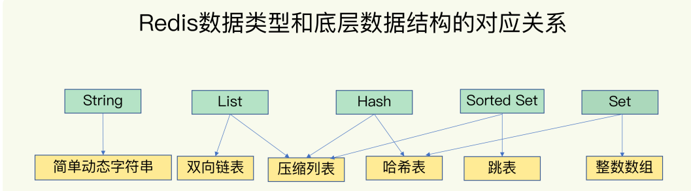

[toc]


# 1. Redis数据类型及其内部编码

Redis根据**value的不同**，分为以下类型（每种类型都有多种内部编码）

* **常见**
  * **string**
    * raw（底层数据结构是SDS）
    * int（底层数据结构是SDS）
    * embstr（底层数据结构是SDS）
  * **hash**
    * hashtable
    * ziplist
  * **list**
    * hashtable
    * ziplist
    * quicklist
  * **set**
    * hashtable
    * intset
  * **zset**
    * skiplist
    * ziplist

* **少用**
  * Geospatial
  * HyperLogLog
  * Bitmap


## Redis使用内部编码的好处

>1. 可以改进内部编码，而对外的数据结构和命令没有影响，一旦开发出了更优秀的内部编码，无序改动外部数据结构和命令
>2. 多种内部编码可以在不同的场景下发挥各自的优势


# 2. Redis的全局哈希表和RedisObject


## 2.1 Redis Object

Redis存储的数据 **都** 用**redisObject**来封装

```c
typedef struct redisObject{
    unsigned int type;      //4B，对象类型
    unsigned int encoding;  //4B，内部编码类型
    REDIS_LRU_BITS lru;     //记录对象最后一次被访问的时间
    int refcount;           //引用计数器，记录当前对象被引用的次数
    void * ptr              //与对象的数据内容相关——如果是整数，直接存储数据，否则为指向数据的指针
}
```


## 2.2 全局哈希表

Redis使用哈希表来存储键值对

* Redis哈希表中的哈希桶保存的是指向Entry的指针
* Redis有两个全局哈希表
* Redis通过链式哈希解决冲突
* Redis的rehash是渐进式的


### rehash

Redis有2个全局哈希表，Redis采用渐进式rehash

0. Redis一次只会使用一个哈希表，另一个哈希表不会被分配空间

1. Redis给哈希表2分配更大的空间（例如是哈希表1的2倍）

2. Redis每处理一个请求，就将哈希表1中第一个索引位置上的entry拷贝到哈希表2中

   再处理一个请求，就将哈希表1中第二个索引位置上的entry拷贝到哈希表2中

   依次类推，直到哈希表1中的所有元素都拷贝到哈希表2中

3. 释放哈希表1的空间


# 3. Redis底层数据结构

Redis一共有**6种底层数据结构**——**简单动态字符串**，**双向链表**，**压缩列表**，**哈希表**，**跳表**，**整数数组**

Redis后续还加入了一种新的——**quciklist** 




## 3.1 简单动态字符串

Redis的简单动态字符串(simple dynamic string，SDS)

string的内部编码 **raw**，**int**，**embstr**都是基于SDS实现的

```c
typedef struct SBS{
    int len;   //已用长度
    int free;  //未用长度
    char buf[];//字符数据
}
```

Redis对于字符串的使用——采用 **空间预分配机制**

* 第一次创建时，len属性=实际大小，free为0，不做预分配

* 修改后，如果已有free空间不够且数据<1MB，每次预分配一倍容量

  >原有len=60b，free=0，再追加60b，预分配120b——len=120b，free=120b

* 修改后，如果已有free空间不够且数据>1MB，每次预分配1MB容量


#### 内部编码int，embstr和raw使用SBS

* **embstr**：RedisObject与SDS连续存放在一起，使用malloc分配一次内存
* **raw**：RedisObject与SDS分开存储，使用malloc分配两次
* **int**：RedisObject的ptr直接存储数据


## 3.2 压缩列表(ziplist)

压缩列表结构如下


**压缩列表**

* 内部表现为数据紧凑排列的一块连续内存数组——节约内存
* 可以快速定位到第一个元素和最后一个元素——以O(1)实现入队和出队
* 对中间元素的操作涉及复杂的指针移动，时间复杂度就是O(N)了


## 3.3 双向链表(linkedlist)

```c
struct list{
    listNode* head;
    listNode* tail;
    long length;
}

struct listNode<T>{
    listNode* prev;
    listNode* next;
    T value
}
```


## 3.4 quicklist

* quciklist是ziplist和linkedlist的混合体
* quicklist内部默认每个ziplist长度为8KB，超过该长度，会另起一个ziplist
* quicklist默认压缩深度为0（不压缩）——压缩深度由 **参数list-compress-depth**决定

```c
struct quciklist{
    quicklistNode* head;
    quicklistNode* tail;
    long count; //元素个数
    int nodes;  //ziplist节点的个数
    int compressDepth; //LZF算法压缩深度
}

struct quicklistNode{
    quicklistNode* prev;
    quciklistNode* next;
    ziplist* zl; //指向压缩列表的指针
    int32 size; //ziplist的字节总数
    int16 count;//ziplist中的元素数目
    int2 encoding;//存储形式，使用原生字节数组还是LZF压缩存储
}
```


## 3.5 整数数组(intset)


intset保存的整数类型根据长度划分——int16，int32，int64

### 升级操作

如果intset保存的都是int16，然后插入了一个int32的元素，那么会创建一个新的intset(保存int32)，然后将旧intset的元素都拷贝进新的intset，删除旧intset


## 3.6 跳表(skiplist)


**时间复杂度O(logN)**

