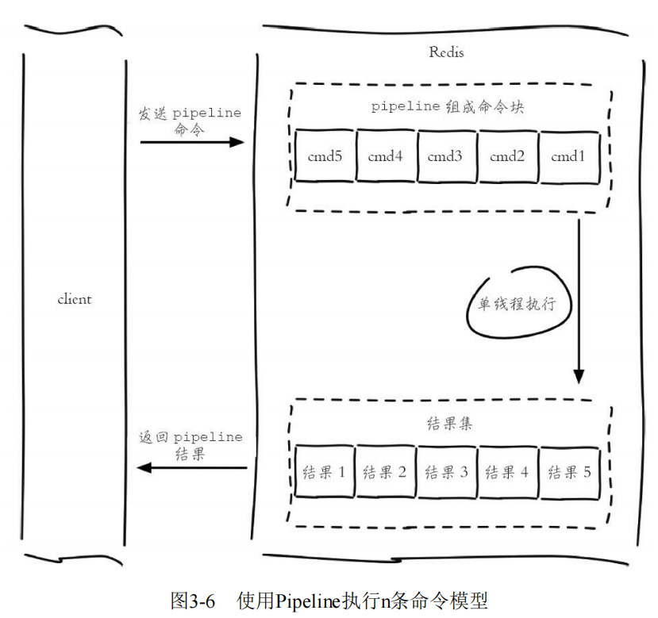

### 1. 一条命令的生命周期

其中，1) + 4)称为 Round Trip Time(RTT，往返时间)

### 2. Pipeline

Redis提供了批量操作命令，可以有效地节约RTT，但是大部分命令是不支持批量操作的

Pipeline机制可以解决这种问题——它将一组Redis命令进行组装，通过一次RTT传输给Redis，再将这组命令的执行结果按照顺序返回给Client

### 3. Pipeline和原生批量操作的区别

* 原生批量操作是原子的

  Pipeline是非原子的

* 原生批量操作时一个命令对应多个key

  Pipeline支持多个命令

* 原生批量操作时Redis服务端支持实现的

  Pipeline需要服务端与客户端共同实现