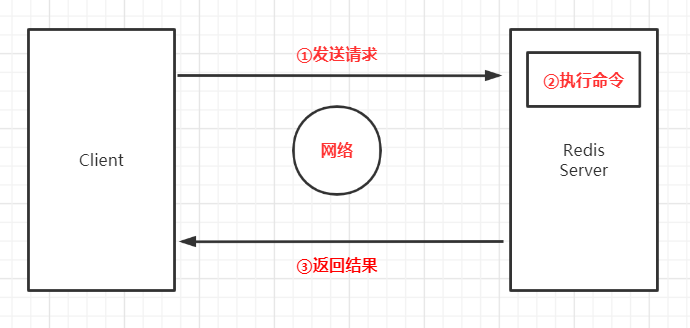
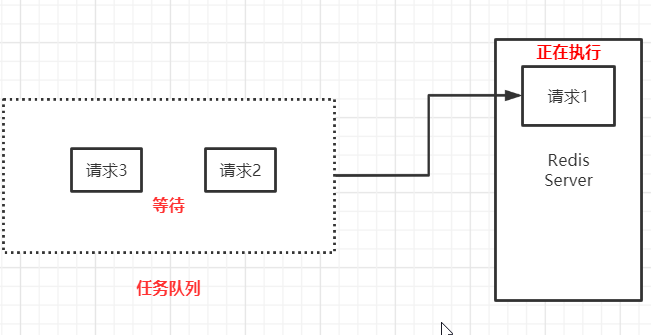
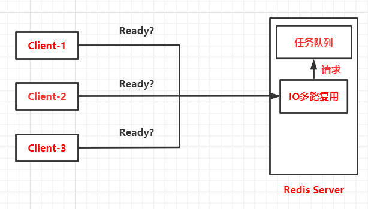

* **Redis架构模型**
  * **单线程架构** 
  * **IO多路复用**   
  * **任务队列**  

* **Redis服务器与Client交互模型**  
   
  
* **单线程+任务队列**   
  Redis是单线程处理命令，一次只能处理一条命令，所有Client发送一条请求给服务器，服务器不会立即执行，所有请求会进入**一个队列**中，然后依次执行   
  

  
* **IO多路复用**    
     
  Redis使用epoll左右IO多路复用技术的实现
  

* **Redis单线程却高速的原因**  
  * ①纯内存访问，所有数据存储在内存中
  * ②非阻塞IO，Redis使用epoll作为IO多路复用技术的实现，加上Redis的事件处理模型，将epoll中的连接，读写，关闭都转换为事件，不在网络IO上浪费过多时间 
  * ③单线程避免了线程切换和竞态产生的消耗  
