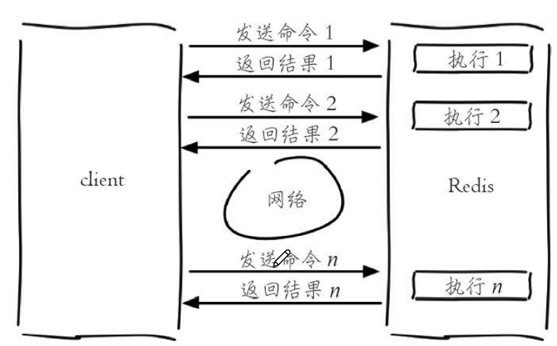
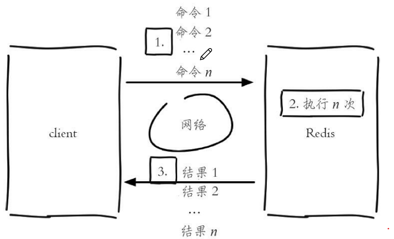
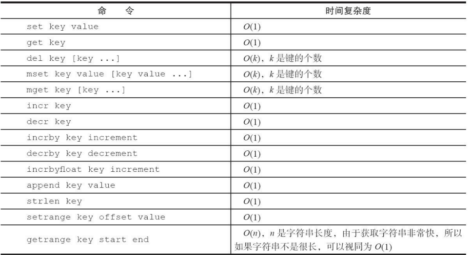

* string类型的值可以是简单字符串，复杂字符串(JSON),数字(整数，浮点数)，也可以是二进制(图片，音频，视频)，但是最大大小不能超过512MB   

* **命令**  
  * **设置值**
      * **set key value [ex seconds] [px milliseconds] [nx|xx]** 
        * ex seconds ：为键设置秒级过期时间
        * px milliseconds：为键设置毫秒级过期时间  
        * nx：键不存在，才可以设置成功，用于添加
        * xx：键存在，才可以设置成功，用于修改  
      * setex：同set的ex——**setex key seconds value**
      * setnx：同set的nx——**setnx key value**    
      * **批量设置值**——**mset key1 value1 [key2 value2 key3 value3......]**
  * **获取值**
    * **get key** 
    * **批量获取值**——**mget key1 [key2 key3 ......]**   
  * **删除键值对** 
    * **del key**
  * **计数(对值操作)**   
    * **自增incr key**  
        * key存在，但不是整数——返回ERROR
        * key存在，且是整数——返回自增后的结果  
        * key不存在，添加键值对(key,1),返回1   
    * **自减decr** 
    * **自增指定数字incrby(number)** 
    * **自减指定数字decrby(number)** 
    * **自增浮点数incrbyfloat(number)** 
  * **其他**  
    * append key something：在键值对的值后追加something  
    * strlen key:返回键值中的值的长度
    * getset key newValue:设置新值，并返回原值
    * setrange key offset some:将值offset处的字符设为some(从0开始)
    * getrange key begin end：获取值的[begin,end]的字串(从0开始) 
    
    

* **批量获取值的好处**   
对于Client来说，一次命令=网络时间(发送命令和接收结果)+Server处理时间  
  批量获取值，极大的缩短了时间，但可能会导致Redis阻塞or网络拥塞
    * 多次get  
    
  * 批量获取值   
        
    
* **各操作的时间复杂度**  
      
  
* **string的内部编码**  
   * int：8个字节的长整型
   * embstr：<=39个字节的字符串
   * raw：>39个字节的字符串  
    

