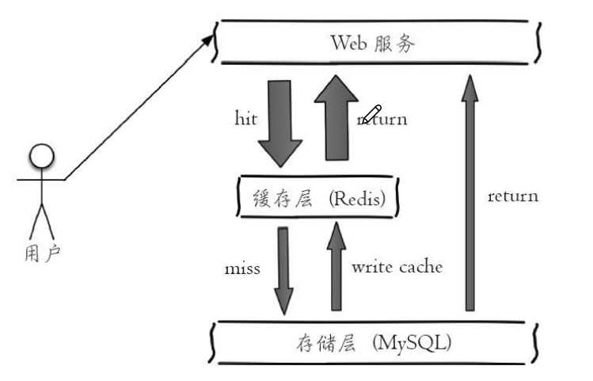
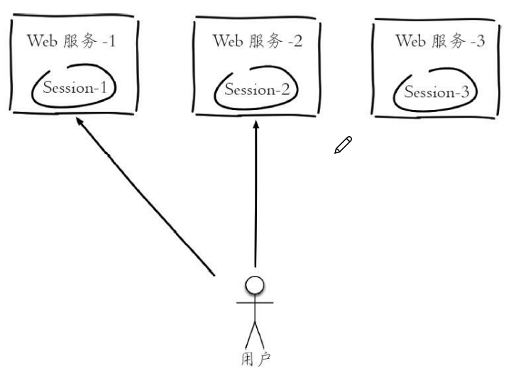
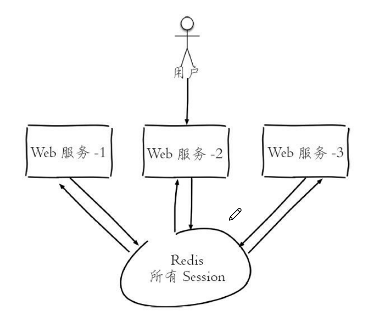

**1.实现缓存功能**   
   
* Redis没有命名空间，对于key的命名   
  * 业务名.对象名.id.属性名  
  * 数据库名.表明.id.列名   

**2.计数**  

**3.分布式下的共享Session**   
  
分布式下，用户每次登录都可能连接到不能的服务器，那么Session信息在不同服务器之间无法共享   
用Redis来实现共享Session，如下图   
 