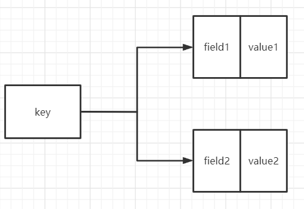
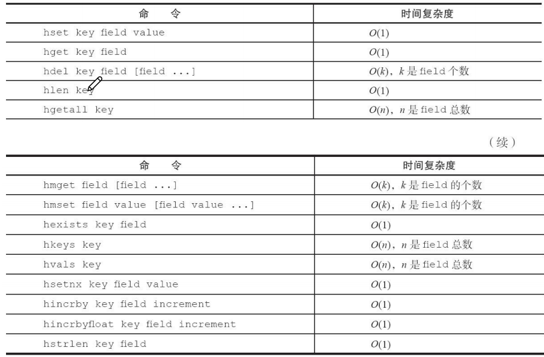

  
* **哈希有三个成员**——key，field，value    
  filed-value:映射对，field映射到value     
  **同一个key下可以有多个field-value**  
  

* **设置值**  
  * **hset key field value**    
  * **hsetnx**   
  * **批量设置值(只能同一个key下)**——**hmset key1 filed1 value1 [field2 value2 ......]**  
    

* **获取值**   
  * **hget key field**   
  * **批量获取值(只能同一个key下)**——**hmget key1 filed1 [filed2......]**  

* **删除** 
  * **hdel key field1 [field2,......]**：返回成功删除的个数  

* **判断field是否存在**
    * **hexists key filed**
    

* **计算key下field-value个数** 
  * **hlen key**  

* **获取某个key下所有的field**  
  * **hkeys key**

* **获取某个key下所有的value** 
  * **hvals key** 
    
* **获取某个key下所有的field-value**  
  * **hgetall key**   
  * 哈希元素较多的时候使用hgetall key容易导致Redis阻塞   
    如果只要获取部分的field-value，建议使用hmget   
    如果一定要获取所有的field-value，使用**hscan**,该命令会渐进式遍历哈希   
    
* **增长**  
  * **hincrby key field**
  * **hincrbyfloat key field**  
    

* **计算value字段长度** 
  * **hstrlen key field**   
    

* **各操作时间复杂度**   
      
  

* **内部编码**   
  * **指的是某个key下存储多个field-value的形式**
  * **ziplist**  
    ①key下field-value个数<hash-max-ziplist-entries(默认512个)   
    ②所有的value大小<hash-max-ziplist-value(默认64字节)  
    满足①②时，使用ziplist来存储field-value,ziplist使用更加紧凑的结构来存储field-value，节省内存  
  * **hashtable**   
    无法满足ziplist使用条件时，使用hashtable,hashtable读写皆为**O(1)**
    

    
