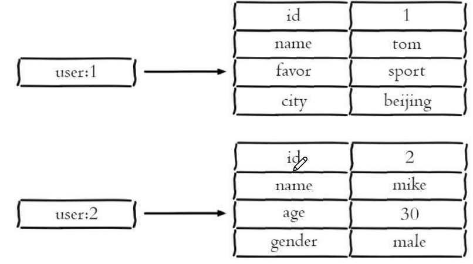

**1. 使用字符串**   
```
//每个属性一个键  
set user1.name hxq
set user1.age 20
set user1.score 90
```
* 优点：简单直观    
* 缺点：占用过多的内存  
**2. 使用序列化** 
```
set user1 serialize(userInfo)
```
* 优点：简化编程，提高内存使用率
* 缺点：序列化和反序列化需要一定开销，每次更新属性都需要把数据反序列化，更新后再序列化

**3. 使用哈希**    

* 优点：简单直观，可以减少内存空间使用   
* 缺点：要控制ziplist和hashtable之间的转换  