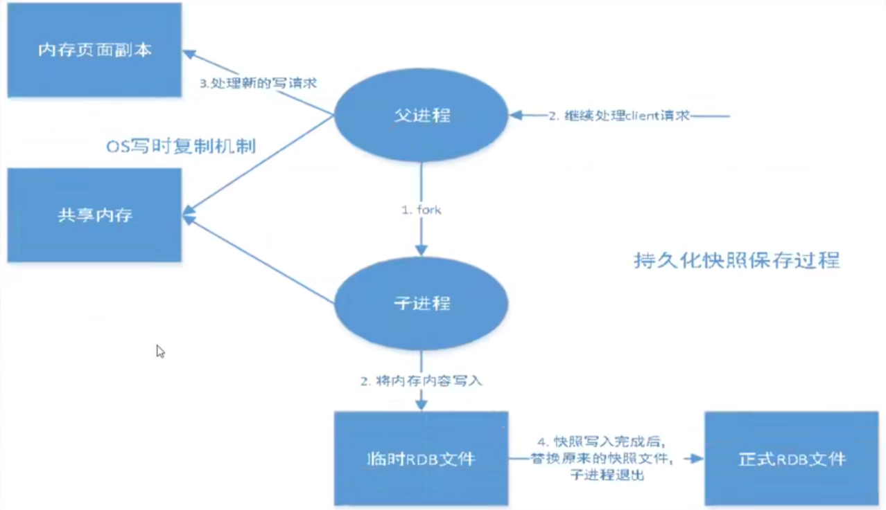
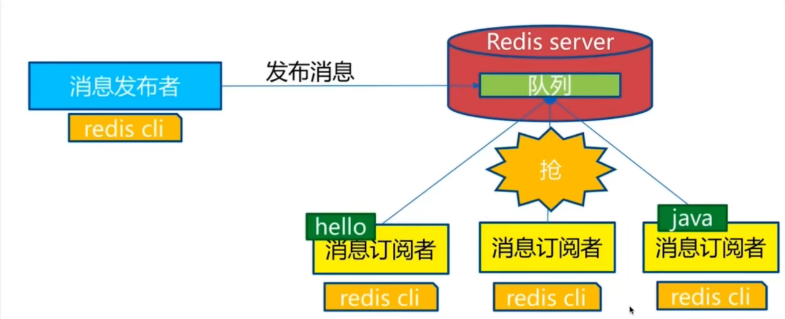
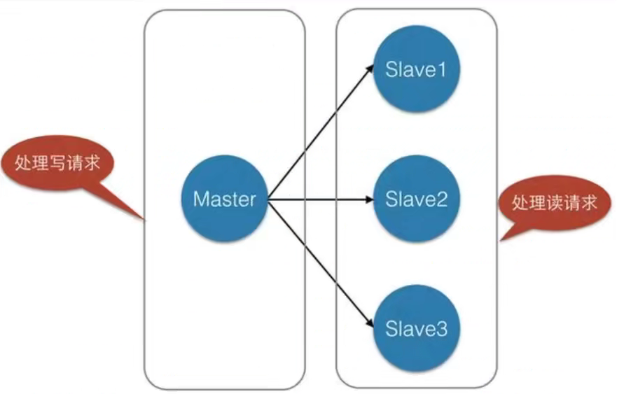
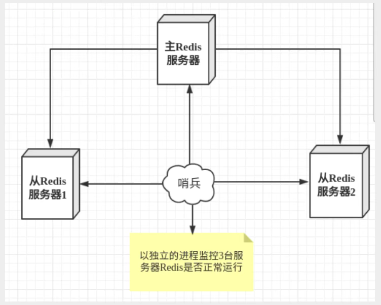
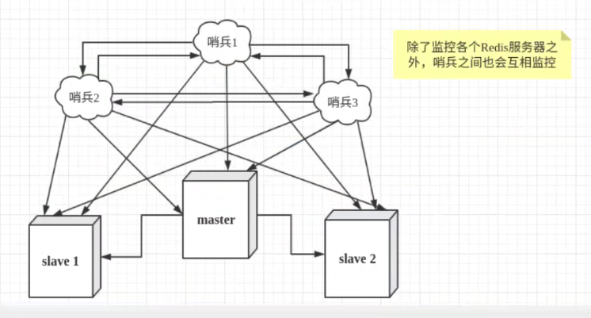
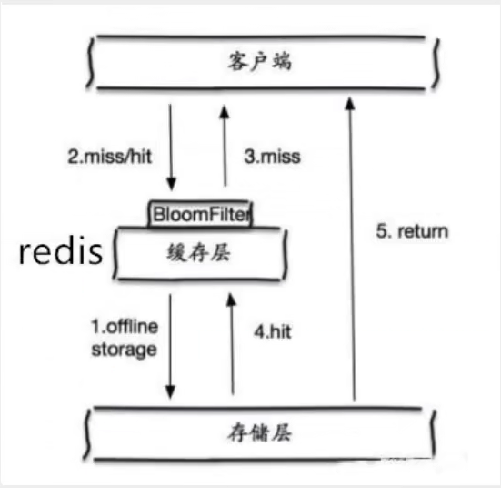
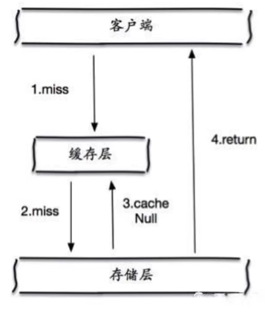

[toc]

# 1. Redis介绍

## 1.1 Redis是什么

Redis（REmote DIctionary Server）远程字典服务

一个开源的支持网络，可基于内存亦持久化的日志型，Key-Value数据库

## 1.2 Redis能干嘛

1. 内存存储，持久化
2. 效率高，可以用不高速缓存
3. 发布订阅系统
4. 地图信息分析
5. 计时器，计数器

Redis可以作**数据库**，**缓存**，**消息中间件**


# 2. Redis基础知识

## 2.1 Redis数据库

### 2.1.1 Redis数据库数目

**redis.conf**中**databases 16**决定Redis数据库数目（0-15，总共16个数据库）

### 2.1.2 Redis数据库操作

* **数据库大小**

  ```
  dbsize
  ```

* **切换数据库**

  ```
  select num
  ```

* **清除当前数据库**

  ```
  flushdb
  ```

* **清除所有数据库**

  ```
  flushall
  ```

## 2.2 Redis是单线程的

Redis是基于内存操作的，CPU不是Redis性能瓶颈，Redis的瓶颈是机器的内存和网络贷款，如果可以使用单线程来实现，就使用单线程！

Redis将所有的数据存放在内存中，所以使用单线程去操作效率最高（多线程的上下文切换是耗时的操作）


# 3. Redis数据类型

Redis根据**value的不同**，分为以下类型

* **常见**

  * string
  * list
  * set
  * hash
  * zset

* **少用**

  * geospatial
  * hyperloglog
  * bitmap

  


## 3.1 Redis-Key

### 查看所有Key

```
keys *
```

### Key是否存在

```
exists key
```

### 移除Key

```
move key 1
del key
```

### 设置过期时间

```
expire key time_to_expire
```

### 查询过期时间

```
ttl key
//如果key不存在，返回-2
//如果key存在，但没有设置过期时间，返回-1
//返回剩余过期时间，单位s
```

### 查看数据类型类型

```
type key 
```

### 查看内部编码

```
object encoding key
```

## 3.2 string

### 追加

```
append key content
//如果key不存在，相当如set
//如果key存在，往value后追加
```

### 获取长度

```
strlen key
```

### 自增1和自减1

```
incr key
decr key
```

### 自增n和自减n

```
incrby key n
decrby key n
```

### 获取子串

```
getrange key begin end
//获取字符串 [begin,end]构建的子串,end=-1表示到结尾
```

### 替换子串

```
setrange key begin xxx
//将字符串从begin开始，往后替换为xxx
```

### set with expire

```
setex key expire_time value
```

### set if not exist

**分布式锁中经常使用**

```
setnx key value
//如果key存在，那么set失败
//如果key不存在，创建
```

### 批量设置(原子操作)

```
mset key value [key value ......]
msetex
msetnx(原子操作，事务)
```

### 批量获取

```
mget key [key key ......]
```

### getset

先get再set

```
getset key value 
```

## 3.3 list

Redis的list实际上是一个链表，值可以重复

Redis中，可以把list玩成栈，队列，阻塞队列

* **栈**——lpush，lpop
* **队列**——lpush，rpop


### 从左边插入list

```
lpush key e1 [e2 e3 ......]
```

### 从左边取出元素

```
lpop key
```

### 从右边插入list

```
rpush key e1 [e2 e3 ......]
```

### 从右边取出元素

```
rpop key
```

### 从左开始显示部分list

```
lrange key begin end
```

### 获取指定位置的元素

```
lindex key index
```

### 获取list长度

```
llen key
```

### 移除指定的值

```
lrem key count value
从左边开始，从列表中移除count个value
```

### 修剪list

```
ltrim key begin end
保留list中[begin,end]的元素
```

### 将一个list中的元素转移到另一个list中

```
lpoprpush source des
//从source左边取出一个元素，放入des右边

rpoplpush source des
```

### 设置list指定位置的值

```
lset key index newValue
//如果key不存在，或者index越界，会报错
```

### 往某个值的前/后位置插入新值

```
linsert key before|after value insert_value
//如果list中有多个相同的value，那么以从左开始的第一个value为准
```


## 3.4 set

set中的值不能重复

### 添加

```
sadd key ele [ele,ele......]
```

### 查看所有元素

```
smembers key
```

### 是否存在某个元素

```
sismember key ele
```

### 获取集合元素个数

```
scard key
```

### 移除元素

```
srem key ele [ele,ele......]
```

### 从set中随机选取元素

```
srandmember key [count]
//如果没有count，那么默认为1
```

### 随机移除元素

```
spop key [count]
//如果没有count，那么默认为1
```

### 将一个值移动到另一个set中

```
smove source destination target
//将source中的target移动到destination
```

### 两个set的差集

```
sdiff key [key key ...]
```

### 两个set的交集

```
sinter key [key key ...]
```

### 两个set的并集

```
sunion key [key key ...]
```


## 3.5 hash

hash——key-Map

### 添加

```
hset key field value [field value ...]

hmset key field value [field value ...]
```

### 获取

```
hget key field
hmget key field [field....]
```

### 获取所有的field和value

```
hgetall key
```

### 获取所有的field

```
hkeys key
```

### 获取所有的value

```
hvals key
```

### 删除

```
hdel key field [field ...]
```

### 获取数目

```
hlen key
```

### 字段是否存在

```
hexists key field
```

### 字段自增长

```
hincrby key field count
```

## 3.6 zset

有序集合

### 添加

```
zadd key [NX|XX] [CH] [INCR] score member [score member]
//score表示的是优先级，zset按照优先级进行排序
```

### 查看部分集合

```
zrange key min max
//显示有序集合中下表在[min,max]的元素

zrangebyscore key min max [withscores] [limit offset count]
//显示有序集合中score在[min,max]的元素
//withscores会显示元素的score
//limit offset count：选出来的元素构成一个新的集合，并显示offset开始的count个元素
```

### 删除

```
zrem key member [member...]
```

### 集合元素数目

```
zcard key
```

### 集合中某个区间中的元素个数

```
zcount key min max
//返回集合中score在[min,max]的元素个数
```

## 3.7 geospatial

### 添加

```
geoadd key 经度 维度 member [经度 维度 member ...]
```

### 获取

```
geopos key member [member ...] 
```

### 计算两个位置的距离

```
geodist key member1 member2
```

### 以给定的经纬度为中心，找出某一半径内的元素

```
georadius key longitude latitude redius
```

### 以给定的元素为中心，找出某一半径内的元素

```
georadiusbymember key member radius
```

### 查看指定范围的member

```
zrange key min max
```

## 3.8 hyperloglog

基数统计算法（统计一个集合中不同元素的数目）

**优点**

占用的内存时固定的，对于2^64不同的元素的计数，只需要12KB内存

但是有0.81%的错误率

### 添加

```
pfadd key element [element...]
```

### 统计数目

```
pfcount key [key...]
//统计输入的集合中不同元素的数目
```

### 合并两个集合

```
pfmerge destKey sourceKey
//将sourceKey中的元素复制一份到destKey中
```


## 3.9 bitmaps

bitmaps位图——数据结构，操作二进制位来进行记录，只有0和1两个状态

### 添加

```
setbit key offset value
```

### 获取

```
getbit key offset
```

### 统计

```
bitcount key [begin end]
//统计1的数目
```


# 4. Redis事务

Redis单条命令都是保证原子性的，但是Redis的事务是不保证原子性的！


## **4.1 Redis事务介绍**

```
开启事务——>命令入队列——>执行事务
```

* 所有的命令入队后并不会直接执行，只有发起执行命令后才会执行

* Redis的事务本质上就是一组命令的集合，一个事务中所有的命令都会被序列化，在事务执行过程中，会**按照顺序依次执行**

  * 一次性
  * 顺序性
  * 排他性（事务内的命令依次执行，不会插入其他命令）

* Redis事务没有隔离级别的概念

* **开启事务**

  ```
  multi
  ```

* **执行事务**

  ```
  exec
  ```

* 事务执行时出现异常

  * **编译型异常**——语法错误

    所有命令都不会执行

  * **运行时异常**

    错误的命令执行报错，其他命令正常执行

    

## 4.2 Redis实现乐观锁—watch

```
watch key [key....]
```

在事务开始前，用watch监听key

如果在事务exec前

* 事务中对key进行了操作
* key的值被其他线程修改

那么事务中的所有操作都不会执行

```
1. watch key——会得到当前的值，记为A
2. exec——再次获取key的值，记为B，判断A和B是否相同
```


# 5.Redis配置文件

## 5.1 includes

整合多个配置文件

```
include .\path\to\local.conf
include c:\path\to\other.conf
```

## 5.2 network

```
bind IP #绑定IP，如果bind绑定私网IP，那么Client只能通过私网IP访问Redis，不能通过回环IP和公网
protected-mode yes  #保护模式
port num #暴露端口

```

## 5.3 general

```
daemonize yes #以守护进程的方式运行，默认为no

pidfile /var/run/redis_6379.pid #如果以守护进程方式运行，需要指定，会将进程的pid写入文件

loglevel notice #指定日志级别，有debug,verbose,notice,warning

logfile "" #日志的位置和文件名

database 16 #数据库数目
```

## 5.4 snapshotting

**持久化配置——rdb文件**

```
save 900 1 #900s内，如果有1个key进行了修改就执行持久化

stop-writes-on-bgsave-error yes #持久化如果失败，是否继续工作

rdbcompression yes  #是否压缩rdb文件
 
rdbchecksum yes  # 保存rdb文件时，是否进行错误的检查校验

dbfilename dump.rdb #rdb文件的名字

dir ./  #rdb文件保存的目录
```

## 5.5 security

```
requirepass password  #设置redis密码
```


## 5.6 clients

```
maxclients 1000 #允许的最大客户端数目
```


## 5.7 memory management

```
maxmemory bytes_num #最大内存容量

maxmemory-policy noeviction #内存到达上限后的处理策略
```


## 5.8 append only mode

**持久化配置——aof文件**

```
appendonly no  #默认不开启aof，默认使用rdb持久化

appendfilename "appendonly.aof" #文件名

appendfsync everysec  #每秒执行一次sync操作
appendfsync always    #每次修改都会sync
appendfsync no        #不同步
```


# 6. Redis持久化

## 6.1 RDB(Redis DataBase)



在指定的时间间隔内将**内存中的数据**写入磁盘(快照文件)，恢复时将快照文件直接读到内存中

Redis会单独创建(fork)一个子进程来进行持久化，会将内存数据先写入一个临时文件中，再用这个临时文件替换上次持久化好的文件，整个过程，主进程不进行任何IO操作，确保了极高的性能

**RDB文件**：RDB保存的默认文件默认是**dump.rdb**


### RDB触发机制

* save规则满足情况下
* 执行flushall
* 退出redis

### RDB恢复

* Redis启动时，会在 **配置文件配置的dir目录**下检查rdb文件，自动读取恢复

### RDB优缺点

* **优点**
  * 适合大规模的数据恢复
  * 对数据的完整性要求不高
* **缺点**
  * 需要一定的时间，如果Redis意外宕机，最后一次修改数据就没有了
  * fork进程的时，会占用一定的内存

## 6.2 AOF(Append Only File)

以日志的形式记录每个写操作，只许追加文件，不可以改写文件

恢复时，根据该文件的内容将指令执行一遍恢复

**AOF默认不开启，需要手动开启**

如果恶意修改aof文件，那么Redis无法启动，不过可以使用Redis提供的工具redis-check-aof来修复

### 优点和缺点

* 缺点
  * aof远远大于rdb文件，修复速度也比rdb慢
  * aof运行效率比rdb慢


## 6.3 拓展

1. RDB持久化方式能够在指定的时间间隔内对你的数据进行快照存储

2. AOF持久化方式记录每次写操作，当服务器重启时，重新执行这些操作来恢复原始数据，AOF以Redis协议追加保存每次写操作到文件末尾，Redis还能对AOF文件进行后台重写，使得AOF文件的体积不至于过大

3. Redis只做缓存，如果你只希望你的数据在服务器运行时存在，你也可以不使用任何持久化

4. 同时开启两种持久化方式

   * 在这种情况下，在Redis重启时，会优先载入AOF来恢复数据，因为同通常情况下，AOF文件保存的数据集比RDB要完整
   * RDB的数据不实时，同时使用两者时服务器也只会找AOF文件，那要不要使用AOF呢？作者建议不要，因为RDB更适合用于备份数据库，快速重启，而且不会有AOF可能潜在的bug

5. 性能建议

   * 因为RDB文件只用作后背用途，建议只在slave上持久化RDB文件，而且只需要15分钟备份一次就足够了

   * 如果Enable AOF，好处是在最恶劣情况下也只会丢失不超过2s数据，启动脚本较简单，只需要load自己的AOF文件就可以。

     代价：一是带来了持续的IO，二是AOF rewrite的最后将rewrite过程中产生的新数据写到新文件造成的阻塞几乎是不可避免的，只要硬盘许可，应该尽量减少AOF rewrite的频率，AOF重写的基础大小默认是64M太小，可以设到5G以上

   * 如果不Enable AOF，仅靠主从架构实现高可用性也可以，能省掉一大笔IO，也较少了rewrite时带来的系统波动

     代价是如果master和slave同时宕机，会丢失10几分钟的数据，启动脚本也要比较master和slave的RDB文件，载入较新的那个


# 7. Redis发布订阅

Redis发布定于(pub/sub)是一种消息通信模式：发送者(pub)发送信息，订阅者(sub)接受信息




Redis提供了命令用于构建即使通信应用

| 命令                                 | 介绍                   |
| ------------------------------------ | ---------------------- |
| psubscribe pattern [pattern ...]     | 订阅符合给定模式的频道 |
| pubsub subcommand [argu [argu...] ]  | 查看订阅与发布系统状态 |
| publish channel message              | 将信息发送到指定频道   |
| punsubscribe [pattern [pattern ...]] | 退订指定模式的频道     |
| subscribe channel [channel ...]      | 订阅指定频道           |
| unsubscribe [channel [channel ...] ] | 退订指定频道           |

**原理**

redis-server内维护了一个字典，字典的key就是一个个channel，字典的值是一个链表，链表中保存了所有订阅这个channel的客户端

向订阅者发送消息时，redis-server使用给定的channel作为key，在它所维护的channel字典中查找订阅了该channel的所有客户端的链表，然后遍历这个链表，将消息发布给所有订阅者


# 8. 主从复制

* 主从复制，就是将一台Redis服务器的数据，复制到其他Redis服务器，前者称为master，后者称为slav

* 数据的复制是单向的，只能由master到slaver

* master以写作主，slave以读为主

  master可写，slave只能读不能写

  master中所有的数据和信息都会自动被slave保存

* 如果master宕机，slave仍能提供读服务，master重启后会再次加入集群

* 如果slave宕机后，slave重启会自动同步master数据

* 默认情况下，每个Redis都是master，我们只需要配置从机即可




## 8.1 主从复制作用

1. 数据冗余：主从复制实现了数据的热备份
2. 故障恢复：当master出现问题时，可以由slave提供服务，实现快速的故障恢复
3. 负载均衡：在主从复制的基础上，配合读写分离，可以由master提供写服务，slave提供读服务，分担服务器负载
4. 高可用基石：主从复制是哨兵模式和集群模式能够实施的基础


## 8.2 搭建主从复制集群

### 查看当前Redis server的集群信息

```
info replication
```


### 命令行配置(临时配置，不推荐)

```
从机运行如下配置
slaveof host port
```


### 配置文件配置

```
replicaof <masterip>
```

# 9. 哨兵模式

哨兵是一个独立进程，独立运行

**单机哨兵**



**哨兵集群**



哨兵有两个作用

* 通过发送命令，让Redis服务器响应，监控Redis服务器运行状态
* 当哨兵检测到master宕机，会选举一个slave作为新的master，然后通过 **发布订阅模式**通知其他从服务器，**修改配置文件**，让旧master和其他slave成为新master的从服务器**（永久更改）**


### 哨兵模式优缺点

* **优点**
  * 哨兵集群，基于主从复制模式，所有主从配置的优点，它都有
  * 主从可以切换，故障可以转移，系统的可用性更好
  * 哨兵模式是主从模式的升级，更加健壮
* **缺点**
  * Redis不方便在线扩容，集群容量一旦达到上限，在线扩容十分麻烦
  * 哨兵模式配置复杂


# 10. Redis缓存穿透,击穿,雪崩

## 10.1 缓存穿透

### 什么是缓存穿透

用户查询一个数据，Redis中没有(缓存没命中)，于是向持久层数据库查询，持久层数据库也没有。当这样的查询很多时，缓存都没有命中，于是都去请求持久层数据库，这就是缓存穿透

### 解决方案

#### 1. 布隆过滤器

布隆过滤器是一种数据结构，对查询使用的所有参数以hash形式存储，在控制层进行校验，不符合则丢弃，避免了对底层存储系统的查询压力




#### 2. 缓存空对象

当存储层未命中后，即使返回空对象也存储起来，同时设置一个过期时间



**缓存空对象的问题**

1. 如果空值能被缓存起来，这就意味着缓存需要更多的哦空间存储更多的键
2. 即使对空值设置了过期时间，还是会存在缓存层和存储层的数据有一段时间的不一致

## 10.2 缓存击穿

### 什么是缓存击穿

缓存击穿——指的是一个key非常热点，不停的扛着大并发

这个key过期的瞬间，大量的请求并发访问持久层数据库，导致数据库瞬间压力过大

### 解决方案

#### 1. 设置热点数据永不过期

#### 2. 加互斥锁

分布式锁，使用分布式锁，保证对于每个key，某一时间只有一个线程去查询持久层数据


## 10.3 缓存雪崩

### 什么是缓存雪崩

某一个时间段，缓存集中过期失效

例如：马上到双十二零点，这波商品数据集中放入缓存，假设缓存1小时，到了凌晨1点时，这批商品的缓存都过期了，对这批商品的访问，都直接落在了持久层数据库上。

key集中过期并不是非常致命

比较致命的缓存雪崩，是缓存服务器的某个节点宕机或者断网

### 解决方案

#### 1. Redis高可用

#### 2. 限流降级

#### 3. 数据预热

在正式部署之前，先把可能的数据预先访问一遍，这样部分可能大量访问的数据就会加载到缓存中
