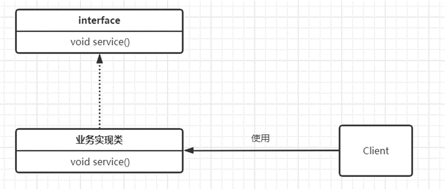
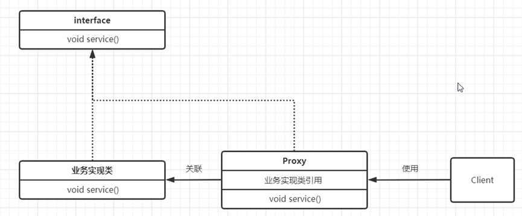

**不使用代理模式——Client直接访问业务实现类**

  
  
**使用代理设计模式**

  
  
**代理设计模式的特征**  
* **代理类对象**与**被代理类对象**之间通常存在关联关系  
* **代理类对象**本身并不真正实现服务，而是通过调用**被代理类对象**的相关方法，来提供服务,并且还可以在不改变被代理对象的情况下，增加一些功能

**为什么要有代理**  
代理设计模式提供了对目标对象额外的访问方式，间接访问目标对象，***这样可以在不修改目标对象的情况下，增加一些功能***

